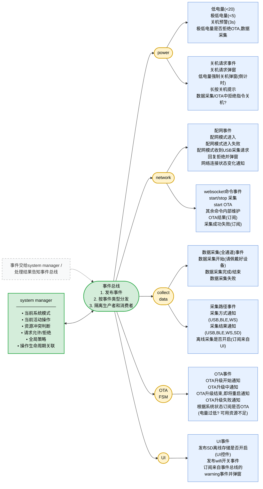

```mermaid
flowchart LR
    SM["system manager<br/>─────────────<br/>• 当前系统模式<br/>• 当前活动操作<br/>• 资源冲突判断<br/>• 请求允许/拒绝<br/>• 全局策略<br/>• 操作生命周期关联"]
    EB(["事件总线<br/>1. 发布事件<br/>2. 按事件类型分发<br/>3. 隔离生产者和消费者"])
    NOTE["事件交给system manager /<br/>处理结果告知事件总线"]

    NOTE -.-> EB
    SM <--> EB

    EB --> Power(["power"])
    EB --> Network(["network"])
    EB --> Collect(["collect<br/>data"])
    EB --> OTA(["OTA<br/>FSM"])
    EB --> UI(["UI"])

    Power --> P1["低电量(&lt;20)<br/>极低电量(&lt;5)<br/>关机预警(3s)<br/>极低电量是否拒绝OTA,数据采集"]
    Power --> P2["关机请求事件<br/>关机请求弹窗<br/>低电量强制关机弹窗(倒计时)<br/>长按关机提示<br/>数据采集/OTA中拒绝指令关机?"]

    Network --> N1["配网事件<br/>配网模式进入<br/>配网模式进入失败<br/>配网模式收到USB采集请求回复拒绝并弹窗<br/>网络连接状态变化通知"]
    Network --> N2["websocket命令事件<br/>start/stop 采集<br/>start OTA<br/>其余命令内部维护<br/>OTA结果(订阅)<br/>采集成功失败(订阅)"]

    Collect --> C1["数据采集(全通道)事件<br/>数据采集开始(请佩戴好设备)<br/>数据采集完成/结束<br/>数据采集失败"]
    Collect --> C2["采集路径事件<br/>采集方式通知(USB,BLE,WS)<br/>采集结果通知(USB,BLE,WS,SD)<br/>离线采集是否开启(订阅来自UI)"]

    OTA --> O1["OTA事件<br/>OTA升级开始通知<br/>OTA升级中通知<br/>OTA升级结束,即将重启通知<br/>OTA升级失败通知<br/>根据系统状态订阅是否OTA<br/>(电量过低? 可用资源不足)"]

    UI --> U1["UI事件<br/>发布SD离线存储是否开启(UI控件)<br/>发布wifi开关事件<br/>订阅来自事件总线的warning事件并弹窗"]

    classDef core fill:#d4edda,stroke:#28a745,stroke-width:2px,color:#000
    classDef hub fill:#fff3cd,stroke:#d39e00,stroke-width:2px,color:#000
    classDef detail fill:#e7f1ff,stroke:#4a7fd6,stroke-width:1px,color:#000
    classDef note fill:#f8f9fa,stroke:#999,stroke-dasharray: 5 5,color:#333

    class SM,EB core
    class Power,Network,Collect,OTA,UI hub
    class P1,P2,N1,N2,C1,C2,O1,U1 detail
    class NOTE note
```
