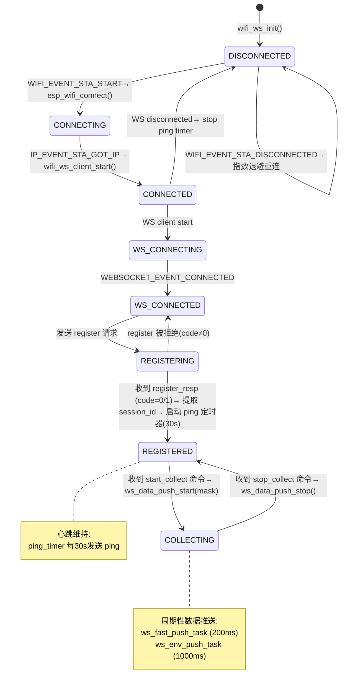
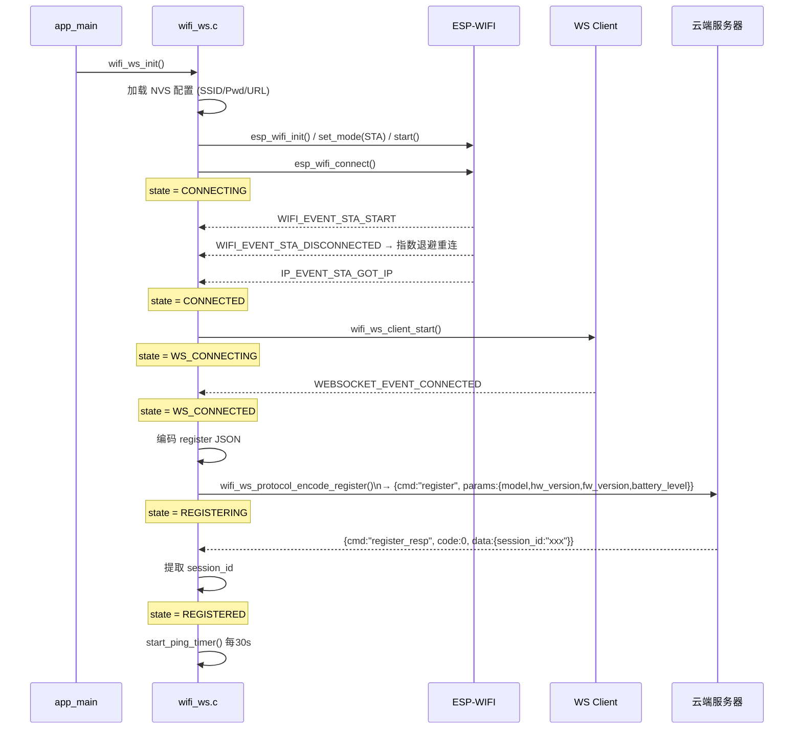
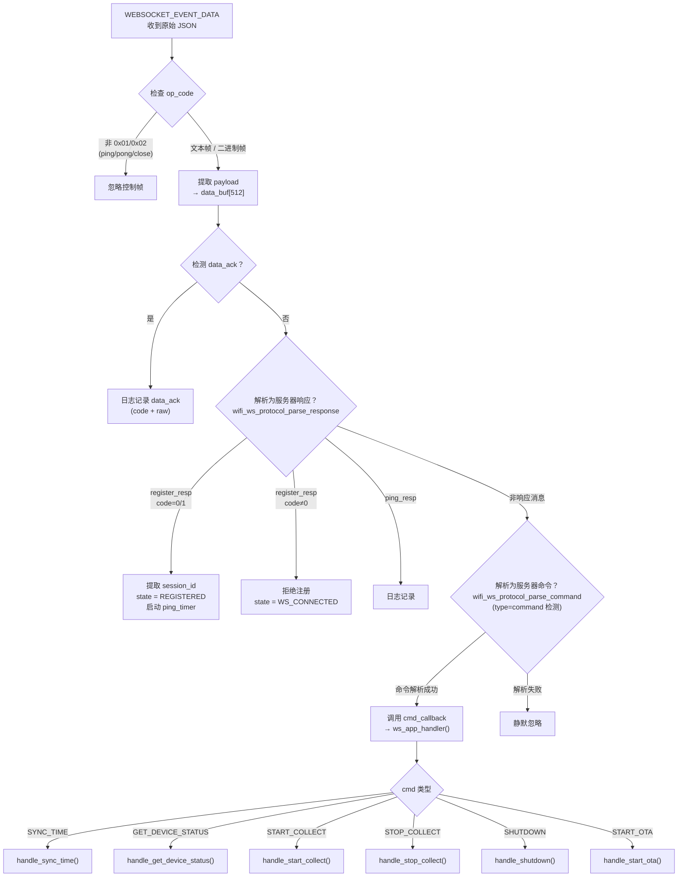
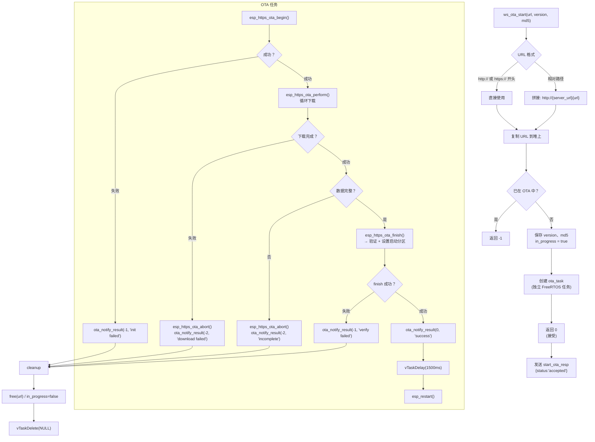
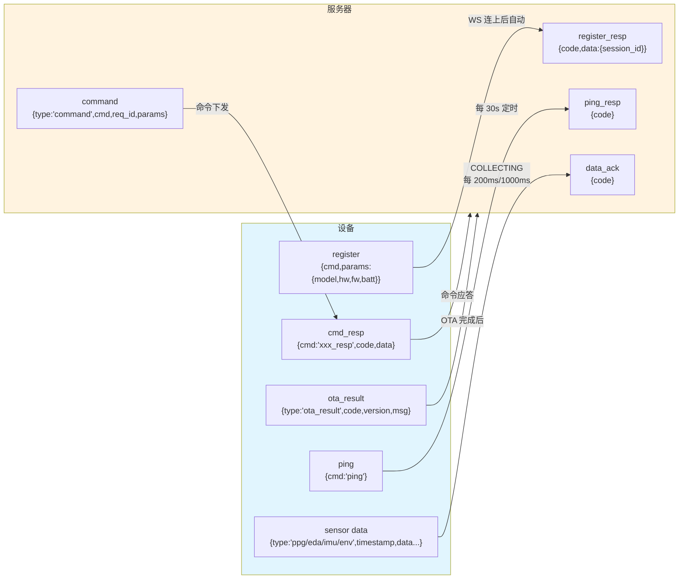

现在我对整个 `wifi_ws` 组件有了完整理解，可以画出涵盖**连接状态机、命令处理、数据推送、OTA**的完整流程图。

---

## wifi_ws 组件完整流程图

### 1. 连接状态机

### 2. 连接建立流程（详细时序）

### 3. 命令处理流程（服务器 → 设备）

### 4. 命令处理子流程（ws_app_handler → 6个命令）

```mermaid
flowchart TD
    subgraph SYNC_TIME
        A1["提取 params.timestamp"] --> A2{"有 timestamp？"}
        A2 -->|"是"| A3["convert_unix_to_rtc_time()<br/>rtc_set_time_ms()<br/>dev_rtc 同步"]
        A2 -->|"否"| A4["跳过 RTC 同步"]
        A3 --> A4
        A4 --> A5["get_current_unix_timestamp_ms()<br/>→ 返回 device_timestamp"]
        A5 --> A6["ws_send_resp('sync_time', code=0, data:{device_timestamp})"]
    end

    subgraph GET_DEVICE_STATUS
        B1["get_device_status(get_data)<br/>→ 设备状态字节数组"] --> B2["映射 device_state"]
        B2 --> B3["读取传感器状态<br/>(PPG/EDA/IMU/ENV)"]
        B3 --> B4["读取 AXP2101 电量和充电状态"]
        B4 --> B5["构建 sensors + battery JSON"]
        B5 --> B6["ws_send_resp('get_device_status', code=0, data:{...})"]
    end

    subgraph START_COLLECT
        C1["提取 params.data_stream_mask"] --> C2{"mask 1~15？"}
        C2 -->|"否"| C3["ws_send_resp(code=3)"]
        C2 -->|"是"| C4{"已是 COLLECTING 状态？"}
        C4 -->|"是"| C5["ws_send_resp(code=4)<br/>已在采集中"]
        C4 -->|"否"| C6["ws_data_push_start(mask)"]
        C6 --> C7["创建 ws_fast_push_task(200ms)<br/>按 mask 包含 PPG(bit0)/EDA(bit1)/IMU(bit2)"]
        C7 --> C8["创建 ws_env_push_task(1000ms)<br/>按 mask 包含 ENV(bit3)"]
        C8 --> C9["state = COLLECTING"]
        C9 --> C10["ws_send_resp(code=0)"]
    end

    subgraph STOP_COLLECT
        D1["ws_data_push_stop()<br/>→ 删除推送任务"] --> D2["state = REGISTERED"]
        D2 --> D3["ws_send_resp(code=0)"]
    end

    subgraph SHUTDOWN
        E1{"state = COLLECTING？"}
        E1 -->|"是"| E2["ws_send_resp(code=1)<br/>需先停止采集"]
        E1 -->|"否"| E3["ws_send_resp(code=0)<br/>应答成功"]
        E3 --> E4["创建 3s 一次性定时器"]
        E4 --> E5["定时回调: axp2101.shutdown()"]
    end

    subgraph START_OTA
        F1["提取 params.url / version / md5"] --> F2{"有 url？"}
        F2 -->|"否"| F3["ws_send_resp(code=3)"]
        F2 -->|"是"| F4["ws_ota_start(url, version, md5)"]
        F4 --> F5{"返回值"}
        F5 -->|"0 (接受)"| F6["ws_data_push_stop()<br/>停止采集"]
        F6 --> F7["state = REGISTERED"]
        F7 --> F8["ws_send_resp(code=0, {status:accepted})"]
        F8 --> F9["创建独立 OTA 任务"]
        F5 -->|"-1 (升级中)"| F10["ws_send_resp(code=4)"]
        F5 -->|"-2 (参数错)"| F11["ws_send_resp(code=3)"]
    end
```

### 5. 数据推送流程（COLLECTING 状态）

```mermaid
flowchart TD
    subgraph ws_fast_push_task [每 200ms]
        direction LR
        F_CHECK["vTaskDelayUntil(200ms)"] --> F_TS["get_current_unix_timestamp_ms()"]
        F_TS --> F_PPG{"mask & 0x01\n(PPG)"}
        F_PPG -->|"是"| F_PPG_READ["ppg_swap_and_get(&count)<br/>最多 5 样本"]
        F_PPG_READ --> F_PPG_SEND["JSON 编码(channel1/2/3)<br/>→ wifi_ws_send_text<br/>type='ppg'"]
        F_PPG_SEND --> F_EDA
        F_PPG -->|"否"| F_EDA
        F_EDA{"mask & 0x02\n(EDA)"}
        F_EDA -->|"是"| F_EDA_READ["eda_swap_and_get(&count)<br/>adc→ohms→μS 转换"]
        F_EDA_READ --> F_EDA_SEND["JSON 编码(adc/ohm/value)<br/>→ wifi_ws_send_text<br/>type='eda'"]
        F_EDA_SEND --> F_IMU
        F_EDA -->|"否"| F_IMU
        F_IMU{"mask & 0x04\n(IMU)"}
        F_IMU -->|"是"| F_IMU_READ["imu_swap_and_get(&count)<br/>最多 5 样本<br/>accel/g 换算"]
        F_IMU_READ --> F_IMU_SEND["JSON 编码(accel_xyz/gyro_xyz)<br/>→ wifi_ws_send_text<br/>type='imu'"]
        F_IMU -->|"否"| F_CHECK
        F_IMU_SEND --> F_CHECK
    end

    subgraph ws_env_push_task [每 1000ms]
        direction LR
        E_CHECK["vTaskDelayUntil(1000ms)"] --> E_MASK{"mask & 0x08\n(ENV)"}
        E_MASK -->|"是"| E_READ["env_swap_and_get()"]
        E_READ --> E_JSON["提取 spo2/skin_temp/pressure\n/env_temp/env_humidity"]
        E_JSON --> E_SEND["JSON 编码→ wifi_ws_send_text<br/>type='env'"]
        E_SEND --> E_CHECK
        E_MASK -->|"否"| E_CHECK
    end
```

### 6. OTA 升级流程

### 7. 设备 ↔ 服务器消息总览

---

### 核心流程总结

| 阶段              | 入口                          | 状态迁移                                     | 关键操作                                              |
| --------------- | --------------------------- | ---------------------------------------- | ------------------------------------------------- |
| **WiFi连接**      | `wifi_ws_init()`            | DISCONNECTED → CONNECTING → CONNECTED    | 加载NVS→WiFi init→connect→获取IP                      |
| **WebSocket连接** | `wifi_ws_client_start()`    | CONNECTED → WS_CONNECTING → WS_CONNECTED | 构建URI→WS client start→连接服务器                       |
| **注册**          | `WEBSOCKET_EVENT_CONNECTED` | WS_CONNECTED → REGISTERING → REGISTERED  | 编码register→发送→解析register_resp→存session_id→启ping   |
| **心跳**          | `ping_timer` 每30s           | REGISTERED/COLLECTING                    | 编码ping→发送→解析ping_resp                             |
| **命令**          | 来自服务器的 `type=command`       | 状态不变                                     | 解析→ws_app_handler分发→回复cmd_resp                    |
| **数据采集**        | `start_collect`             | REGISTERED → COLLECTING                  | 按mask创建推送任务→200ms/1000ms周期→swap_and_get→JSON→send |
| **OTA升级**       | `start_ota`                 | COLLECTING → REGISTERED                  | 停止采集→独立任务→HTTPS下载→烧录→通知→重启                        |
| **关机**          | `shutdown`                  | 任何非COLLECTING状态                          | 应答→3s延迟→AXP2101关电源                                |