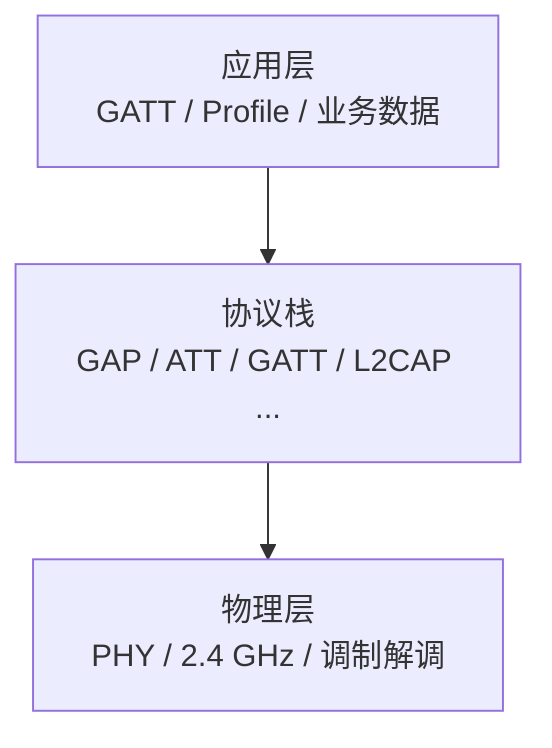
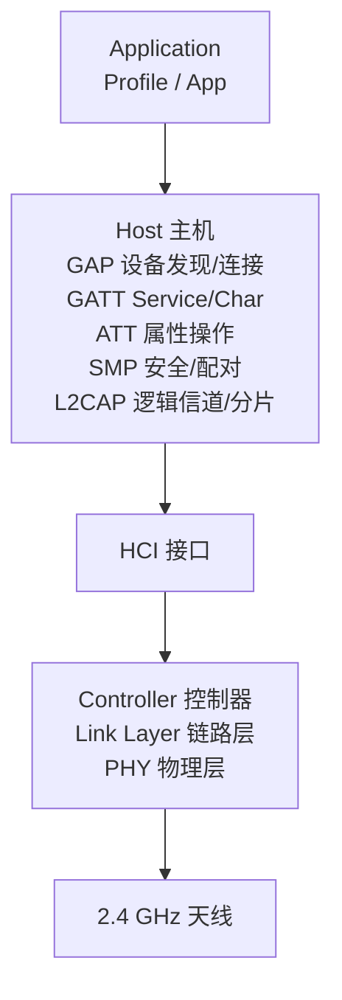
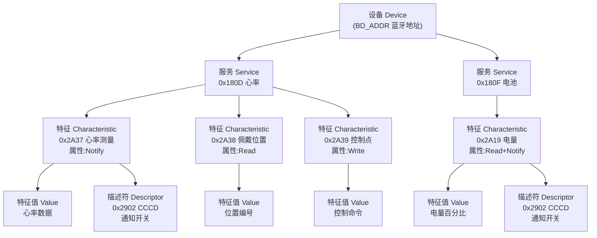
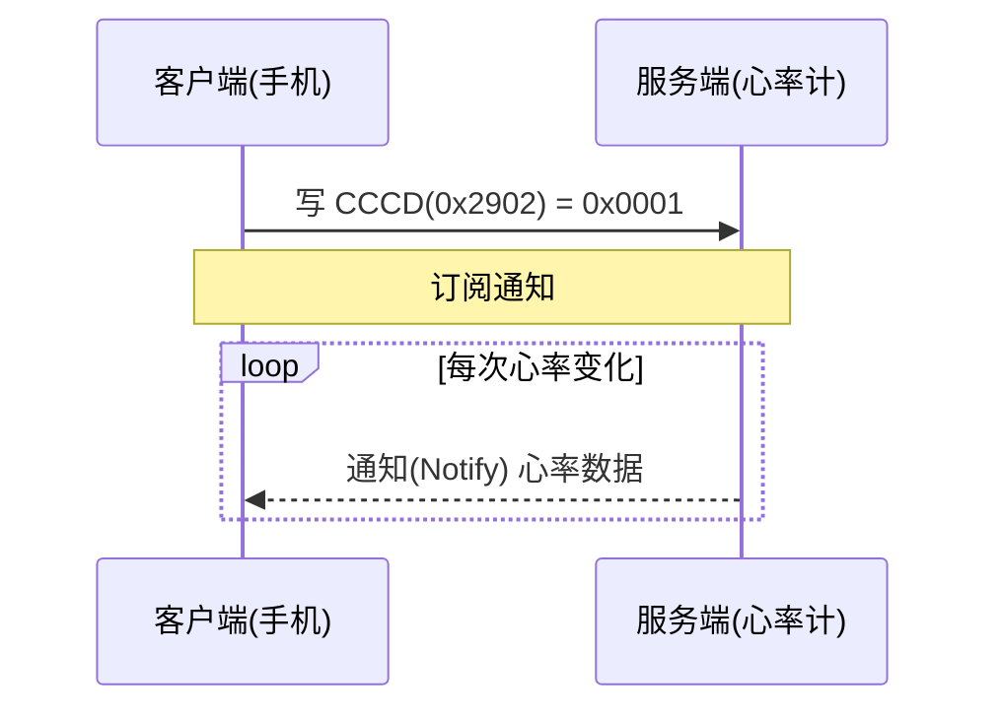
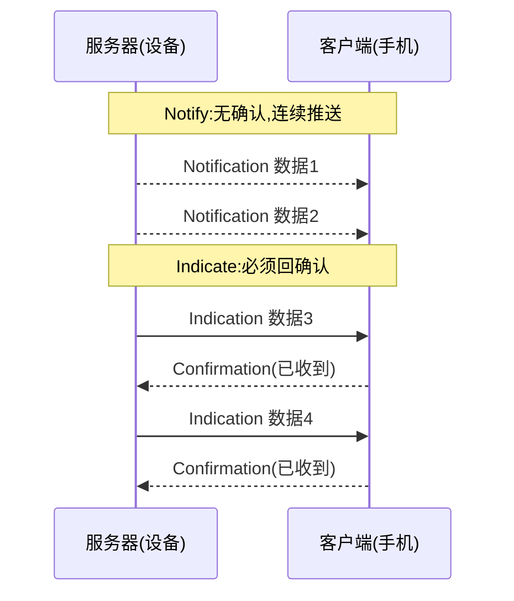

# 蓝牙协议栈

## 总览:蓝牙通信的三层

## 协议栈详细分层

## 各层职责

| 协议 | 全称 | 核心职责 |
|---|---|---|
| L2CAP | Logical Link Control and Adaptation Protocol | 逻辑信道复用、分包/重组 |
| ATT | Attribute Protocol | 属性读写/通知/指示 |
| SMP | Security Manager Protocol | 配对、加密、密钥绑定 |
| GAP | Generic Access Profile | 设备发现与连接 |
| GATT | Generic Attribute Profile | 服务/特征/描述符数据模型 |

### L2CAP —— Host 最底层的分包层
- 将上层数据包**分包**发送,收到的小包**重组**为完整包再交给上层
- 负责**逻辑信道复用**,区分上层数据属于 ATT、SMP 等哪个协议

### ATT —— 属性(Attribute)协议
- 所有收发数据都以**属性**为单元传输,是 GATT 的底层支撑协议
- 提供属性的**读取、写入、通知(Notify)、指示(Indicate)**等操作
- 注意:服务/特征/描述符的层次结构由 **GATT** 定义,ATT 本身只负责属性操作

### SMP —— 安全管理协议
- 负责**配对、链路加密、密钥分发与绑定**(保存密钥)

### GAP —— 设备发现与连接
- 管理设备的**连接、广播、身份、拓扑**
- 连接建立/断开,主/从设备角色区分
- 设备名称、可见性、白名单

### GATT —— 数据通信的关键(开发者最常用)
- 设备连接后通信的**数据结构**,详见下节
- 在 ATT 之上定义了**服务(Service)、特征(Characteristic)、描述符(Descriptor)**

## GATT 数据模型

设备连接后,数据按「设备 → 服务 → 特征 → 描述符」四级组织。以心率计为例:

> 一个特征 = 特征声明 + **特征值(Value)** + 若干**描述符**;描述符可以有多个(CCCD、用户描述、显示格式),也可以没有;多个描述符共享同一个特征值

### ATT 视角:属性表
GATT 的四级模型在设备里实际存储为一张**属性表**,图上的每个框都是表中的一行:

| handle | 类型(UUID) | 内容 |
|---|---|---|
| 0x0001 | 0x2800 主服务声明 | 服务 UUID = 0x180D |
| 0x0002 | 0x2803 特征声明 | 属性 0x10(Notify) + 值句柄 0x0003 + UUID 0x2A37 |
| 0x0003 | 0x2A37 心率测量(特征值) | 心率数据 |
| 0x0004 | 0x2902 CCCD | 0x0000 / 0x0001(通知开关) |
| 0x0005 | 0x2803 特征声明 | 属性 0x02(Read) + 值句柄 0x0006 + UUID 0x2A38 |
| 0x0006 | 0x2A38 佩戴位置(特征值) | 位置编号 |

handle 从 0x0001 起按声明顺序递增,UUID 标识"这是什么",handle 标识"它在哪",属性权限决定"能不能读写"

### 设备 Device
- 每一台蓝牙产品就是一个设备,每个设备有唯一的**蓝牙地址**(BD_ADDR,48 位,俗称 MAC 地址)

### 服务 Service
- 每个设备可以有多个服务
- 服务的作用是区分一个设备的不同数据类型
- 不同服务用 UUID 区分

#### 服务 UUID
UUID 总长 128 位,用 16 进制数表示
简化版:用 16 位表示(总长仍 128 位,仅这 16 位可变,其余固定)
16 位 UUID 由蓝牙技术联盟(SIG)统一分配,用于标识不同的数据类型

**基础 UUID**:`0000xxxx-0000-1000-8000-00805F9B34FB`,16 位 UUID 填入 `xxxx` 即得完整 128 位 UUID

**UUID 编号段规律**:

| 段     | 用途                        |
| ------ | --------------------------- |
| 0x18xx | 服务                        |
| 0x2Axx | 特征                        |
| 0x29xx | 描述符                      |
| 0x28xx | 属性声明(0x2800 主服务/0x2803 特征声明) |

**常用 16 位 UUID**:

| UUID | 名称 | 类型 |
|---|---|---|
| 0x1800 | Generic Access (GAP) | 服务 |
| 0x1801 | Generic Attribute (GATT) | 服务 |
| 0x180A | Device Information (设备信息) | 服务 |
| 0x180D | Heart Rate (心率) | 服务 |
| 0x180F | Battery Service (电池) | 服务 |
| 0x2A00 | Device Name (设备名称) | 特征 |
| 0x2A01 | Appearance (外观) | 特征 |
| 0x2A19 | Battery Level (电量) | 特征 |
| 0x2A29 | Manufacturer Name String (厂商名) | 特征 |
| 0x2A37 | Heart Rate Measurement (心率测量) | 特征 |

> 完整分配表见蓝牙技术联盟官方文档:[Assigned Numbers](https://www.bluetooth.com/specifications/assigned-numbers/)(GATT 服务见 3.4 节,特征见 8.2 节)

### 特征 Characteristic
特征是对服务数据的进一步细化
比如 Battery Service(0x180F) 下,用 Battery Level(0x2A19) 特征存放电量百分比

#### 特征 UUID
- 特征值也用 UUID 标识"这是什么数据",16 位特征 UUID 由 SIG 分配(0x2Axx 段),自定义特征用 128 位 UUID
- 上表 0x2Axx 开头的行为特征 UUID:Device Name 0x2A00、Battery Level 0x2A19、Heart Rate Measurement 0x2A37 等
- **UUID 与句柄(handle)的区别**:UUID 标识特征的"类型",handle 标识它在属性表中的"位置";同一服务允许存在多个同 UUID 的特征(如两个温度传感器),靠 handle 区分
- 特征的"身份"由**特征声明(0x2803)**定义,其值包含:属性 1 字节 + 值句柄 2 字节 + 特征 UUID

#### 特征属性(Properties)
特征属性决定特征值支持哪些操作:

| 属性                          | 值    | 含义                       |
| --------------------------- | ---- | ------------------------ |
| Broadcast                   | 0x01 | 允许广播特征值                  |
| Read                        | 0x02 | 允许读                      |
| Write Without Response      | 0x04 | 允许写(无确认)                 |
| Write                       | 0x08 | 允许写(带确认)                 |
| Notify                      | 0x10 | 允许通知(无需确认,需 CCCD 0x2902) |
| Indicate                    | 0x20 | 允许指示(需确认,需 CCCD 0x2902)  |
| Authenticated Signed Writes | 0x40 | 允许签名写                    |
| Extended Properties         | 0x80 | 启用扩展属性描述符                |

### 描述符 Descriptor
一个特征 = 特征声明(0x2803) + 特征值 + 若干描述符
描述符描述或配置特征值,每个特征可以有多个描述符,也可以没有

| UUID | 名称 | 作用 |
|---|---|---|
| 0x2900 | Characteristic Extended Properties(扩展属性) | 补充特征属性,特征属性 0x80 位开启时必须存在 |
| 0x2901 | Characteristic User Description(用户描述) | 特征的文字说明(UTF-8 字符串),如"电量" |
| 0x2902 | Client Characteristic Configuration(CCCD) | 客户端配置,控制通知/指示开关,最常用 |
| 0x2903 | Server Characteristic Configuration(SCCD) | 服务器端配置 |
| 0x2904 | Characteristic Presentation Format(显示格式) | 特征值的展示格式(类型、单位、小数位) |
| 0x2905 | Characteristic Aggregate Format(聚合格式) | 多个显示格式时的聚合描述 |

#### CCCD(0x2902)详解
支持通知/指示的特征必须带它,客户端向其中写入 2 字节值来订阅:

- `0x0001` 开启通知(Notify)
- `0x0002` 开启指示(Indicate)
- `0x0000` 关闭

> 例:心率服务(0x180D)的心率测量特征(0x2A37)带 CCCD,手机写入 `0x0001` 后,心率计才会持续上报心率数据

#### Notify 与 Indicate 的区别
两者都是设备 → 客户端的主动推送(都需要 CCCD),区别在于**要不要确认**:

| | Notify 通知 | Indicate 指示 |
|---|---|---|
| 确认 | 无,发出即完成 | 客户端必须回确认(Confirmation) |
| 可靠性 | 可能丢失 | 可靠:确认后才发下一条,不丢不漏不重 |
| 速度 | 快,可连续发多条 | 慢,同一时刻只有一条在途 |
| 适用场景 | 高频数据(心率、电量实时值) | 重要事件(告警、指令结果) |

> 选择建议:高频实时数据用 Notify,重要事件用 Indicate——确认的开销换来"必达"。两者的开关互斥(CCCD 只能写 `0x0001` 或 `0x0002` 之一)

## 相关笔记
- [[01-蓝牙入门]]
- [[02-NimBLE-API基础]]
