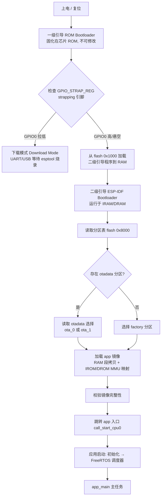

# ESP32 启动流程与 Bootloader 笔记

> 本笔记介绍 ESP32 从上电复位到运行 `app_main()` 的完整启动流程（以 ESP32 经典款 / Xtensa LX6 双核为例，末尾附新系列差异）。
>
> 关联笔记：[[嵌入式系统启动流程与 Bootloader 核心笔记]]（Cortex-M 对照）、[[ota为什么需要双分区]]、[[ota如何保障真正的安全]]

---

## 目录

1. [宏观流程：三级启动架构](#一宏观流程三级启动架构)
2. [一级引导：ROM Bootloader（不可修改）](#二一级引导rom-bootloader不可修改)
3. [二级引导：ESP-IDF Bootloader（flash 0x1000）](#三二级引导esp-idf-bootloaderflash-0x1000)
4. [应用启动：call_start_cpu0 → app_main](#四应用启动call_start_cpu0--app_main)
5. [与 Cortex-M 启动流程对比](#五与-cortex-m-启动流程对比)
6. [Flash 布局速查表](#六flash-布局速查表)
7. [常见问题与避坑](#七常见问题与避坑)
8. [学习自检清单](#八学习自检清单)
9. [答案与解析](#九答案与解析)

---

## 一、宏观流程：三级启动架构

与 Cortex-M 的"硬件取向量表 → 直接跳 Reset_Handler"不同，ESP32 采用**分级引导（Multi-stage Boot）**架构，共分三级：



**设计动机**：ROM 中的一级引导无法修改（出厂固化），但通过它加载一个**可编程的二级引导**，就能实现分区表灵活性、OTA 升级、Flash 加密、Secure Boot 等功能。这正是 ESP-IDF 引入二级引导的目的。

---

## 二、一级引导：ROM Bootloader（不可修改）

复位后，**PRO CPU 立即开始执行复位向量代码，APP CPU 保持复位**。复位向量位于芯片掩膜 ROM（Mask ROM），**不能被修改**。启动期间所有初始化都由 PRO CPU 完成。

### 2.1 启动模式选择（Strapping Pins）

ROM 启动代码读取 `GPIO_STRAP_REG` 寄存器（保存复位时 bootstrap 引脚电平）来决定启动模式：

| 模式 | 关键引脚状态 | 行为 | 典型场景 |
|------|--------------|------|----------|
| **下载模式** Download | GPIO0 拉低（复位期间） | ROM 等待 UART0（或新芯片 USB Serial/JTAG）命令 | 用 esptool 烧录固件 |
| **正常启动** SPI Boot | GPIO0 高/悬空（内部上拉） | 从外部 SPI flash 加载二级引导 | 正常运行固件 |

其他影响启动的引脚（经典 ESP32）：

| 引脚 | 影响 |
|------|------|
| GPIO2 | 必须悬空或拉低才能进入下载模式 |
| GPIO12 (MTDI) | 拉高 → VDD_SDIO 变为 1.8V；若用的是 3.3V flash 会导致掉电、无法启动 |
| GPIO15 (MTDO) | 拉低 → 静默 ROM 启动日志 |
| GPIO5 | 参与启动模式编码 |

### 2.2 ROM 启动日志解读

开发板开机串口常打印（115200 波特率）：

```text
ets Jun  8 2016 00:22:57
rst:0x1 (POWERON_RESET),boot:0x3 (DOWNLOAD_BOOT(UART0/UART1/SDIO_REI_REO_V2))
```

- `boot:0xNN` 是 strapping 引脚在 `GPIO_STRAP` 寄存器中的十六进制值
  - `boot:0x1` = SPI_FAST_FLASH_BOOT（**正常 SPI flash 启动**）
  - `boot:0x3` = DOWNLOAD_BOOT（**下载模式**，可被 esptool 识别）
- 后续的 `load:0x40078000,len:8364` 行是 ROM 加载二级引导各段时的打印（地址 + 长度）
- 最后一行 `entry 0x40080034` 是二级引导的入口地址

---

## 三、二级引导：ESP-IDF Bootloader（flash 0x1000）

**位置**：经典 ESP32 的二级引导位于 **flash 偏移 0x1000**（新芯片见 [7.3](#73-新系列差异esp32-c3s3c6h2)）。源码在 ESP-IDF 的 `components/bootloader` 目录，由用户工程编译烧录，**可配置**。

ROM 一级引导从 flash 读二级引导的镜像头信息，据此把二级引导整个加载进 RAM（IRAM & DRAM）并跳转。注意：此时系统时钟低于配置值，只支持部分 flash 模式，**二级引导运行后会按所选 app 镜像头里的配置重新配置 flash**（这也允许 OTA 改变 SPI flash 设置）。

### 3.1 核心职责

1. 内部模块的最小化初始配置；
2. 初始化 flash 加密 / Secure Boot（如启用）；
3. 读取分区表（默认偏移 **0x8000**）；
4. 根据分区表和 `otadata` 选择要启动的 app 分区（factory / ota_0 / ota_1）；
5. 将 app 镜像加载到内存（IRAM/DRAM 拷贝 + IROM/DROM MMU 映射）；
6. 校验 app 完整性 → 跳转 app 入口。

### 3.2 分区表与 OTA 选择

分区表默认位于 flash **0x8000**（`CONFIG_PARTITION_TABLE_OFFSET`，可配置），每条目包含：Name、Type（app/data）、SubType、Offset、Size。

二级引导的选区逻辑：

- 分区表里有 **otadata 分区**（Type=data, SubType=ota）→ 查询它决定引导 `ota_0` 还是 `ota_1`；
- 没有 otadata → 引导 **factory** 分区。

这就是 OTA 双分区方案在 ESP32 上的落地：升级时写非活跃区，通过 otadata 原子切换启动分区。详见 [[ota为什么需要双分区]]。

### 3.3 app 镜像格式（ESP Image Format）

`app.bin` 的结构（小端序）：**8 字节文件头 + 16 字节扩展头 + 若干数据段 + 尾部（校验和 + SHA256）**

```text
┌─────────────────────────────────────────┐
│ Image Header (8B)                       │
│  byte0: magic 0xE9                      │
│  byte1: 段数量                          │
│  byte2: SPI Flash 模式 (QIO/QOUT/DIO/DOUT)│
│  byte3: Flash 大小 / 频率               │
│  byte4-7: 入口点地址 (Entry Point)      │
├─────────────────────────────────────────┤
│ Extended Header (16B)                   │
├─────────────────────────────────────────┤
│ Segment 1: 4B 内存地址 + 4B 长度 + 数据  │
│ Segment 2: ...                          │
│ ...                                     │
├─────────────────────────────────────────┤
│ Footer: 校验和 + SHA256 摘要            │
└─────────────────────────────────────────┘
```

**关键点：没有"向量表"概念。** 程序入口地址直接写在镜像头里（而非像 Cortex-M 那样从向量表第二项取），每个段自带"要加载到的内存地址"。

### 3.4 加载机制：拷贝 vs 映射

对于选定的 app 分区，二级引导逐段处理：

| 段类型 | 目标区域 | 处理方式 |
|--------|----------|----------|
| IRAM（指令 RAM）/ DRAM（数据 RAM）段 | 内部 RAM | 从 flash **拷贝**到加载地址 |
| IROM（代码执行区）/ DROM（数据存储区）段 | flash 映射地址空间 | 配置 **flash MMU** 提供 flash → 地址空间的映射（即 XIP，不拷贝） |

> 细节：二级引导为 PRO/APP 两个 CPU 都配置 flash MMU，但**只使能 PRO CPU 的**——因为二级引导自身代码正占着 APP CPU 的 cache 区域，使能 APP CPU cache 的任务留给应用程序自己。

加载完成后：**校验镜像完整性 → 从镜像头取入口地址 → 跳转**。

---

## 四、应用启动：call_start_cpu0 → app_main

应用启动分为三个阶段：

1. **硬件和基本 C 运行环境的端口初始化**（`call_start_cpu0`）
2. **软件服务和 FreeRTOS 的系统初始化**（`start_cpu0`）
3. **运行主任务，调用 `app_main`**

### 4.1 入口：call_start_cpu0（从不返回）

位于 `components/esp_system/port/cpu_start.c`，由二级引导跳入。主要工作：

- 重新配置 CPU 异常处理（使用应用配置的错误处理，替代 ROM 简易版）；
- 按配置使能/关闭 RTC 看门狗；
- **初始化内部内存（.data & .bss）**（对应 Cortex-M 启动文件干的活）；
- 完成 MMU 高速缓存配置；
- （如配置）使能 PSRAM；
- 设置 CPU 时钟到项目配置频率；
- （双核）启动 APP CPU 并等待其初始化完成；
- 重新配置主 SPI flash（兼容旧版引导程序）。

### 4.2 系统初始化：start_cpu0

- 打印应用信息（项目名、版本号等）；
- 初始化堆分配器（在此之前一切分配必须静态或栈上）；
- 初始化 libc 系统调用和时间函数、stdin/stdout/stderr；
- 配置掉电检测器；
- 执行安全相关检查（烧录 eFuse，如禁用 ROM 下载模式）；
- 初始化 SPI flash API；
- 调用 C++ 全局构造函数 / `__attribute__((constructor))` 函数。

之后：**创建主任务 → FreeRTOS 调度器启动 → 主任务运行 `app_main()`**（主任务有固定优先级和可配置栈大小 `CONFIG_ESP_MAIN_TASK_STACK_SIZE`）。

### 4.3 APP CPU 启动（双核）

- PRO CPU 给 APP CPU 设置入口地址 → 解除 APP CPU 复位 → 等待全局标志；
- APP CPU 跳入 `call_start_cpu1`，完成端口初始化后自旋等待；
- PRO CPU 调度器启动时通过中断触发 APP CPU 上的 RTOS 调度器。

> 深睡唤醒特例：从 deep sleep 唤醒时若 `RTC_CNTL_STORE6_REG` 非零且 RTC 内存 CRC 有效，则直接以它记录的入口点启动（跳过完整启动），否则按上电复位处理。

---

## 五、与 Cortex-M 启动流程对比

| 维度 | Cortex-M（STM32） | ESP32（经典款） |
|------|-------------------|-----------------|
| 启动架构 | 单级：硬件读向量表直接跳 App | **三级**：ROM → 二级引导 → App |
| 入口来源 | 向量表第 2 项（0x04 处） | **镜像头里的 entry point 字段** |
| 向量表 | 有（MSP + 各中断地址），VTOR 可重定位 | **无向量表概念**（Xtensa 架构） |
| 栈指针初始化 | 硬件自动从 0x0 读 MSP | ROM/引导代码自行设置 |
| 复位向量 | 可修改（flash 中的 startup） | Mask ROM 固化，**不可修改** |
| 启动汇编 | startup.s（Reset_Handler） | 入口是 **C 函数** call_start_cpu0 |
| .data/.bss 初始化 | startup.s / __main 完成 | call_start_cpu0 完成 |
| 代码执行 | flash 直接 XIP（总线映射） | **flash MMU + cache 映射**（IROM/DROM） |
| 引导程序可编程性 | 无出厂引导（从 0x0 直接启动） | ROM 固化 + 二级引导可编程 |
| 多核 | 单核为主 | PRO/APP 双核协同启动 |
| OTA 支持 | 需自写 Bootloader | 二级引导原生支持（otadata） |

**一句话总结**：Cortex-M 是"硬件按固定地址约定直接进用户程序"，ESP32 是"ROM 引导逐级加载 + 可编程二级引导做分区/OTA/安全"。

---

## 六、Flash 布局速查表

经典 ESP32 默认布局（无 Secure Boot）：

| Flash 偏移 | 内容 | 说明 |
|-----------|------|------|
| 0x0000 | 空闲 | Secure Boot 开启时存 IV + 引导镜像摘要 |
| **0x1000** | 二级 Bootloader | ESP-IDF 编译，最大受分区表位置限制 |
| **0x8000** | 分区表 | 默认偏移（可配置），占 4KB |
| 0x9000 | nvs | 非易失存储（Wi-Fi 校准等），建议 ≥ 0x3000 |
| 0xf000 | phy_init | PHY 初始化数据（默认可能不启用） |
| **0x10000** | factory | 出厂 app（app 分区必须 64KB 对齐） |
| 0x110000 | ota_0 | OTA 槽 1 |
| 0x210000 | ota_1 | OTA 槽 2 |

```c
/* "Factory app, two OTA definitions" 默认分区表 */
# Name,   Type, SubType, Offset,  Size, Flags
nvs,      data, nvs,     0x9000,  0x4000,
otadata,  data, ota,     0xd000,  0x2000,
phy_init, data, phy,     0xf000,  0x1000,
factory,  app,  factory, 0x10000, 1M,
ota_0,    app,  ota_0,   0x110000, 1M,
ota_1,    app,  ota_1,   0x210000, 1M,
```

约束：所有分区偏移必须是 4KB 倍数；**app 分区必须 64KB（0x10000）对齐**；若引导程序超过 `0x8000 - 0x1000` 大小会与分区表冲突（编译报错或启动失败）。

---

## 七、常见问题与避坑

1. **板子不进下载模式**：GPIO0 未在复位瞬间拉低；GPIO2 被外部拉高（经典款）；确认 strapping 引脚状态。
2. **GPIO12 (MTDI) 被拉高导致无法启动**：flash 电压变为 1.8V，3.3V flash 掉电。
3. **上电卡死 / 反复复位**：正常启动时 RTC 看门狗是开启的，二级引导加载中断会触发 SoC 复位重试；检查 flash 0x1000 处镜像是否有效。
4. **日志显示 boot:0x3（下载模式）但无法烧录**：串口芯片 DTR/RTS 与 GPIO0/EN 连接问题。
5. **引导程序过大**：默认分区表偏移 0x8000 限制了 bootloader 最大 0x7000 字节；可调高 `CONFIG_PARTITION_TABLE_OFFSET`。
6. **Secure Boot / Flash 加密开启后启动失败**：镜像需配套签名/加密生成，且 eFuse 一次性烧录不可逆。
7. **App 入口不对**：app 分区偏移必须是 64KB 对齐；`idf.py partition-table` 可打印当前布局。

---

## 八、学习自检清单

点击题目跳转到 [[#九答案与解析|答案与解析]]：

- [x] [[#9.1 ESP32 为什么需要两级引导（ROM + 可编程）？一级引导能修改吗？|ESP32 为什么需要两级引导（ROM + 可编程）？一级引导能修改吗？]] ✅ 2026-08-12
- [x] [[#9.2 GPIO0 拉低和拉高分别进入什么模式？经典款还有哪些 strapping 引脚？|GPIO0 拉低和拉高分别进入什么模式？经典款还有哪些 strapping 引脚？]] ✅ 2026-08-12
- [x] [[#9.3 二级引导的加载流程：RAM 段和 flash 映射段分别怎么处理？|二级引导的加载流程：RAM 段和 flash 映射段分别怎么处理？]] ✅ 2026-08-12
- [x] [[#9.4 分区表里 otadata 的作用？二级引导如何决定启动 factory 还是 ota_x？|分区表里 otadata 的作用？二级引导如何决定启动 factory 还是 ota_x？]] ✅ 2026-08-12
- [x] [[#9.5 ESP32 镜像头和 Cortex-M 向量表有什么本质区别？|ESP32 镜像头和 Cortex-M 向量表有什么本质区别？]] ✅ 2026-08-12
- [x] [[#9.6 call_start_cpu0 和 Cortex-M 的 startup.s 职责有何异同？|call_start_cpu0 和 Cortex-M 的 startup.s 职责有何异同？]] ✅ 2026-08-12
- [x] [[#9.7 PRO CPU 和 APP CPU 谁先启动？APP CPU 何时被解除复位？|PRO CPU 和 APP CPU 谁先启动？APP CPU 何时被解除复位？]] ✅ 2026-08-12
- [x] [[#9.8 flash 默认布局：bootloader、分区表、factory 各在什么偏移？|flash 默认布局：bootloader、分区表、factory 各在什么偏移？]] ✅ 2026-08-12
- [x] [[#9.9 为什么 app 分区必须 64KB 对齐？|为什么 app 分区必须 64KB 对齐？]] ✅ 2026-08-12

---

## 九、答案与解析

> 建议先独立作答，再点回来看。每题先给结论，再解释"为什么"。

### 9.1 ESP32 为什么需要两级引导（ROM + 可编程）？一级引导能修改吗？

**答**：一级引导（ROM bootloader）固化在芯片**掩膜 ROM** 中，出厂后**不能修改**，只能做最基本的硬件初始化并加载 flash 里的镜像。但固定代码无法灵活支持分区表、OTA、Flash 加密、Secure Boot 等复杂特性，所以 ESP-IDF 通过它加载一个**可编程的二级引导**（flash 0x1000，随工程编译烧录），由二级引导负责读分区表、选 app、校验、跳转。

**设计动机**：ROM 只保证"最低限度能启动"，灵活性和安全策略全部交给可升级的二级引导——这也是它能支撑 OTA 生态的基础。

### 9.2 GPIO0 拉低和拉高分别进入什么模式？经典款还有哪些 strapping 引脚？

**答**：

- GPIO0 **拉低**（复位期间）→ **下载模式**（ROM 等待 UART0 命令，配合 esptool 烧录）；
- GPIO0 **高/悬空**（内部上拉）→ **正常 SPI Flash 启动**。

其他 strapping 引脚（经典款）：**GPIO2**（必须悬空或拉低才能进下载模式）、**GPIO12/MTDI**（拉高 → VDD_SDIO 变 1.8V，3.3V flash 会掉电无法启动）、**GPIO15/MTDO**（拉低静默 ROM 日志）、**GPIO5**（参与启动模式编码）。

### 9.3 二级引导的加载流程：RAM 段和 flash 映射段分别怎么处理？

**答**：二级引导按段处理 app 镜像：

- 加载地址在 **IRAM / DRAM** 的段 → 从 flash **拷贝**到 RAM 对应地址；
- 加载地址在 **IROM / DROM** 的段 → 配置 **flash MMU** 建立 flash → 地址空间的映射（即 XIP，**不拷贝**）。

细节：二级引导为 PRO/APP 两个 CPU 都配置 flash MMU，但**只使能 PRO CPU 的**——二级引导自身代码正占着 APP CPU 的 cache 区域，APP CPU 的 cache 由应用自己使能。

### 9.4 分区表里 otadata 的作用？二级引导如何决定启动 factory 还是 ota_x？

**答**：**otadata** 分区（Type=data, SubType=ota）记录当前应启动的 OTA 槽（相当于 A/B 方案里的"current 位"）。二级引导的决策逻辑：

- 分区表中**存在** otadata → 读取它，选择 `ota_0` / `ota_1`；
- **不存在** otadata → 默认启动 **factory** 分区。

升级时新固件写入"非活跃槽"，验证通过后**原子更新 otadata 完成切换**——这就是 ESP32 上 A/B 双分区防变砖的落地。详见 [[ota为什么需要双分区]]。

### 9.5 ESP32 镜像头和 Cortex-M 向量表有什么本质区别？

**答**：Cortex-M 向量表是**固定内存布局的数据表**——0x00 放 MSP 初值、0x04 放 Reset_Handler，硬件按约定地址读取；而 ESP32 镜像头是**文件格式描述**——每个段自带"加载到哪个内存地址"的信息，入口点写在镜像头字段（byte4-7）里，由引导程序读出后跳转。

**一句话**：Cortex-M 是"硬件按固定约定取地址"，ESP32 是"引导软件按镜像描述加载"。所以 ESP32 没有 VTOR，也不需要向量表重定位。

### 9.6 call_start_cpu0 和 Cortex-M 的 startup.s 职责有何异同？

**答**：

- **同**：都负责 C 运行环境初始化——.data 拷贝、.bss 清零、配置时钟、内存就绪，然后进入用户代码；
- **异**：Cortex-M 是**汇编**启动文件（Reset_Handler），跳 `__main` 后直接进 `main()`；ESP32 是 **C 函数** `call_start_cpu0`（由二级引导跳入、从不返回），还要做**双核启动**（解除 APP CPU 复位）、PSRAM 使能、异常处理重配置等更重的系统级初始化，之后经 `start_cpu0` → FreeRTOS 调度器 → `app_main`（而非直接进用户 main）。

### 9.7 PRO CPU 和 APP CPU 谁先启动？APP CPU 何时被解除复位？

**答**：**PRO CPU 复位后立即执行**，APP CPU 保持复位；启动期间所有初始化由 PRO CPU 完成。PRO CPU 在 `call_start_cpu0` 中给 APP CPU **设置入口地址（call_start_cpu1）并解除其复位**，随后等待 APP CPU 设置全局标志确认启动；PRO CPU 的 FreeRTOS 调度器启动时，通过中断触发 APP CPU 上的 RTOS 调度器。

### 9.8 flash 默认布局：bootloader、分区表、factory 各在什么偏移？

**答**（经典 ESP32）：

- 二级 bootloader：**0x1000**；
- 分区表：**0x8000**（`CONFIG_PARTITION_TABLE_OFFSET` 可配置）；
- factory app：**0x10000**（默认分区表）。

其余：0x9000 nvs、0xf000 phy_init、ota_0/ota_1 由分区表定义（默认 0x110000 / 0x210000）；0x0000 通常空闲（Secure Boot 开启时存 IV + 摘要）。注意新芯片（C3/S3/C6/H2）bootloader 默认偏移是 **0x0**。

### 9.9 为什么 app 分区必须 64KB 对齐？

**答**：ESP32 的 flash 内存映射硬件（MMU）**以 64KB 页为单位**工作（`SPI_FLASH_MMU_PAGE_SIZE` = 64KB），`spi_flash_mmap()` 要求映射的物理地址必须 64KB 对齐。app 镜像的代码/数据需要被 MMU 干净地映射到 IROM/DROM 地址空间（XIP），因此 app 分区偏移必须与 0x10000 对齐——未对齐时 `gen_esp32part.py` 工具会直接报错。Secure Boot V1 开启时，app 的**大小**也要求 64KB 对齐。

---

*主要资料来源：ESP-IDF 编程指南《应用程序的启动流程》《引导加载程序》《分区表》（v5.1/v6.0）、esptool 文档《Firmware Image Format》《Boot Mode Selection》*
