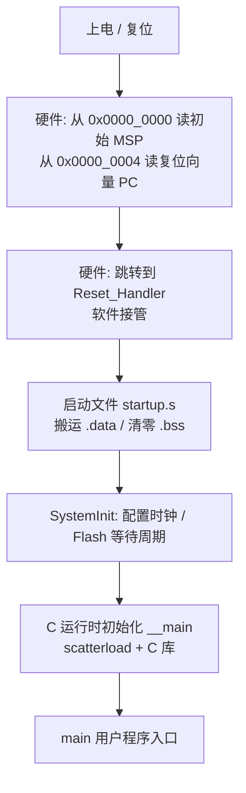

# 嵌入式系统启动流程与 Bootloader 核心笔记

> 本笔记梳理嵌入式系统从上电复位到进入 `main()` 的完整执行路径，以及 Bootloader / IAP 升级的核心原理与安全规范。
>
> 关联笔记：[[ota为什么需要双分区]]（升级分区方案）、[[ota如何保障真正的安全]]（OTA 安全问题清单）

---

## 目录

1. [上电到 main() 的必经之路](#一上电到-main-的必经之路)
2. [Bootloader 与 IAP 核心原理](#二bootloader-与-iap-核心原理)
3. [安全升级策略](#三安全升级策略)
4. [常见通信方式](#四常见通信方式)
5. [避坑指南](#五避坑指南)
6. [学习自检清单](#六学习自检清单)
7. [答案与解析](#七答案与解析)

---

## 一、上电到 main() 的必经之路

单片机上电后**并非直接进入 `main()`**，需经历以下阶段，任何一步出错都会导致系统崩溃。



### 1.1 硬件自动完成的动作（复位序列）

Cortex-M 内核复位后**先由硬件自动完成两步**，不需要任何软件指令干预：

1. 从地址 `0x0000_0000` 取出**初始 MSP**（主栈指针），写入 SP 寄存器；
2. 从地址 `0x0000_0004` 取出**复位向量**（`Reset_Handler` 入口地址），写入 PC 寄存器。

> **为什么先要 MSP 再取 PC？** 因为第一条指令还没执行就可能被 NMI 等异常打断，异常处理要压栈，栈必须先就绪。

**向量表（Vector Table）结构** —— 一张存放在 Flash 起始处的 32 位地址表：

| 偏移 | 内容 | 说明 |
|------|------|------|
| 0x00 | `__initial_sp` | 初始 MSP（**唯一不是函数地址的条目**） |
| 0x04 | `Reset_Handler` | 复位后第一个执行的函数 |
| 0x08 | `NMI_Handler` | 不可屏蔽中断 |
| 0x0C | `HardFault_Handler` | 硬件错误（最高优先级故障） |
| 0x10~0x28 | MemManage / BusFault / UsageFault / 保留 | 各类 Fault |
| 0x2C | `SVC_Handler` | 系统调用（RTOS 入口） |
| 0x38 | `PendSV_Handler` | 可悬起系统调用（RTOS 上下文切换） |
| 0x3C | `SysTick_Handler` | 系统滴答定时器 |
| 0x40+ | `IRQn_Handler` | 外部中断（厂商定义，随芯片型号变化） |

两个关键细节：

- 向量表里放的是**32 位地址而不是跳转指令**（与传统 ARM 在 0 地址放跳转指令不同）；
- 所有向量地址的 **bit0 必须为 1**（Thumb 模式标记），硬件跳转时自动对齐。

**启动模式（以 STM32 为例）**：BOOT 引脚决定哪块存储被重映射到 `0x0000_0000`。

| BOOT 模式 | 映射来源 | 用途 |
|-----------|----------|------|
| 主 Flash | 0x0800_0000（内部 Flash） | 正常运行 |
| 系统存储器 | 内置 ROM（出厂 ISP 代码） | 通过 UART/CAN/USB 烧录（**出厂 Bootloader**） |
| 片上 SRAM | 0x2000_0000 | 调试，掉电丢失 |

### 1.2 启动文件 startup.s —— 软件接管的起点

启动文件是**复位后第一段执行的代码**，主要做三件事：

1. **初始化数据段 (.data)**：把 Flash 中带初值的全局/静态变量拷贝到 RAM；
2. **清零 BSS 段 (.bss)**：未初始化或初值为 0 的变量区域清零，保证程序确定性；
3. **初始化中断向量表**：定义各中断服务程序入口。

> **为什么 .data 要搬到 RAM？** 代码段 (.text) 只读，可以在 Flash 上直接执行（XIP）；但 .data/.bss 会被读写，必须放进 RAM。
> 链接脚本通过 `_sdata/_edata/_sbss/_ebss` 等符号告诉启动代码搬运的起止地址。

`Reset_Handler` 是**弱定义（WEAK）**——用户可以在 C 里重新实现来覆盖默认启动流程（例如提前初始化看门狗）。

### 1.3 SystemInit() —— 配置系统时钟

由厂商库提供（如 `system_stm32f1xx.c`），在进入 C 世界前执行：

- 将 CPU 从低性能的**内部 RC 振荡器（HSI）切换到外部晶振 + PLL** 的高性能模式；
- 设置 AHB/APB 总线分频；
- 配置 **Flash 等待周期**（SYSCLK 越高，取指越需要插入等待周期，否则取指出错）；
- 设置 VTOR（向量表偏移寄存器）。

### 1.4 C 运行时初始化 —— __main

`Reset_Handler` 最终跳转到 C 库入口 `__main`（**注意不是用户的 main**），它内部依次完成：

```text
__main → __scatterload（RW 段从 Flash 复制到 RAM、ZI 段清零）
       → __rt_entry（设置栈/堆、初始化 C 库、C++ 全局构造函数）
       → main()  ← 到这里才是用户程序
```

### 1.5 链接脚本（分散加载）的角色

链接脚本决定了各段落在内存中的布局，是启动流程的"总地图"：

| 段 | 加载地址（Flash） | 运行地址（RAM） | 启动时动作 |
|----|-------------------|-----------------|------------|
| `.isr_vector` | Flash 首地址 | Flash 首地址（XIP） | 硬件直接读取 |
| `.text` / `.rodata` | Flash | Flash（XIP） | 无 |
| `.data` | Flash（存初值） | RAM | **拷贝**（`_sidata` → `_sdata~_edata`） |
| `.bss` | 无 | RAM | **清零**（`_sbss~_ebss`） |
| `_estack` | — | RAM 顶 | 硬件写入 MSP |

```c
/* 链接脚本要点（GCC 语法） */
MEMORY
{
  FLASH (rx)  : ORIGIN = 0x08000000, LENGTH = 2M
  RAM   (rw)  : ORIGIN = 0x20000000, LENGTH = 128K
}

SECTIONS
{
  .isr_vector : { KEEP(*(.isr_vector)) } > FLASH   /* 必须放在 Flash 首地址 */
  .text       : { *(.text) } > FLASH
  .data :
  {
    _sdata = .;
    *(.data)
    _edata = .;
  } > RAM AT > FLASH                                /* 运行在 RAM，初值存在 Flash */
  _sidata = LOADADDR(.data);
  .bss :
  {
    _sbss = .;
    *(.bss)
    _ebss = .;
  } > RAM
}
```

---

## 二、Bootloader 与 IAP 核心原理

### 2.1 Bootloader 的本质

一段独立运行的小程序，是**软硬件的分界线**，核心职责只有两个：

1. **程序搬运（升级）**：接收新固件并写入 Flash；
2. **程序跳转（启动）**：校验后把控制权交给 App。

### 2.2 Flash 自编程 (IAP) 约束

- **不能自擦自写**：运行中的代码不能擦除自己所在的 Flash 区域，否则 CPU 连下一条指令都读不到，程序立即跑飞。因此 **Bootloader 通常不能升级自身**；
- **操作单位**：擦除以**页（Sector）**为单位，写入通常为 32 位（word），且**写前必须先擦**；
- **写入生效前需回读校验**。

### 2.3 跳转至 App 的"五步走"

在跳转到用户程序前必须执行以下操作，否则系统会异常：

| 步骤 | 操作 | 为什么 |
|------|------|--------|
| ① 关全局中断 | `__disable_irq()` | 防止中断向量表切换期间来中断，导致跳转到旧向量表 → 跑飞 |
| ② 复位外设 | 停 SysTick、外设 DeInit、RCC 复位 | 给 App 一个干净的硬件环境，假设上一段代码留了"垃圾" |
| ③ 设 App 栈顶 | 从 App 向量表第 1 个字读 MSP | 不设则硬件错误（HardFault） |
| ④ 切换中断向量表 | `SCB->VTOR = APP_ADDR` | 让中断查找 App 的向量表（**VTOR 地址 0xE000ED08**，STM32 要求 512 字节对齐） |
| ⑤ 跳转 | 取 App 向量表第 2 个字（Reset_Handler 地址）赋给 PC | 让 App 完整走一遍自己的启动流程 |

```c
#define APP_ADDR 0x08008000          /* App 在 Flash 中的起始地址 */

typedef void (*pFunction)(void);

void jump_to_app(void)
{
    uint32_t msp   = *(__IO uint32_t *)APP_ADDR;        /* ① App 栈顶 */
    uint32_t reset = *(__IO uint32_t *)(APP_ADDR + 4);  /* ② App 复位入口 */

    /* ③ 跳到 App 前先清场 */
    __disable_irq();                  /* 关全局中断 */
    SysTick->CTRL = 0;                /* 停 SysTick */
    SysTick->LOAD = 0;
    SysTick->VAL  = 0;
    HAL_RCC_DeInit();                 /* 时钟回到复位状态（内部时钟、无 PLL） */
    HAL_DeInit();                     /* 外设全部复位 */

    /* ④ 切换向量表到 App */
    SCB->VTOR = APP_ADDR;

    /* ⑤ 设栈顶并跳转（永不返回） */
    __set_MSP(msp);
    ((pFunction)reset)();
}
```

**跳转前必须校验 App 合法性（绝不盲跳）**，最简单的方式是检查 App 首地址是否有效：

```c
uint32_t app_msp = *(__IO uint32_t *)APP_ADDR;
if (app_msp == 0xFFFFFFFF) {
    /* Flash 全空 = 没有有效 App，进入升级模式兜底 */
    enter_upgrade_mode();
}
```

> **向量表重定位的两种做法**：
> - Bootloader 跳转时设置（如上代码）—— 跳转前必须保证不再有中断；
> - App 自己的 `SystemInit()` 里设置（`SCB->VTOR = FLASH_BASE | VECT_TAB_OFFSET`）—— 更常见，App 自主性更强。
> 两种都可行，关键原则：**重新使能中断之前，向量表必须已指向正确位置**。

---

## 三、安全升级策略

### 3.1 单区 vs 双区升级

| 方案 | 做法 | 风险 / 优势 |
|------|------|-------------|
| 单区升级 | 直接擦除旧程序写新程序 | 升级中断电 → 固件损坏（**变砖**） |
| 双区（A/B）升级 | 写"非活跃区"，验证通过后切换启动分区 | 任何时刻都有一个可用固件，**防断电变砖** |

双区方案还需要一个 `current` 位记录当前启动分区，且 **Boot Metadata 必须最后修改**（事务思想）。

> 详细推导见 [[ota为什么需要双分区]]。

### 3.2 固件安全校验

| 手段 | 用途 | 特点 |
|------|------|------|
| CRC32 | 传输正确性 | 快速，但**无防篡改能力** |
| SHA256 | 完整性 / 安全启动 | 防篡改，哈希比对 |
| 数字签名 | 认证 | 私钥签名、公钥验签，防伪造 |
| 版本号 | 防降级 | Anti-Rollback（防回滚） |

### 3.3 安全启动 (Secure Boot)

Bootloader 使用**公钥**验证 App 固件的**数字签名**，确保只有经过授权的代码才能运行，防止恶意程序注入。链路为：`签名固件 → 下载 → Bootloader 验签 → 通过才允许运行`。

> OTA 场景下还有断点续传、事务化写入、Trial Boot 回滚、灰度发布等问题，完整清单见 [[ota如何保障真正的安全]]。

---

## 四、常见通信方式

| 方式 | 特点 | 典型协议 |
|------|------|----------|
| UART | 最简单，成本低 | XModem / YModem |
| CAN | 汽车电子标配，可靠 | UDS 诊断协议 |
| USB | 速度快 | DFU（Device Firmware Upgrade） |
| OTA | 物联网设备必备 | 需额外处理传输安全（加密、签名） |

---

## 五、避坑指南

### 5.1 Flash 操作四铁律

1. **写密钥寄存器需连续正确两次**（很多芯片 Flash 控制器要求）；
2. **擦除后校验是否全为 0xFF**，写入后必须回读对比；
3. **跳转前必须复位外设**，假设上一段代码留了"垃圾"；
4. **绝不盲跳**，必须先校验 App 合法性（栈顶有效 + 校验和/签名）。

### 5.2 常见死穴

| 现象 | 原因 |
|------|------|
| 跳转后程序跑飞 | 跳转时没关中断，中断向量表切换期间来中断 |
| HardFault | 栈指针错误（MSP 没从 App 向量表取） |
| 中断不响应 | VTOR 没指向 App 向量表，或地址未按 512 字节对齐 |
| Bootloader 阶段无限重启 | 不喂看门狗 |
| 神秘 HardFault | 栈溢出（先查启动文件的栈大小） |

---

## 六、学习自检清单

看完本笔记后，能不看答案回答以下问题即视为掌握。点击题目跳转到 [[#七答案与解析|答案与解析]]：

- [ ] [[#7.1 上电后硬件自动做了哪两件事？为什么顺序不能反？|上电后硬件自动做了哪两件事？为什么顺序不能反？]]
- [ ] [[#7.2 向量表的第 0、1、2 项分别是什么？为什么第 0 项不是函数地址？|向量表的第 0、1、2 项分别是什么？为什么第 0 项不是函数地址？]]
- [ ] [[#7.3 data 段为什么要从 Flash 搬到 RAM？bss 段为什么要清零？|.data 段为什么要从 Flash 搬到 RAM？.bss 段为什么要清零？]]
- [ ] [[#7.4 SystemInit 和 __main 各负责什么？main 是谁调用的？|`SystemInit()` 和 `__main()` 各负责什么？`main()` 是谁调用的？]]
- [ ] [[#7.5 为什么 Bootloader 不能升级自身？|为什么 Bootloader 不能升级自身？]]
- [ ] [[#7.6 跳转 App 的五步分别是什么？漏掉任一步的后果？|跳转 App 的五步分别是什么？漏掉任一步的后果？]]
- [ ] [[#7.7 VTOR 是什么？地址是多少？为什么跳转时一定要改它？|VTOR 是什么？地址是多少？为什么跳转时一定要改它？]]
- [ ] [[#7.8 单区升级为什么可能变砖？A/B 方案如何解决？|单区升级为什么可能变砖？A/B 方案如何解决？]]
- [ ] [[#7.9 CRC32 / SHA256 / 数字签名 / 版本号各自的防护目标？|CRC32 / SHA256 / 数字签名 / 版本号各自的防护目标？]]

---

## 七、答案与解析

> 建议先独立作答，再点回来看。每题先给结论，再解释"为什么"。

### 7.1 上电后硬件自动做了哪两件事？为什么顺序不能反？

**答**：硬件先从 `0x0000_0000` 读出**初始 MSP** 写入 SP 寄存器；再从 `0x0000_0004` 读出**复位向量**（Reset_Handler 地址）写入 PC 寄存器。

**为什么顺序不能反**：异常（NMI、HardFault）可能在任意时刻到来，异常处理要**压栈保存现场**，栈必须先就绪。若先设 PC 执行指令，第一条指令还没跑完就可能被异常打断，此时无栈可用，系统直接崩溃。

### 7.2 向量表的第 0、1、2 项分别是什么？为什么第 0 项不是函数地址？

**答**：第 0 项 = **初始 MSP**（栈顶地址）；第 1 项 = **Reset_Handler**（复位入口）；第 2 项 = **NMI_Handler**。

**为什么第 0 项不是函数地址**：它在复位时由硬件**直接加载进 MSP 寄存器**，是一个数据值而非跳转目标——栈的建立不需要"调用"动作。而异常/中断需要 CPU 跳转去执行代码，所以向量表其余项都是函数入口地址（且 bit0 置 1 表示 Thumb 模式）。

### 7.3 .data 段为什么要从 Flash 搬到 RAM？.bss 段为什么要清零？

**答**：

- **.data**（带初值的全局/静态变量）：运行期需要**读写**，Flash 只读放不下；所以初值存在 Flash（`_sidata`），启动时由 `__scatterload` 拷贝到 RAM 执行地址（`_sdata ~ _edata`）；
- **.bss**（未初始化/初值为 0 的变量）：不占 Flash 空间，但 C 标准保证全局变量初值为 0，RAM 上电是随机值，所以必须**清零**（`_sbss ~ _ebss`），否则程序行为不确定。

### 7.4 SystemInit() 和 __main() 各负责什么？main() 是谁调用的？

**答**：

- `SystemInit()`：厂商库函数，配置系统时钟（HSI → HSE + PLL）、AHB/APB 分频、Flash 等待周期，并设置 VTOR；
- `__main()`：ARM C 库入口，内部先由 `__scatterload` 完成 .data 拷贝 + .bss 清零，再由 `__rt_entry` 初始化栈/堆和 C 库；
- `main()` 由 **C 运行时（`__main` 链路）调用**——调用它之前 C 运行环境已完全就绪。注意 `__main` 不是用户写的 `main`。

### 7.5 为什么 Bootloader 不能升级自身？

**答**：运行中的代码**不能擦除自己所在的 Flash**——擦除瞬间 CPU 连下一条指令都读不到，程序直接跑飞。因此 Bootloader 要升级自己，只能借助外部手段（烧录器、ROM 引导）或**双 Bank 硬件**支持（一个 Bank 运行、另一个 Bank 被擦写）。

### 7.6 跳转 App 的五步分别是什么？漏掉任一步的后果？

**答**：

| 步骤 | 漏掉的后果 |
|------|-----------|
| ① 关全局中断 | 向量表切换期间来中断，仍查旧向量表 → **跑飞** |
| ② 复位外设（停 SysTick、DeInit） | 外设残留状态干扰 App 初始化（如串口接收标志误触发） |
| ③ 设 MSP（从 App 向量表第 1 个字取） | App 压栈使用 Bootloader 的栈区 → **HardFault** |
| ④ 切换 VTOR 到 App 向量表 | 中断仍查 Bootloader 的向量表 → App 中断处理找不到 → **跑飞** |
| ⑤ 跳转 App 入口（第 2 个字） | 前四步都做了但不校验就跳（盲跳），非法 App 依然会崩溃 |

### 7.7 VTOR 是什么？地址是多少？为什么跳转时一定要改它？

**答**：VTOR（**Vector Table Offset Register**，向量表偏移寄存器）位于系统控制块 SCB 中，地址 **0xE000ED08**，复位值 0（向量表在 0x0000_0000 / Flash 首地址）。App 不在 Flash 首地址，**不改 VTOR 则中断仍从 Bootloader 的向量表取地址** → App 的所有中断全部失效或跑飞。设置时需 512 字节对齐（STM32 要求，架构下限为 128 字节）。

### 7.8 单区升级为什么可能变砖？A/B 方案如何解决？

**答**：单区升级**先擦旧再写新**，若中途断电，Flash 里既无旧固件也无完整新固件 → 无法启动 → **变砖**。A/B 方案在 Flash 中保留**两个固件副本**，新固件写入"非活跃区"，验证通过后**原子切换**启动标志（Boot Metadata 永远最后写 = 事务思想）。任何时刻都至少有一个可用固件，升级失败自动回退旧区。

### 7.9 CRC32 / SHA256 / 数字签名 / 版本号各自的防护目标？

**答**：

| 手段 | 防护目标 | 局限 |
|------|----------|------|
| CRC32 | **传输误码检测**（快速） | 可被轻易伪造，无对抗能力 |
| SHA256 | **完整性**（内容被篡改/损坏） | 攻击者可同时改内容和哈希，防不了恶意固件 |
| 数字签名 | **认证 + 完整性**（私钥签名、公钥验签） | 需要密钥管理，Secure Boot 的基础 |
| 版本号 | **防降级**（Anti-Rollback） | 需结合签名校验防止伪造版本号 |
