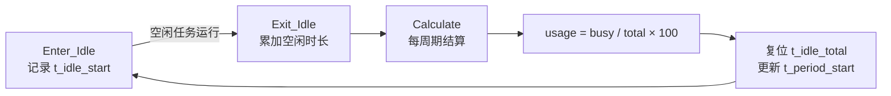

# CPU使用率统计：硬件定时器实现

> 来源：[【嵌解析】CPU使用率怎么算？别信别人封装好的，自己用定时器写一套资源统计。 - 铪珀Harperr](https://zhuanlan.zhihu.com/p/2064022090760591139)（发布于 2026-07-24）

## 为什么"封装好的统计"会骗人

### 案例

工业网关项目（多路电机控制 + 高频无线通信），设备运行不到三天偶发通信丢包。某开源系统自带的 CPU 使用率统计显示 **12.5%**，排查无果后拿示波器硬测 IO 翻转时间，才发现真实 CPU 使用率在某些特定中断并发瞬间**飙到 98% 以上**，系统早已开始丢任务。

### 开源库的通用套路

不管是 RTOS 还是第三方封装库，统计 CPU 使用率的通用原理都是**看空闲任务（Idle Task）分到了多少蛋糕**：

1. 初始化时让空闲任务独自运行一段时间（如 1 秒），数出计数器 `Idle_Count` 的累加值 → 定义为"CPU 完全没事干的最高算力上限"
2. 系统跑起来后，到结算周期再读当前 `Idle_Count`

$$
CPU使用率 = \left(1 - \frac{当前周期的 Idle\_Count}{全空时（无任务）的 Idle\_Count}\right) \times 100\%
$$


### 两个工程巨坑

| 坑 | 原因 | 后果 |
| --- | --- | --- |
| **ISR 时间被蒸发** | 中断触发时 CPU 被 NVIC 强停、压栈、跳转 ISR，但绝大多数 RTOS 里中断执行过程对空闲任务计数器完全"隐身"——中断执行完又回到被抢占的任务，只要那个任务不是空闲任务，计数器就认为"一切正常" | 系统被高频中断（20kHz 电机环、SPI/DMA 通信）榨干 80% 算力，统计数字依然岁月静好 |
| **编译器优化** | `Idle_Count++` 未加 `volatile`，或在 -O3 下，编译器发现"加完没用"直接优化掉，只剩寄存器操作甚至循环体变形 | 拿到的数据与真实 CPU 物理动作脱节 |

## 底层原理：硅片视角的"空闲"定义

- CPU 是否工作，微观上是**时钟信号（Clock Gating）是否推动逻辑门电路电荷翻转**
- 执行指令时：PC 每个时钟上升沿自增，晶体管充放电、功耗上升
- 真正空闲（如执行 `WFI`，Wait For Interrupt）时：内核时钟被切断，时钟树停止翻转，晶体管静态维持

> 所以最精准的统计不是数软件跑了几圈，而是量 **CPU 物理处于 Run Mode 的时间 vs Sleep Mode 的时间比例**。

### 硬件定时器的两个硬性条件

1. **时钟源不受 CPU 降频/休眠影响** —— 必须是独立硬件外设时钟（APB 总线时钟）
2. **足够高的分辨率** —— 系统 Tick 是 1ms 时，定时器计数频率至少 1MHz（微秒级精度）甚至更高

## 工程实现（Cortex-M 示例）

### 1. 配置高精度微秒定时器（TIM2）作为"绝对时间轴"

```c
#include "stm32f4xx.h"  // 根据实际芯片选择

// 初始化高精度统计定时器
void CPU_Stat_Timer_Init(void)
{
    // 1. 开启 TIM2 的外设时钟
    RCC->APB1ENR |= RCC_APB1ENR_TIM2EN;
    // 2. 预分频：APB1 时钟 84MHz 分频 84 → 1MHz 计数频率（1 微秒一步）
    TIM2->PSC = 84 - 1;
    // 3. 自动重装载值设最大，自由狂奔
    TIM2->ARR = 0xFFFFFFFF;
    // 4. 启动计数
    TIM2->CR1 |= TIM_CR1_CEN;
}
```

关键点：**不开启任何定时器中断**，只在后台物理性累加硅片内部时钟脉冲，避开中断污染。

### 2. 在上下文切换处埋伏钩子

无论系统切入/切出空闲任务，都精准记录时间。

```c
// 全局变量（单核 RTOS 安全；双核需加锁防竞争）
volatile uint32_t t_idle_start   = 0;
volatile uint32_t t_idle_total   = 0;
volatile uint32_t t_period_start = 0;
volatile uint8_t  cpu_usage_percent = 0;

// 切入空闲任务时调用（打卡上班摸鱼）
void CPU_Stat_Enter_Idle(void)
{
    t_idle_start = TIM2->CNT;  // 记录进入空闲的物理绝对时间
}

// 从空闲任务切出、或被中断打断时调用（被抓去干活）
void CPU_Stat_Exit_Idle(void)
{
    uint32_t t_current = TIM2->CNT;
    if (t_current >= t_idle_start) {
        t_idle_total += (t_current - t_idle_start);
    } else {
        // 处理 32 位整型物理溢出的极端情况
        t_idle_total += (0xFFFFFFFF - t_idle_start + t_current + 1);
    }
}

// 周期性结算（如每隔 1 秒由低优先级任务调用，或在 SysTick 里结算）
void CPU_Stat_Calculate(void)
{
    uint32_t t_now = TIM2->CNT;
    uint32_t total_period = 0;

    if (t_now >= t_period_start) {
        total_period = t_now - t_period_start;
    } else {
        total_period = 0xFFFFFFFF - t_period_start + t_now + 1;
    }

    if (total_period > 0) {
        // 核心哲学：CPU使用率 = 1 - (空闲时间 / 总时间)
        if (t_idle_total > total_period)
            t_idle_total = total_period;  // 边界防御

        uint32_t busy_time = total_period - t_idle_total;
        // 规避浮点运算：嵌入式能用整型就别用 float（防 FPU 异常/拖慢结算）
        cpu_usage_percent = (uint8_t)((busy_time * 100) / total_period);
    }

    // 状态复位，开启下一个周期的统计
    t_idle_total = 0;
    t_period_start = TIM2->CNT;
}
```

### 高明之处

- 依赖内核调度底层钩子：不论任务主动让出 CPU，还是硬件中断强行剥夺，只要离开空闲任务上下文，`CPU_Stat_Exit_Idle` 必然触发
- 隐藏的高频中断消耗的时间**不计入 `t_idle_total`**，结算时自动归类到 `busy_time`，让伪装成"优良代码"的频繁中断露出马脚



## 认知升维：低功耗靠"精准控制"而非"省"

- **误区**：低功耗 = 选低功耗芯片 + 降主频
- **反例**：主频从 168MHz 降到 16MHz，电流变小，但原本 1ms 处理完的任务要跑 10ms，期间外设全面开启，整体功耗反而可能恶化
- **正解**：CPU 全速狂奔，用最快时间干完活，**立刻进入深度休眠**；休眠控制得精不精准，正需要本文这套微秒级资源统计来验证（空闲占比稳步提升、中断时间被清晰剥离 = 掌控感建立）

## 延伸思考（原文留题）

在多核异构处理器（如 Cortex-M4 + Cortex-A7 同芯片）或支持 DVFS（动态电压频率调整）的系统中，主频随时变化，固定硬件定时器的统计方法是否失效？若失效，应从哪个硬件寄存器抓取真正的"时间锚点"？

## 参考

- 原文：[【嵌解析】CPU使用率怎么算？别信别人封装好的，自己用定时器写一套资源统计。 - 铪珀Harperr（知乎）](https://zhuanlan.zhihu.com/p/2064022090760591139)
- 相关概念：上下文切换钩子、Idle 任务、WFI 低功耗指令、Cortex-M TIM 外设

## 相关笔记

- [[Tickless IDLE]] — 空闲期间停止 SysTick 并进入深度睡眠的低功耗机制（同为"空闲状态"的硬件级处理）
- [[FreeRTOS链表实现与调度]] — RTOS 调度与上下文切换的底层实现
- [[低功耗的评估标准]] — 低功耗设计的评估维度
