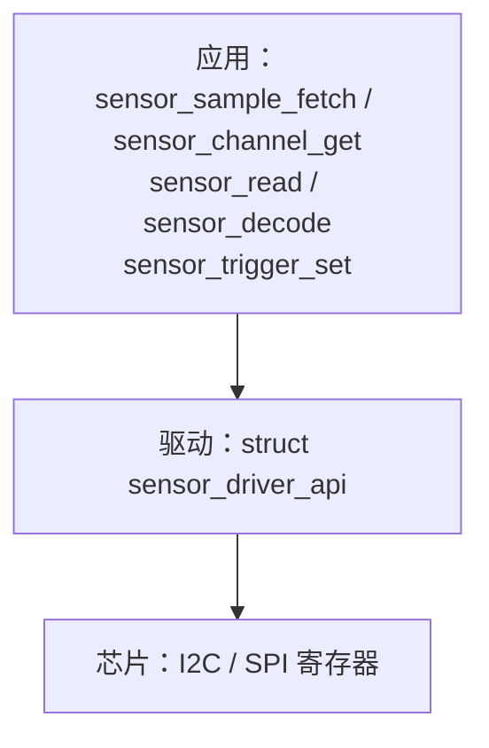
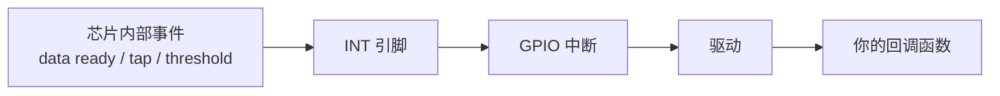
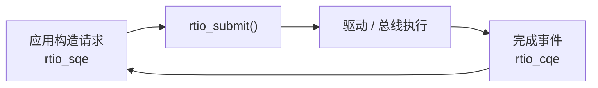

# Zephyr Sensor API

> 对照 Zephyr 4.x（main 分支），内容与 `include/zephyr/drivers/sensor.h`、官方文档逐条核对。
> 前置笔记：[[01-Zephyr-核心API]]、[[02-Zephyr-项目结构与构建配置]]、[[03-Zephyr-设备树与驱动开发]]、[[05-Zephyr-官方组件用法]]。

## 目录

1. [整体模型](#1-整体模型)
2. [设备树接入](#2-设备树接入)
3. [Fetch and Get](#3-fetch-and-get)
4. [Attributes 配置](#4-attributes-配置)
5. [Triggers 触发器](#5-triggers-触发器)
6. [Read and Decode 与 RTIO](#6-read-and-decode-与-rtio)
7. [电源管理](#7-电源管理)
8. [sensor shell](#8-sensor-shell)
9. [驱动侧接口](#9-驱动侧接口)
10. [资料索引](#10-资料索引)

---

## 1. 整体模型

Sensor API 为各种测量物理量的设备提供统一接口：统一的读取方式、统一的配置方式、统一的事件处理。应用代码、驱动、芯片三层的关系如下：



### 1.1 三个概念

| 概念 | 对应枚举 | 含义 |
| --- | --- | --- |
| Channel | `enum sensor_channel` | 设备能测什么 |
| Attribute | `enum sensor_attribute` | 设备的可配置项与元数据 |
| Trigger | `enum sensor_trigger_type` | 设备能产生什么事件 |

### 1.2 sensor_value

读出来的数值用 `struct sensor_value` 表示，是定点格式：

```c
struct sensor_value {
    int32_t val1;   /* 整数部分 */
    int32_t val2;   /* 小数部分，单位为百万分之一 */
};
```

数值 = `val1 + val2 × 10⁻⁶`：

| 实际数值 | val1 | val2 |
| --- | --- | --- |
| 0.5 | 0 | 500000 |
| -0.5 | 0 | -500000 |
| -1.0 | -1 | 0 |
| -1.5 | -1 | -500000 |

转成 double 打印用 `sensor_value_to_double()`。

### 1.3 Channel

通道枚举覆盖常见物理量，单位写在枚举注释里：

| 物理量 | 通道 | 单位 |
| --- | --- | --- |
| 加速度 | `SENSOR_CHAN_ACCEL_X / _Y / _Z / _XYZ` | m/s² |
| 角速度 | `SENSOR_CHAN_GYRO_X / _Y / _Z / _XYZ` | rad/s |
| 磁场 | `SENSOR_CHAN_MAGN_X / _Y / _Z / _XYZ` | G |
| 环境温度 | `SENSOR_CHAN_AMBIENT_TEMP` | ℃ |
| 芯片温度 | `SENSOR_CHAN_DIE_TEMP` | ℃ |
| 压力 | `SENSOR_CHAN_PRESS` | kPa |
| 湿度 | `SENSOR_CHAN_HUMIDITY` | % |
| 光照 | `SENSOR_CHAN_LIGHT` / `AMBIENT_LIGHT` | lux |
| 距离 | `SENSOR_CHAN_DISTANCE` | m |
| 电压 / 电流 | `SENSOR_CHAN_VOLTAGE` / `CURRENT` | V / A |
| 转速 | `SENSOR_CHAN_RPM` | RPM |
| 电池计 | `SENSOR_CHAN_GAUGE_*` 系列 | V / A / mAh / % |
| 编码器 | `SENSOR_CHAN_ENCODER_COUNT` | 计数 |

- `_XYZ` 是组合通道：一次调用填满 `val[0]`、`val[1]`、`val[2]`，对应 X / Y / Z。
- `SENSOR_CHAN_ALL` 表示全部通道，`sensor_sample_fetch()` 内部传的就是它。
- 判断通道类别的宏：`SENSOR_CHANNEL_3_AXIS(chan)`、`SENSOR_CHANNEL_IS_ACCEL(chan)`、`SENSOR_CHANNEL_IS_GYRO(chan)`。
- 芯片专有通道从 `SENSOR_CHAN_PRIV_START` 开始编号，定义在芯片驱动的头文件里（如 `include/zephyr/drivers/sensor/bmi270.h`）。

### 1.4 sensor_chan_spec

Zephyr 3.7 引入 `struct sensor_chan_spec`，用于描述"同一类通道的多个实例"（例如多个温度测点）：

```c
struct sensor_chan_spec {
    uint16_t chan_type;   /* enum sensor_channel */
    uint16_t chan_idx;    /* 同类通道的序号 */
};
```

只传 `enum sensor_channel` 的写法属于旧接口。

### 1.5 两套读取接口

官方文档明确说明：读取传感器数据有两套接口，Fetch and Get（长期稳定）与 Read and Decode（较新，将来会取代前者）。触发器的处理方式在两者里完全不同，分别见第 3 章和第 6 章。

---

## 2. 设备树接入

传感器节点除 `compatible` 和 `reg` 之外，binding 还允许一组初始硬件配置，上电初始化时使用。以官方文档的 ICM42688 为例：

```dts
accel_gyro0: icm42688p@0 {
    compatible = "invensense,icm42688", "invensense,icm4268x";
    reg = <0>;
    int-gpios = <&pioc 6 GPIO_ACTIVE_HIGH>;  /* 中断线，用 trigger 时需要 */
    spi-max-frequency = <DT_FREQ_M(24)>;
    accel-pwr-mode = <ICM42688_ACCEL_LN>;    /* 低噪声模式 */
    accel-odr = <ICM42688_ACCEL_ODR_2000>;   /* 2000 Hz 采样 */
    accel-fs = <ICM42688_ACCEL_FS_16>;       /* 16G 量程 */
    gyro-pwr-mode = <ICM42688_GYRO_LN>;
    gyro-odr = <ICM42688_GYRO_ODR_2000>;
    gyro-fs = <ICM42688_GYRO_FS_16>;
};
```

- `accel-odr`、`accel-fs` 这类属性是上电初始状态，运行起来之后可以用 attribute 再改。
- Kconfig 除 `CONFIG_SENSOR=y` 外还有驱动自身的选项，名字要查驱动目录下的 Kconfig 源文件。
- 查找流程沿用 [[03-Zephyr-设备树与驱动开发]] 的五步命令。

---

## 3. Fetch and Get

### 3.1 三个核心函数

| 函数 | 作用 |
| --- | --- |
| `sensor_sample_fetch(dev)` | 读取全部通道，存入驱动实例的私有数据 |
| `sensor_sample_fetch_chan(dev, chan)` | 只读取指定类型的通道 |
| `sensor_channel_get(dev, chan, &val)` | 从私有数据取值，不访问总线 |

```c
const struct device *dev = DEVICE_DT_GET(DT_ALIAS(accel0));
struct sensor_value accel[3];

sensor_sample_fetch(dev);                              /* 读全部通道 */
sensor_channel_get(dev, SENSOR_CHAN_ACCEL_XYZ, accel); /* 取三轴，填 accel[0..2] */

printk("%f %f %f\n", sensor_value_to_double(&accel[0]),
       sensor_value_to_double(&accel[1]), sensor_value_to_double(&accel[2]));
```

### 3.2 使用要点

- fetch 是阻塞调用，调用者必须是线程；挂在 I2C / SPI 上的设备在 ISR（中断服务程序）里调用不安全——trigger 注册的回调不在此列，它运行在线程上下文里，见第 5 章。
- 一次 fetch 之后可以反复 get，数值不变（读的是驱动缓存）；再次 fetch 才更新。
- 官方警告：多个上下文同时 fetch / get 没有内置保护，驱动不提供互斥，需要应用自己加锁。
- 适合低频轮询。

### 3.3 单位换算辅助函数

sensor.h 里提供的转换函数：

| 函数 | 作用 |
| --- | --- |
| `sensor_ms2_to_g()` / `sensor_g_to_ms2()` | 加速度 m/s² ↔ g |
| `sensor_ms2_to_mg()` / `sensor_ms2_to_ug()` / `sensor_ug_to_ms2()` | 加速度与毫克 / 微克单位的换算 |
| `sensor_rad_to_deg()` | 弧度 → 角度 |
| `sensor_value_to_double()` | sensor_value → double |

常量：`SENSOR_G`（9806650，单位 micro m/s²）、`SENSOR_PI`（3141592，单位 micro）。

---

## 4. Attributes 配置

attribute 作用于"设备 + 通道"组合，读写用 `sensor_attr_get()` / `sensor_attr_set()`：

```c
struct sensor_value rate;

sensor_attr_get(dev, SENSOR_CHAN_ACCEL_XYZ, SENSOR_ATTR_SAMPLING_FREQUENCY, &rate);

rate.val1 = 200;   /* 200 Hz */
rate.val2 = 0;
sensor_attr_set(dev, SENSOR_CHAN_ACCEL_XYZ, SENSOR_ATTR_SAMPLING_FREQUENCY, &rate);
```

常见 attribute：

| attribute | 含义 |
| --- | --- |
| `SENSOR_ATTR_SAMPLING_FREQUENCY` | 采样率 |
| `SENSOR_ATTR_FULL_SCALE` | 量程（SI 单位） |
| `SENSOR_ATTR_OVERSAMPLING` | 过采样倍数 |
| `SENSOR_ATTR_OFFSET` | 读数偏移，最终值 = 原值 + offset |
| `SENSOR_ATTR_GAIN` / `SENSOR_ATTR_RESOLUTION` | 增益 / 分辨率 |
| `SENSOR_ATTR_CALIB_TARGET` / `SENSOR_ATTR_CALIBRATION` | 校准目标 / 校准值 |
| `SENSOR_ATTR_SLOPE_TH` / `SENSOR_ATTR_SLOPE_DUR` | 运动检测的斜率阈值与持续时间 |
| `SENSOR_ATTR_LOWER_THRESH` / `SENSOR_ATTR_UPPER_THRESH` / `SENSOR_ATTR_HYSTERESIS` | 阈值触发相关 |
| `SENSOR_ATTR_BATCH_DURATION` | 硬件批处理时长 |
| `SENSOR_ATTR_CHIP_ID` | 芯片 ID |
| `SENSOR_ATTR_FF_DUR` | 自由落体判定时长 |

- 驱动支持哪些项由它自己的 `attr_set` / `attr_get` 实现决定：没实现的分支返回 `-ENOSYS`。
- 常见写法是先 get 探测，拿到 0 或失败再设默认值——`samples/sensor/accel_polling` 里的 `set_sampling_freq()` 就是这个模式。
- 芯片私有 attribute 从 `SENSOR_ATTR_PRIV_START` 开始编号。

---

## 5. Triggers 触发器

数据通路：芯片检测到事件 → 拉 INT 引脚 → GPIO 中断 → 驱动的处理 → 注册的回调函数。



### 5.1 注册方式

```c
static struct sensor_trigger trig = {
    .type = SENSOR_TRIG_DATA_READY,
    .chan = SENSOR_CHAN_ACCEL_XYZ,
};

static void handler(const struct device *dev, const struct sensor_trigger *t)
{
    sensor_sample_fetch(dev);   /* 取数据，同时清除芯片的中断标志 */
    k_sem_give(&sem);           /* 把处理工作交给线程 */
}

sensor_trigger_set(dev, &trig, handler);
```

### 5.2 要点

- **回调不在中断上下文里运行**。芯片事件触发 INT 引脚后，驱动的 ISR 只做最少的工作（记录事件、唤醒线程），然后在**线程**里调用回调——所以回调里执行 `sensor_sample_fetch()` 这类 I2C / SPI 操作是安全的，各驱动正是靠回调里的 fetch 取数据并清除芯片的中断标志。第 3 章说的"不能在中断里 fetch"针对的是把 fetch 直接写进 ISR 的情形。
- 驱动保存的是 `struct sensor_trigger` 的**指针**，目的是让回调里能用 `CONTAINER_OF()` 取回自己定义的上下文。trigger 对象不能定义在函数内部（生命周期不够长），要做成静态变量或嵌入更大的结构体。
- 回调运行在哪个线程由驱动的 Kconfig 选择。以 BMI160 为例有三个选项：`CONFIG_BMI160_TRIGGER_NONE`（不启用）、`CONFIG_BMI160_TRIGGER_GLOBAL_THREAD`（系统工作队列）、`CONFIG_BMI160_TRIGGER_OWN_THREAD`（驱动专用线程）。专用线程有独立的内存空间与优先级，不会被系统工作队列里的其他工作拖延；工作队列方式可能引入排队延迟。
- 回调所在线程的可用内存由驱动设定、容量有限，回调里不要做占用大量内存的操作。
- `sensor_trigger_set()` 不能在用户模式线程里调用。
- 回调里要及时返回：标准模式是 fetch 清中断标志，再通过信号量把处理交给线程。
- 中断发生到回调执行之间存在不确定的延迟，使用工作队列时延迟还可能加大。

### 5.3 触发器类型

| 类型 | 触发条件 |
| --- | --- |
| `SENSOR_TRIG_DATA_READY` | 新数据就绪 |
| `SENSOR_TRIG_THRESHOLD` | 读数越过阈值 |
| `SENSOR_TRIG_DELTA` | 读数明显变化（常用于 any-motion 检测） |
| `SENSOR_TRIG_TAP` / `SENSOR_TRIG_DOUBLE_TAP` | 单击 / 双击 |
| `SENSOR_TRIG_FREEFALL` | 自由落体 |
| `SENSOR_TRIG_MOTION` / `SENSOR_TRIG_STATIONARY` | 检测到运动 / 长时间无运动 |
| `SENSOR_TRIG_NEAR_FAR` | 接近 / 远离事件 |
| `SENSOR_TRIG_FIFO_WATERMARK` / `SENSOR_TRIG_FIFO_FULL` | FIFO 到达水位 / 已满 |
| `SENSOR_TRIG_TIMER` | 定时触发（芯片没有中断线时可用） |
| `SENSOR_TRIG_TILT` / `SENSOR_TRIG_OVERFLOW` | 倾斜 / 数据溢出 |

阈值类触发器要先通过 attribute 配参数：`SENSOR_TRIG_DELTA` 配 `SLOPE_TH` / `SLOPE_DUR`；`SENSOR_TRIG_THRESHOLD` 配 `LOWER_THRESH` / `UPPER_THRESH` / `HYSTERESIS`。

---

## 6. Read and Decode 与 RTIO

### 6.1 这套接口解决的问题

官方文档列出的设计目标：

- 读取在实现上是异步的，可以从中断、工作队列、线程任意上下文发起，不需要专用线程。
- 一个上下文可以同时对多个传感器发起读取。
- 支持硬件 FIFO 批量搬运、ping-pong 双缓冲。
- 原始编码数据可以先不解码，之后处理或者搬给别的处理器。
- 解码可以在用户模式（内存受保护）线程里做。
- 更好地支持同一设备的多个同类通道。

### 6.2 RTIO 模型

RTIO 是 Zephyr 的异步 IO 执行框架，模型来自 Linux 的 io_uring：



三个核心名词：提交队列条目 `rtio_sqe`、完成队列条目 `rtio_cqe`、IO 设备抽象 `rtio_iodev`。`sensor_read()` 内部就是"构造一个读请求、提交、等待完成"。

### 6.3 定义读取端点与读取

用宏把"设备 + 通道列表"固定成一个读取端点：

```c
SENSOR_DT_READ_IODEV(accel_iodev, DT_ALIAS(accel0),
                     {SENSOR_CHAN_ACCEL_XYZ, 0});

RTIO_DEFINE(ctx, 4, 4);

uint8_t buf[128];
sensor_read(&accel_iodev, &ctx, buf, sizeof(buf));   /* 阻塞读，返回时数据在 buf 里 */
```

非阻塞读取的缓冲区由 RTIO 内存池提供，完成事件在回调里处理：

```c
sensor_read_async_mempool(&accel_iodev, &ctx, userdata);
sensor_processing_with_callback(&ctx, my_callback);  /* 循环等待完成事件并回调 */
```

这套接口需要 `CONFIG_SENSOR_ASYNC_API=y`。

### 6.4 解码

读到的是驱动按自己格式写入的编码数据。缓冲区开头是通用头 `struct sensor_data_generic_header`，记录时间戳、通道数、所有样本的公共移位值 shift、通道列表；解码器据此把后面的原始样本还原成 q31 定点向量（Q1.31 表示法，在无浮点单元的芯片上运算快、结果可重复）。

```c
const struct sensor_decoder_api *decoder;
struct sensor_three_axis_data data;
uint32_t fit = 0;

sensor_get_decoder(dev, &decoder);
decoder->decode(buf, (struct sensor_chan_spec){SENSOR_CHAN_ACCEL_XYZ, 0},
                &fit, 1, &data);
```

- `fit` 是帧迭代器：一个缓冲区里可能有 FIFO 的多帧数据，重复调用 decode 时靠它推进到下一帧；`max_count` 是本次最多解码几帧。
- 驱动没有提供解码器时，`sensor_get_decoder()` 返回默认解码器 `__sensor_default_decoder`。
- 解码器接口里的函数：`get_frame_count`（某通道有多少帧）、`get_size_info`（解码所需空间）、`decode`（解码）、`has_trigger`（缓冲里是否含某个触发器事件）。

更省事的封装：

```c
struct sensor_decode_context ctx = SENSOR_DECODE_CONTEXT_INIT(
    decoder, buf, SENSOR_CHAN_ACCEL_XYZ, 0);

int n;
do {
    struct sensor_three_axis_data out;
    n = sensor_decode(&ctx, &out, 1);
} while (n > 0);
```

### 6.5 流式读取

流式把触发器变成数据流：定义流端点、挂上要监听的事件，启动后事件与数据一起进入完成队列。

```c
SENSOR_DT_STREAM_IODEV(imu_stream, DT_ALIAS(imu),
                       {SENSOR_TRIG_FIFO_WATERMARK, SENSOR_STREAM_DATA_INCLUDE},
                       {SENSOR_TRIG_FIFO_FULL, SENSOR_STREAM_DATA_NOP});

struct rtio_sqe *handle;

sensor_stream(&imu_stream, &ctx, NULL, &handle);   /* 开始 */
/* ... 处理完成事件 ... */
rtio_sqe_cancel(handle);                            /* 停止 */
```

每个事件带一个数据处理选项：

| 选项 | 行为 |
| --- | --- |
| `SENSOR_STREAM_DATA_INCLUDE` | 事件和数据一起取出 |
| `SENSOR_STREAM_DATA_NOP` | 只取事件，数据留在芯片里稍后再取 |
| `SENSOR_STREAM_DATA_DROP` | 丢弃数据 |

### 6.6 与 Fetch and Get 的对照

| | Fetch and Get | Read and Decode |
| --- | --- | --- |
| 读取方式 | `sensor_sample_fetch` + `sensor_channel_get`，阻塞 | `sensor_read` / `sensor_read_async_mempool`，基于 RTIO |
| 数据形态 | 解码后的 `sensor_value` | 编码数据，解码为 q31 定点向量 |
| 触发器处理 | 回调函数 | 事件入队，应用在完成队列里消费 |
| 多传感器 | 顺序逐个读取 | 一个上下文并发发起 |
| 用户模式 | 不支持 | 支持在用户模式线程里处理 |
| 适用场景 | 低频轮询、简单场景 | FIFO、批量数据、多传感器、数据流 |

---

## 7. 电源管理

传感器通常有多个功耗状态（低功耗、低噪声、挂起），分两个层面处理：

- 通道级：采样率、功耗模式等通过 attribute 修改，很多是芯片私有 attribute。
- 设备级：整个设备的挂起与恢复用运行时电源管理 `pm_device_runtime_get(dev)` / `pm_device_runtime_put(dev)`，官方说明这是传感器完全挂起 / 恢复的推荐方式。

策略属于应用层：不采样时挂起、采样前恢复。有的设备挂起后会丢失寄存器配置，恢复后需要重新配置。

---

## 8. sensor shell

在开发板上快速验证传感器的手段：

```conf
CONFIG_SENSOR_SHELL=y            # 依赖 SHELL，会自动打开 CONFIG_SENSOR_ASYNC_API
CONFIG_SENSOR_SHELL_STREAM=y     # 增加 stream 子命令
CONFIG_SENSOR_INFO=y             # 增加 info 子命令
```

| 命令 | 作用 |
| --- | --- |
| `sensor info` | 列出所有传感器的厂商、型号、名称 |
| `sensor get <dev> [channel ...]` | 读数据，不写通道就读全部 |
| `sensor attr_get <dev> ...` | 读属性 |
| `sensor attr_set <dev> ...` | 写属性 |
| `sensor trig <dev> ...` | 触发器操作 |
| `sensor stream <dev> ...` | 流式输出 |

shell 运行在管理员模式，设备名写错会直接触发硬件异常（官方 README 明确提示），使用前先用 `sensor info` 确认设备名。

---

## 9. 驱动侧接口

应用侧的所有调用最终落到 `struct sensor_driver_api`：

```c
struct sensor_driver_api {
    sensor_attr_set_t attr_set;         /* 可选 */
    sensor_attr_get_t attr_get;         /* 可选 */
    sensor_trigger_set_t trigger_set;   /* 可选 */
    sensor_sample_fetch_t sample_fetch; /* 必需 */
    sensor_channel_get_t channel_get;   /* 必需 */
    sensor_get_decoder_t get_decoder;   /* 可选，Read and Decode 用 */
    sensor_submit_t submit;             /* 可选，RTIO 提交 */
};
```

官方对驱动实现的规范：

- `sample_fetch` 实现为阻塞调用，把指定通道（或全部）存进驱动实例数据。
- `channel_get` 不产生副作用，只从已保存的数据换算。
- `trigger_set` 保存 trigger 的地址。
- Read and Decode 侧：`submit` 必须非阻塞，尽量用 RTIO 完成总线传输；`decoder` 必须是无状态纯函数，把原始数据换算成定点 SI 值所需的信息全部放在缓冲区里。

注册设备实例用 `SENSOR_DEVICE_DT_INST_DEFINE()`。驱动可以放在应用工程目录里（在 `CMakeLists.txt` 中加入编译）验证，不必修改 Zephyr 源码树。

不接硬件验证驱动逻辑的手段是 emulator：Zephyr 里很多传感器驱动配有模拟器（`<chip>_emul.c`），配合 I2C / SPI 模拟总线（`CONFIG_I2C_EMUL` / `CONFIG_SPI_EMUL`）使用，`tests/drivers/sensor/` 下的驱动测试就是这么跑的（例如 bmi160 的测试限定在 native_sim 平台）。

---

## 10. 资料索引

| 内容 | 位置 |
| --- | --- |
| 官方文档总入口 | https://docs.zephyrproject.org/latest/hardware/peripherals/sensor/index.html （Attributes、Channels、Triggers、Power Management、Device Tree、Fetch and Get、Read and Decode 各一节，末尾有 Implementing Sensor Drivers） |
| API 头文件 | `zephyr/include/zephyr/drivers/sensor.h` |
| 驱动源码 | `zephyr/drivers/sensor/<厂商>/<芯片>/` |
| 轮询示例 | `samples/sensor/accel_polling`、`samples/sensor/bme280`、`samples/sensor/magn_polling` |
| 触发示例 | `samples/sensor/accel_trig`、`samples/sensor/6dof_motion_drdy` |
| 流式示例 | `samples/sensor/accel_stream`、`samples/sensor/6dof_fifo_stream` |
| 文档内嵌示例 | `doc/hardware/peripherals/sensor/` 下的 `temp_polling.c`、`multiple_temp_polling.c`、`accel_stream.c`、`tap_count.c` |
| shell | `drivers/sensor/sensor_shell.c`、`samples/sensor/sensor_shell` |
| 驱动测试（emulator） | `tests/drivers/sensor/` |
| RTIO 文档 | https://docs.zephyrproject.org/latest/services/rtio/index.html |

## 关联笔记

- [[01-Zephyr-核心API]]——线程、信号量、工作队列（trigger 回调与采集线程的基础）
- [[03-Zephyr-设备树与驱动开发]]——binding、compatible 与驱动查找流程
- [[05-Zephyr-官方组件用法]]——zbus（把传感器数据发布给其他模块时使用）
- [[嵌入式设计模式-事件总线]]——zbus 的底层实现分析
