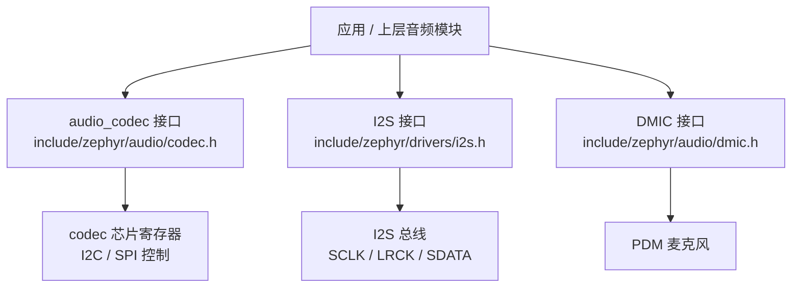
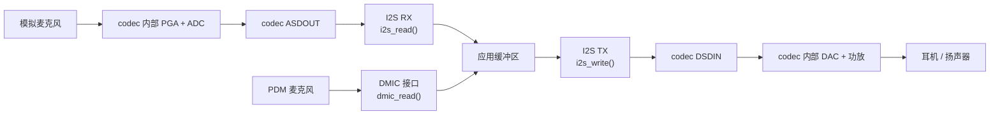
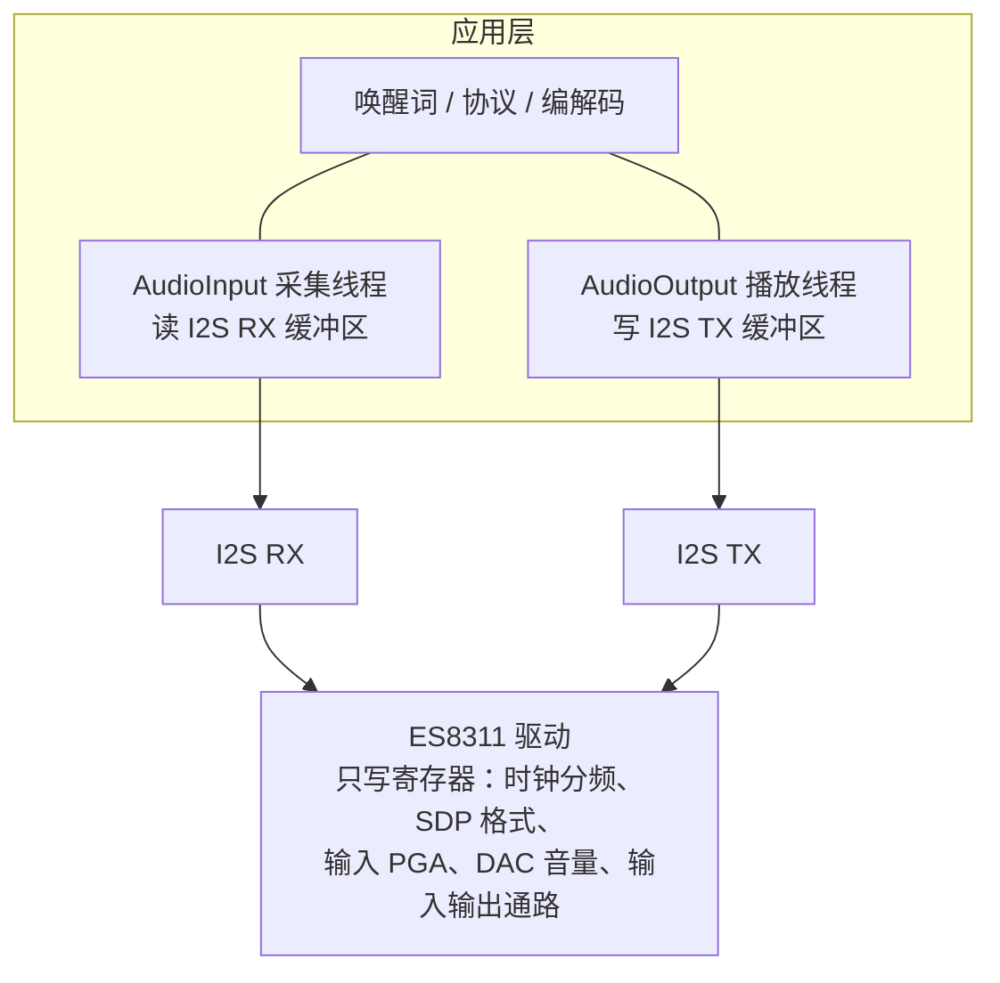

# Zephyr Audio Codec API

> 对照 Zephyr main 分支（含 4.3 的内容）逐条核对：`include/zephyr/audio/codec.h` 完整定义、`drivers/audio/` 下的真实驱动、`samples/drivers/audio/codec` 与 `samples/drivers/i2s/i2s_codec` 两个官方示例、`include/zephyr/drivers/dai.h`。
> 前置笔记：[[01-Zephyr-核心API]]、[[03-Zephyr-设备树与驱动开发]]、[[06-Zephyr-Sensor-API]]。

## 目录

1. [接口定位](#1-接口定位)
2. [驱动操作表](#2-驱动操作表)
3. [配置数据结构](#3-配置数据结构)
4. [播放与采集分别走哪条通路](#4-播放与采集分别走哪条通路)
5. [应用侧两种用法](#5-应用侧两种用法)
6. [自己写一个 codec 驱动](#6-自己写一个-codec-驱动)
7. [映射到 xiaozhi-zephyr](#7-映射到-xiaozhi-zephyr)
8. [资料索引](#8-资料索引)

---

## 1. 接口定位

头文件是 `include/zephyr/audio/codec.h`，不在 `drivers/` 目录下，内容来自 Intel 2018 年的提交。它在开头包含两个头文件：

```c
#include <errno.h>
#include <zephyr/drivers/i2s.h>
```

包含 `i2s.h` 的原因是配置结构里直接嵌入了一份 `struct i2s_config`，见第 3 章。

子系统名字是 `audio_codec`，驱动用 `DEVICE_API(audio_codec, xxx_driver_api)` 声明自己的操作表。旧代码里的 `struct audio_codec_api` 是同一个类型的旧别名：

```c
#define audio_codec_api audio_codec_driver_api __DEPRECATED_MACRO
```

codec shell 判定设备类型用的也是子系统名字：`DEVICE_API_IS(audio_codec, dev)`。

这个接口把两类职责放在同一张操作表里：设备级配置（音量、静音、路由、时钟）与链路级数据操作（启停、写入、完成回调）。后一组是 2025 年底随 SiFli SF32LB52x codec 驱动一起加进来的，上游评审在 issue #98701 里提出意见：流控与回调这类职责更适合交给 `zephyr/drivers/dai.h` 的 DAI 层，codec 层只保留设备级配置。



## 2. 驱动操作表

`struct audio_codec_driver_api` 共 13 个函数指针，官方文档写明：REQ 标记的成员驱动必须赋值，OPT 标记的成员可以不赋值。

```c
struct audio_codec_driver_api {
    audio_codec_configure_t configure;                       /* REQ */
    audio_codec_start_output_t start_output;                 /* REQ */
    audio_codec_stop_output_t stop_output;                   /* REQ */
    audio_codec_set_property_t set_property;                 /* REQ */
    audio_codec_apply_properties_t apply_properties;         /* REQ */
    audio_codec_clear_errors_t clear_errors;                 /* OPT */
    audio_codec_register_error_callback_t register_error_callback; /* OPT */
    audio_codec_route_input_t route_input;                   /* OPT */
    audio_codec_route_output_t route_output;                 /* OPT */
    audio_codec_start_t start;                               /* OPT */
    audio_codec_stop_t stop;                                 /* OPT */
    audio_codec_write_t write;                               /* OPT */
    audio_codec_register_done_callback_t register_done_callback;   /* OPT */
};
```

| 操作 | 必需 | 签名要点 | 作用 |
| --- | --- | --- | --- |
| `configure` | 是 | `(dev, struct audio_codec_cfg *cfg)` | 按配置结构写芯片寄存器 |
| `start_output` | 是 | `(dev)`，返回 void | 开始播放 |
| `stop_output` | 是 | `(dev)`，返回 void | 停止播放 |
| `set_property` | 是 | `(dev, property, channel, val)` | 设置音量、静音、EQ 等属性 |
| `apply_properties` | 是 | `(dev)` | 把缓存起来的属性一次性生效 |
| `clear_errors` | 否 | `(dev)` | 清除错误状态 |
| `register_error_callback` | 否 | `(dev, cb)` | 注册错误回调 |
| `route_input` | 否 | `(dev, channel, uint32_t input)` | 选择一个输入通道的信号来源 |
| `route_output` | 否 | `(dev, channel, uint32_t output)` | 选择一个输出通道的信号来源 |
| `start` | 否 | `(dev, audio_dai_dir_t dir)` | 按方向启停播放或采集 |
| `stop` | 否 | `(dev, audio_dai_dir_t dir)` | 按方向停止播放或采集 |
| `write` | 否 | `(dev, uint8_t *data, size_t data_size)` | 提交一个 block_size 的播放数据 |
| `register_done_callback` | 否 | `(dev, tx_cb, tx_cb_data, rx_cb, rx_cb_data)` | 注册 TX / RX 完成回调 |

上层包装函数对两类操作的处理方式不同：

- 必需操作直接调用，不检查空指针，例如 `audio_codec_configure()` 里就是 `api->configure(dev, cfg)`。
- 可选操作先判空，空指针时返回 `-ENOSYS`，例如 `audio_codec_write()`、`audio_codec_start()`。
- `audio_codec_start_output()` 与 `audio_codec_stop_output()` 的返回值是 void，调用方拿不到失败信息。

必需只要求驱动提供函数，不要求函数有实质动作。wm8962 驱动里两个播放函数就是这样：

```c
static void wm8962_start_output(const struct device *dev)
{
	/* Not supported */
}
```

wm8962 的播放启停实际由应用侧对 I2S 设备调用 `i2s_trigger()` 完成，codec 侧在 `configure` 阶段就把 DAC 通路和电源序列打开了。

错误上报通路：`audio_codec_error_callback_t` 的参数是错误位图，`enum audio_codec_error_type` 定义了五个位：`AUDIO_CODEC_ERROR_OVERCURRENT`、`OVERTEMPERATURE`、`UNDERVOLTAGE`、`OVERVOLTAGE`、`DC`。

数据完成通路：`register_done_callback` 一次注册两个回调，TX 回调签名是 `(dev, void *user_data)`，RX 回调签名是 `(dev, uint8_t *buf, uint32_t len, void *user_data)`，采集到的数据直接通过 RX 回调的缓冲区交给应用。

## 3. 配置数据结构

配置全部通过一个结构传进 `configure`：

```c
struct audio_codec_cfg {
	uint32_t mclk_freq;          /* MCLK 频率，驱动用来算内部分频 */
	audio_dai_type_t dai_type;   /* AUDIO_DAI_TYPE_I2S / LEFT_JUSTIFIED / ... / PCM */
	audio_dai_cfg_t dai_cfg;     /* DAI 参数，联合类型 */
	audio_route_t dai_route;     /* 播放 / 采集 / 双向 / 都不配 */
};
```

`dai_cfg` 是按 DAI 类型选择的联合，目前定义了两条分支：

```c
typedef union {
	struct i2s_config i2s;
	struct pcm_config pcm;
	/* Other DAI types go here */
} audio_dai_cfg_t;
```

- `struct i2s_config` 是 I2S 驱动的标准配置结构，包含 `word_size`、`channels`、`format`、`options`（主从、时钟提供方）、`frame_clk_freq`、`mem_slab`、`block_size` 等字段。
- `struct pcm_config` 用于 PCM 变体：`dir`（方向）、`pcm_width`、`channels`、`block_size`、`samplerate`。

`dai_route` 用 `enum audio_route_t` 选择通路：

| 取值 | 含义 |
| --- | --- |
| `AUDIO_ROUTE_BYPASS` | 播放与采集都不配置 |
| `AUDIO_ROUTE_PLAYBACK` | 只打开播放通路 |
| `AUDIO_ROUTE_CAPTURE` | 只打开采集通路 |
| `AUDIO_ROUTE_PLAYBACK_CAPTURE` | 播放与采集都打开 |

真实驱动就在 `configure` 里按这个字段分支。wm8962 的写法：

```c
	switch (cfg->dai_route) {
	case AUDIO_ROUTE_BYPASS:
		break;
	case AUDIO_ROUTE_PLAYBACK:
		wm8962_configure_output(dev);
		break;
	case AUDIO_ROUTE_CAPTURE:
		wm8962_configure_input(dev);
		break;
	case AUDIO_ROUTE_PLAYBACK_CAPTURE:
		wm8962_configure_output(dev);
		wm8962_configure_input(dev);
		break;
	}
```

其中 `wm8962_configure_input()` 会打开输入 PGA、选择输入来源、使能输入 MIXER、设置输入音量；`wm8962_configure_output()` 设置输出音量、解除静音、调用 `apply_properties`。

属性相关的类型：

```c
typedef enum {
	AUDIO_PROPERTY_OUTPUT_VOLUME,
	AUDIO_PROPERTY_OUTPUT_MUTE,
	AUDIO_PROPERTY_INPUT_VOLUME,
	AUDIO_PROPERTY_INPUT_MUTE,
	AUDIO_PROPERTY_EQ_GAIN
} audio_property_t;

typedef union {
	int vol;
	bool mute;
	struct audio_codec_eq_cfg eq;
} audio_property_value_t;
```

通道用 `audio_channel_t`：`AUDIO_CHANNEL_FRONT_LEFT`、`FRONT_RIGHT`、`LFE`、`FRONT_CENTER`、`REAR_LEFT`、`REAR_RIGHT`、`REAR_CENTER`、`SIDE_LEFT`、`SIDE_RIGHT`、`HEADPHONE_LEFT`、`HEADPHONE_RIGHT`、`ALL`，芯片私有通道从 `AUDIO_CHANNEL_PRIV_START` 开始编号。`set_property`、`route_input`、`route_output` 都要传 channel。

结构里没有 I2S 设备指针。同一份 DAI 参数要交给两处：`audio_codec_configure()` 交给 codec 驱动，`i2s_configure()` 交给 I2S 设备。codec 驱动会用 `dai_cfg.i2s` 里的字段反算自己的时钟寄存器，wm8960 就是按 `dai_cfg.i2s.frame_clk_freq` 与 `dai_cfg.i2s.word_size` 计算 MCLK 分频，并按 `options & I2S_OPT_FRAME_CLK_TARGET` 判定芯片工作在主机模式还是从机模式。两处参数写得不一样，codec 寄存器里的时钟配置就会与总线上的实际时钟不匹配。

## 4. 播放与采集分别走哪条通路

方向用位标志表示：

```c
typedef uint8_t audio_dai_dir_t;
#define AUDIO_DAI_DIR_TX   BIT(0)
#define AUDIO_DAI_DIR_RX   BIT(1)
#define AUDIO_DAI_DIR_TXRX (AUDIO_DAI_DIR_TX | AUDIO_DAI_DIR_RX)
```

TX 指 MCU 把数据发给 codec（播放），RX 指 codec 把数据送到 MCU（采集）。官方 codec 示例里两个方向的用法很直白：播放用 `audio_codec_start(dev, AUDIO_DAI_DIR_TX)`，本地回环用 `AUDIO_DAI_DIR_TXRX`，回环时 RX 完成回调收到数据后原样交给 `audio_codec_write()`。

接口里没有 `audio_codec_read()`，只有 `audio_codec_write()`。采集数据的出口有三条，取决于麦克风接在哪里：

| 硬件形态 | 控制面 | 数据面 | 用到的接口 |
| --- | --- | --- | --- |
| 模拟麦克风接 codec 的 MIC 输入（ES8311、WM8962 一类） | `audio_codec_configure` 配 `dai_route = AUDIO_ROUTE_CAPTURE` 或 `PLAYBACK_CAPTURE`，`route_input` 选输入来源，`set_property` 设输入音量 | I2S 的 RX 方向，`i2s_configure(dev, I2S_DIR_RX, ...)` + `i2s_read()` | audio_codec + I2S |
| I2S 数字麦克风（INMP441 一类） | 无 codec 参与 | I2S 的 RX 方向，麦克风作为从设备接在 SCLK / WS / SD 上 | I2S |
| PDM 麦克风 | 无 codec 参与（芯片内部 PDM 控制器） | DMIC 的 `dmic_configure` / `dmic_trigger` / `dmic_read` | DMIC |

几个容易混淆的点：

- INMP441 的输出是 I2S 格式（24 位补码，MSB 先出，一个立体声帧 64 个 SCK，靠 L/R 引脚决定占用左声道还是右声道），走 I2S 的 RX 方向。它不接受 PDM 时钟，DMIC 接口对它不适用。
- PDM 麦克风在 Zephyr 里对应 `include/zephyr/audio/dmic.h`，驱动文件是 `drivers/audio/dmic_*.c`。官方 i2s_codec 示例里的采集就是用 DMIC 接口做的，采到的数据写入 I2S 的 TX 方向送给 codec 播放。
- ES8311 这类 codec 除了模拟差分输入，还带一路 PDM 数字麦克风输入（寄存器 0x14 的 `DMIC_ON` 位，数据引脚与 MIC1P 复用），采集数据统一从 ASDOUT 输出。
- `route_input` 只改输入 PGA 的来源选择，与数据接口无关。wm8962 的采集配置就是靠它选通输入：左声道取 `Input1`，右声道取 `Input3`。



## 5. 应用侧两种用法

### 5.1 分立方式：应用自己管 I2S 与内存块

`samples/drivers/i2s/i2s_codec`（NXP）演示了这种写法。顺序是：先填 `audio_codec_cfg` 调 `audio_codec_configure()`，再单独配置 I2S 设备，之后循环写内存块并触发启动。

```c
	audio_cfg.dai_route = AUDIO_ROUTE_PLAYBACK;
	audio_cfg.dai_type = AUDIO_DAI_TYPE_I2S;
	audio_cfg.dai_cfg.i2s.word_size = SAMPLE_BIT_WIDTH;
	audio_cfg.dai_cfg.i2s.channels = 2;
	audio_cfg.dai_cfg.i2s.format = I2S_FMT_DATA_FORMAT_I2S;
	audio_cfg.dai_cfg.i2s.options = I2S_OPT_FRAME_CLK_MASTER;
	audio_cfg.dai_cfg.i2s.frame_clk_freq = SAMPLE_FREQUENCY;
	audio_cfg.dai_cfg.i2s.mem_slab = &mem_slab;
	audio_cfg.dai_cfg.i2s.block_size = BLOCK_SIZE;
	audio_codec_configure(codec_dev, &audio_cfg);

	config.word_size = SAMPLE_BIT_WIDTH;
	config.channels = NUMBER_OF_CHANNELS;
	config.format = I2S_FMT_DATA_FORMAT_I2S;
	config.options = I2S_OPT_BIT_CLK_MASTER | I2S_OPT_FRAME_CLK_MASTER;
	config.frame_clk_freq = SAMPLE_FREQUENCY;
	config.mem_slab = &mem_slab;
	config.block_size = BLOCK_SIZE;
	config.timeout = TIMEOUT;
	i2s_configure(i2s_dev_codec, I2S_DIR_TX, &config);

	/* 循环里：分配内存块 → i2s_write() → 首次写入后 i2s_trigger(..., I2S_TRIGGER_START) */
```

内存块由应用自己的 `K_MEM_SLAB_DEFINE_STATIC()` 提供，数据面的节奏完全由应用控制。示例里的采集方向没有用 codec，而是用 DMIC 接口取 PDM 麦克风的数据。

### 5.2 集成方式：codec 自带 DMA，应用只喂数据

`samples/drivers/audio/codec`（SiFli 平台）演示了这种写法，用的是 `AUDIO_DAI_TYPE_PCM` 分支。数据搬运由 codec 驱动内部的 DMA 完成，应用通过完成回调续数据：

```c
	struct audio_codec_cfg cfg = {
		.dai_type = AUDIO_DAI_TYPE_PCM,
		.dai_cfg.pcm.dir = AUDIO_DAI_DIR_TX,
		.dai_cfg.pcm.pcm_width = AUDIO_PCM_WIDTH_16_BITS,
		.dai_cfg.pcm.channels = 1,
		.dai_cfg.pcm.block_size = AUDIO_BLOCK_SIZE,
		.dai_cfg.pcm.samplerate = AUDIO_PCM_RATE_16K,
	};

	audio_codec_configure(dev, &cfg);
	audio_codec_register_done_callback(dev, tx_done, NULL, rx_done, NULL);
	audio_codec_start(dev, AUDIO_DAI_DIR_TX);

	val.vol = SPEAKER_VOL;
	audio_codec_set_property(dev, AUDIO_PROPERTY_OUTPUT_VOLUME, 0, val);

	/* 一个 block 播完之后驱动调用 tx_done，在回调里继续 audio_codec_write() */

	audio_codec_stop(dev, AUDIO_DAI_DIR_TX);
```

回调的两种用途：

```c
static void tx_done(const struct device *dev, void *user_data)
{
	/* 播放侧续数据 */
	audio_codec_write(dev, audio_data_p, AUDIO_BLOCK_SIZE);
}

static void rx_done(const struct device *dev, uint8_t *buf, uint32_t len, void *user_data)
{
	/* 采集侧拿到数据，回环时直接写回播放 */
	audio_codec_write(dev, buf, AUDIO_BLOCK_SIZE);
}
```

判断驱动属于哪一种用法的办法是看操作表：只填前 5 个（外加可选的 route_input / route_output）的是分立式 codec，例如 wm8962；填了 `write` 与 `register_done_callback` 的是自带 DMA 的 codec。

### 5.3 codec shell

打开 `CONFIG_AUDIO_CODEC_SHELL`（`drivers/audio/codec_shell.c`，从 Zephyr 3.6 起这类 shell 选项默认关闭）后可以在串口上直接操作 codec 设备，用于快速验证寄存器配置是否生效：

| 命令 | 作用 |
| --- | --- |
| `codec start <dev>` | 调用 `audio_codec_start_output()` |
| `codec stop <dev>` | 调用 `audio_codec_stop_output()` |
| `codec set_prop <dev> <property> <channel> <value>` | 设置属性，属性名与通道名支持字符串形式 |
| `codec apply_prop <dev>` | 调用 `audio_codec_apply_properties()` |

## 6. 自己写一个 codec 驱动

驱动需要提供的部分：

- 设备树 binding，例如 `dts/bindings/audio/<厂商>,<型号>.yaml`。控制总线用 `I2C_DT_SPEC_INST_GET(n)` 之类的宏取，wm8962 的 binding 是 `wolfson,wm8962`。
- Kconfig 选项，以及 `CONFIG_AUDIO_CODEC_INIT_PRIORITY` 指定的初始化优先级。
- 设备实例用 `DEVICE_DT_INST_DEFINE()` 注册，操作表用 `DEVICE_API(audio_codec, ...)` 声明：

```c
static DEVICE_API(audio_codec, wm8962_driver_api) = {
	.configure = wm8962_configure,
	.start_output = wm8962_start_output,
	.stop_output = wm8962_stop_output,
	.set_property = wm8962_set_property,
	.apply_properties = wm8962_apply_properties,
	.route_input = wm8962_route_input,
	.route_output = wm8962_route_output,
};

DEVICE_DT_INST_DEFINE(n, NULL, NULL, NULL, &wm8962_device_config_##n,
		      POST_KERNEL, CONFIG_AUDIO_CODEC_INIT_PRIORITY, &wm8962_driver_api);
```

`configure` 的典型步骤（wm8962 的次序）：软复位 → 判断 `dai_route` 是否为 `BYPASS` → 打开 MCLK → 按 `dai_cfg.i2s.frame_clk_freq` 与位宽算分频（需要时启用 PLL）→ 设置数据协议与字长（按 `dai_type` 与 `dai_cfg.i2s.word_size` 映射到芯片寄存器）→ 设置各类音量 → 按 `dai_route` 打开输入与输出通路。

属性操作按"缓存 + 生效分开"的方式实现：`set_property` 写入驱动私有数据，`apply_properties` 再把缓存批量写进芯片，wm8962 的 `configure_output` 末尾就是调用自己的 `apply_properties`。

上游 `drivers/audio/` 下的 codec 驱动：`wm8962.c`、`wm8960.c`、`wm8904.c`、`cs43l22.c`、`da7212.c`、`max98091.c`、`aw88298.c`、`tlv320aic3110.c`、`tlv320dac.c`、`tas6422dac.c`、`pcm1681.c`、`sf32lb.c`。这个目录里没有 ES8311，要用 ES8311 需要自己写。同类接口的测试可以参照 `tests/drivers/audio/wm8960/`。

## 7. 映射到 xiaozhi-zephyr

ES8311 的硬件事实（数据手册）：I2C 控制（地址 `0011 00x`，由 CE 引脚决定最低位，寄存器可读可写，速率上限 400 kbps）；I2S / 左对齐 / DSP-PCM 数据端口（LRCK、SCLK、DSDIN、ASDOUT），支持主机与从机两种模式；采集通路由差分输入 + PGA（增益 0 到 30 dB）+ 单声道 ADC 组成；播放通路由单声道 DAC + 可编程音量 + 差分输出与耳机驱动组成；24 位，8 到 96 kHz；另外带一路 PDM 数字麦克风输入。

在 Zephyr 上拆成三块：



需要自己完成的部分：

1. ES8311 驱动：实现 5 个必需操作，`configure` 里按 `dai_type` 写寄存器 0x09 / 0x0A（SDP 数据格式与字长），按 `dai_cfg.i2s.frame_clk_freq` 与 `mclk_freq` 配内部时钟，按 `dai_route` 打开采集或播放通路（寄存器 0x0B 到 0x17 一片是上电控制、偏置、PGA 增益、ADC 音量），`route_input` 用来切模拟输入与 PDM 输入。
2. 采集通路：ES8311 作为从机接在 I2S RX 上（LRCK / SCLK 由 MCU 提供），应用用 `i2s_read()` 取数据；用 INMP441 时同样接 I2S RX，codec 不参与。
3. 播放通路：应用用 `i2s_write()` 送数据，ES8311 从 DSDIN 取数。音量与静音通过 `audio_codec_set_property()` 走 I2C 配置。
4. `dai_cfg.i2s` 与 `i2s_config` 用同一份参数（`frame_clk_freq`、`word_size`、`channels`、`format`、`options` 的主从设置），否则 codec 内部时钟与总线时钟不匹配。
5. 上层的 AudioInput / AudioOutput 只负责缓冲区、重采样与协议，不直接碰 codec 寄存器。

## 8. 资料索引

| 内容 | 位置 |
| --- | --- |
| 接口头文件 | `zephyr/include/zephyr/audio/codec.h` |
| 官方文档 | https://docs.zephyrproject.org/latest/hardware/peripherals/audio/codec.html |
| 接口的 doxygen 页面 | https://docs.zephyrproject.org/latest/doxygen/html/group__audio__codec__interface.html |
| 驱动接口（REQ / OPT 标记） | https://docs.zephyrproject.org/latest/doxygen/html/structaudio__codec__driver__api.html |
| 分立式示例 | `samples/drivers/i2s/i2s_codec`（NXP，codec 配置 + I2S TX + DMIC 采集） |
| 集成式示例 | `samples/drivers/audio/codec`（SiFli，PCM 分支 + 完成回调） |
| DMIC 接口 | `zephyr/include/zephyr/audio/dmic.h`，示例 `samples/drivers/audio/dmic` |
| 参考驱动 | `drivers/audio/wm8962.c`、`wm8960.c`、`sf32lb.c` |
| 驱动测试 | `tests/drivers/audio/wm8960/`、`tests/drivers/audio/dmic_api/` |
| codec shell | `drivers/audio/codec_shell.c` |
| DAI 层接口 | `zephyr/include/zephyr/drivers/dai.h` |
| 接口扩展的讨论 | https://github.com/zephyrproject-rtos/zephyr/issues/98701 |
| ES8311 数据手册 | http://www.everest-semi.com/pdf/ES8311%20PB.pdf |
| ES8311 用户指南（寄存器说明） | https://files.waveshare.com/wiki/common/ES8311.user.Guide.pdf |
| INMP441 数据手册 | https://www.farnell.com/datasheets/1824785.pdf |

## 关联笔记

- [[01-Zephyr-核心API]]——I2S 读写与内存块、线程与信号量（采集线程的基础）
- [[03-Zephyr-设备树与驱动开发]]——binding、compatible 与 `DEVICE_DT_INST_DEFINE()` 的完整流程
- [[06-Zephyr-Sensor-API]]——同类"驱动接口逐条梳理"的写法，可作为写驱动时的对照
- [[05-Zephyr-官方组件用法]]——音频数据往外传时用到的组件
