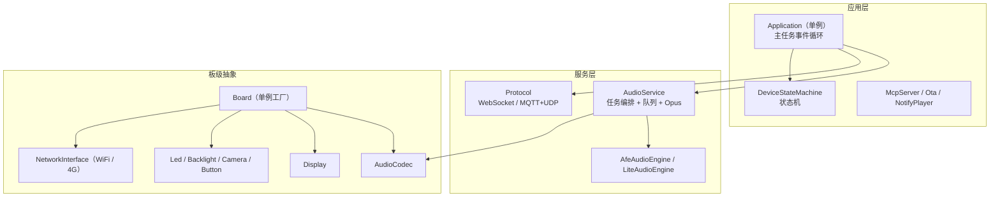
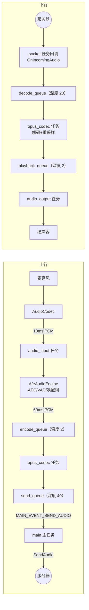

# xiaozhi 架构分析（xiaozhi-esp32）

> 分析对象：[78/xiaozhi-esp32](https://github.com/78/xiaozhi-esp32) main 分支（2026-09-25 抓取源码）。聚焦三个角度：任务分配、分层思想、接口封装。所有结论都对照源码，标注来源文件；源码注释原文为英文，引用时保留原文。

## 1. 项目是什么

ESP32 上的 AI 语音聊天设备：唤醒词唤醒 → 麦克风采样 → Opus 编码推流 → 服务器做 ASR/LLM/TTS → 下行 Opus 音频解码播放，同时驱动屏幕表情、LED 状态和 MCP 设备控制（音量、灯光等作为工具暴露给大模型调用）。

`main/` 目录布局（60+ 块板子目录省略）：

```
main/
├── main.cc                 # app_main：NVS 初始化 → Application::Initialize() → Run()
├── application.cc/h        # 应用核心：单例 + 主任务事件循环
├── device_state.h              # 设备状态枚举（11 个状态）
├── device_state_machine.cc/h   # 带转移校验的状态机
├── audio/                  # 音频子系统（v2 重构后独立成目录）
│   ├── audio_codec.h/cc    #   编解码芯片抽象，codecs/ 下 ES8311/ES8388/box 等实现
│   ├── audio_service.h/cc  #   音频服务：3 个任务 + 5 条队列 + Opus 编解码调度
│   ├── audio_engine.h      #   信号处理引擎抽象，engines/ 下 afe / lite 两个实现
│   ├── wake_word.h         #   唤醒词抽象，wake_words/ 下 esp / custom 两个实现
│   ├── demuxer/ogg_demuxer #   提示音 ogg 解封装
│   └── fixed_queue.h       #   定容量无阻塞队列（滥用即 esp_system_abort）
├── display/                # Display 抽象 + lcd/oled/epd/lvgl/emote 实现
├── led/                    # Led 抽象 + gpio_led/single_led/circular_strip
├── protocols/              # Protocol 抽象 + websocket_protocol / mqtt_protocol
├── boards/                 # 板级：common/board.h 等 + 每块板一个 .cc + config.h
├── mcp_server.cc/h         # MCP 工具注册（AI 控制设备）
├── ota.cc/h                # 升级与激活（激活后才知道该用哪个协议）
├── settings.cc/h           # NVS 键值封装
└── notify/notify_player    # 通知音播放（带字幕进度回调）
```

## 2. 分层思想

### 2.1 分层与依赖方向



依赖方向单向向下：Application 组合 `AudioService`、`unique_ptr<Protocol>`、`unique_ptr<Ota>`，全部通过抽象接口使用；板级对象（codec、display、led）由 Board 创建，Application 每次经 `Board::GetInstance().GetDisplay()` 取用。`main.cc` 只有十几行，业务入口全部收在 Application 里。

分层的可移植性收益直接体现在数字上：60 多块板子，每块板只写一个 `XxxBoard.cc`（创建外设对象）加一个 `config.h`（引脚宏），公共外设驱动（AXP2101 电源管理、背光、按键、旋钮、电池监测）全部复用 `boards/common/`。

### 2.2 两个"选择点"是分层质量的试金石

- **编译期选引擎**：`audio_service.cc` 按芯片型号选择信号处理实现——S3/P4/S31 用 `AfeAudioEngine`（esp-sr 的 AFE 硬件加速 AEC/VAD/WakeNet），其余芯片用 `LiteAudioEngine`。代码是 `#if CONFIG_IDF_TARGET_ESP32S3 ... #include "engines/afe_audio_engine.h" #else #include "engines/lite_audio_engine.h"`。
- **运行期选协议**：`Application::InitializeProtocol()` 读服务器 OTA 下发的配置决定实例化哪个协议——`ota_->HasMqttConfig()` 用 `MqttProtocol`，`HasWebsocketConfig()` 用 `WebsocketProtocol`，都没有则回退 MQTT。

同一抽象各留两个实现、一个编译期选、一个运行期选：接口设计是否成立，靠第二套实现来验证。

## 3. 任务分配

### 3.1 任务清单

| 任务 | 创建位置 | 优先级 | 内存 | 职责 |
| --- | --- | --- | --- | --- |
| main | app_main（FreeRTOS 主任务） | 10 | — | 唯一的业务状态机：事件循环处理 14 种事件、UI、JSON 消息分发、发送队列搬运 |
| audio_input | `AudioService::Start()` | 8 | 6KB，启用 CONFIG_USE_AUDIO_PROCESSOR 时绑定 core 0 | 按 10ms/160 采样读麦克风，重采样到 16k 后喂引擎；audio testing 模式也走它 |
| audio_output | `AudioService::Start()` | 4 | 4KB | 等 playback_queue 有货就 `codec_->OutputData()` 写扬声器，顺带发播放进度/排空回调 |
| opus_codec | `AudioService::Start()` | 2 | 24KB | 单任务双职责：encode_queue 编码进 send_queue；decode_queue 解码进 playback_queue |
| activation | `HandleNetworkConnectedEvent()` 临时创建 | 2 | 8KB | 联网后跑 OTA 版本检查、设备激活、协议初始化，完成后删除自己 |
| ProcessingTask | AfeAudioEngine 内部 | — | — | AFE fetch 循环，产出唤醒词命中/VAD 变化/净化后音频三个结果 |
| wake_word_encode | AfeAudioEngine 内部，静态分配 | — | — | 把唤醒词片段编码成 Opus 留给服务器确认 |
| socket 收发 | esp-websocket / mqtt 组件内部 | — | — | 协议数据的实际收发，收到的包经回调进入应用 |
| esp_timer 软定时器 | clock_timer / audio_power_timer | — | — | 1 秒一次：状态栏时钟；1 秒一次：音频电源空闲检查 |

优先级设计的意图：控制面最高（主任务 10，保证交互响应），数据面其次（采集 8 > 播放 4 > 编解码 2）——CPU 大户 Opus 优先级最低，靠队列缓冲吸收抖动。Opus 任务 24KB 内存在全项目里独一档，编码器很吃内存。

### 3.2 音频数据流

源码 `audio_service.h` 顶部注释写明了两条流：

```
1. (MIC) -> [Audio Engine] -> {Encode Queue} -> [Opus Encoder] -> {Send Queue} -> (Server)
2. (Server) -> {Decode Queue} -> [Opus Decoder] -> {Playback Queue} -> (Speaker)
```



### 3.3 任务间通信手段

- **事件组**：主任务用 14 个 `MAIN_EVENT_*` 位驱动状态循环（`xEventGroupWaitBits` + 位判断分发）；AudioService 另有一组运行状态位（wake word running / voice processing running / audio testing running）加一个停止请求位。事件组是全项目跨任务通知的首选。
- **Schedule 投递**：`Application::Schedule(std::function<void()>)` 把闭包压进 `main_tasks_` 双端队列并置 `MAIN_EVENT_SCHEDULE` 位；主循环把整个队列 swap 出来逐个执行。所有 UI 操作和状态迁移最终都汇聚到主任务，业务状态因此天然单线程化，不需要锁。
- **互斥锁 + 条件变量**：AudioService 的五条队列共用一把 `audio_queue_mutex_` 和一个 `audio_queue_cv_`；`playback_generation_` 代数计数让 Stop/Reset 后的在途播放结果直接作废。
- **std::function 回调**：服务层对上层的全部出口都是回调（`AudioServiceCallbacks`、`Protocol::OnIncomingAudio` 等七个注册点、`AudioEngine::OnOutput` 三个）。回调里只做轻活，重活包进 `Schedule` 投回主任务——`OnIncomingJson` 里每个 JSON 分支都是这个写法。

### 3.4 实时流的背压策略：丢弃优于阻塞

audio 相关代码里三条注释值得整段记录，它们回答"队列满了怎么办"：

- 生产端丢最旧（`PushTaskToEncodeQueue`）：*"Microphone audio is realtime, so drop the oldest frame instead of blocking. Blocking here would stall the audio engine task (AFE fetch) and deadlock the whole input pipeline when the send queue stops being drained"*——实时麦克风数据过期即无价值，阻塞生产者会连环拖住整条输入管道。
- 编码端丢最旧（`OpusCodecTask`）：*"Never let a full send queue stall encoding: stale realtime audio is useless to the server, so drop the oldest packet."*
- 发送端失败清空（主循环 `MAIN_EVENT_SEND_AUDIO`）：`SendAudio` 失败就把 send_queue 排空，注释说明留着会卡住 Opus 任务进而互相等待造成永久阻塞（源码注释用的 deadlock）。

对照面是提示音播放：`PushPacketToDecodeQueue(packet, wait=true)` 允许阻塞等待——非实时数据可以背压，实时数据必须丢弃。这个二分是音频系统设计的关键判断。

### 3.5 音频电源管理

`audio_power_timer_` 每秒检查一次，输入输出静默超过 15 秒（`AUDIO_POWER_TIMEOUT_MS`）就关 codec 的输入/输出通路，下次用时再开。一个细节：关闭 ADC 采集不直接在 esp_timer 任务里做，而是置 `AS_EVENT_AUDIO_INPUT_STOP_REQUEST` 位让 audio_input 任务自己关——源码注释：*"ADC continuous start/stop must run in the same task. Wake the audio input task instead of closing the codec from the esp_timer task."*（硬件资源由哪个任务开启就必须由哪个任务关闭，这是 FreeRTOS 驱动的常见约束。）

## 4. 接口封装

### 4.1 Board：编译期单例工厂

`boards/common/board.h` 的核心就一段：

```cpp
void* create_board();          // 每块板子自己定义

class Board {
    Board(const Board&) = delete;       // 禁用拷贝
    Board& operator=(const Board&) = delete;
public:
    static Board& GetInstance() {
        static Board* instance = static_cast<Board*>(create_board());
        return *instance;
    }
    virtual std::string GetBoardType() = 0;      // 必须实现
    virtual AudioCodec* GetAudioCodec() = 0;
    virtual NetworkInterface* GetNetwork() = 0;
    virtual Display* GetDisplay();               // 可选，默认返回空
    virtual Led* GetLed();
    virtual Camera* GetCamera();
};

#define DECLARE_BOARD(BOARD_CLASS_NAME) \
void* create_board() { return new BOARD_CLASS_NAME(); }
```

每个板子的 `.cc` 末尾一行 `DECLARE_BOARD(CompactWifiBoard)` 就完成注册；构建系统按 Kconfig 的 `CONFIG_BOARD_TYPE_*` 在 main/CMakeLists.txt 里 `set(BOARD_DIR ...)`，只编译选中板子目录。新板子的接入成本被压到"抄一个最近的板子改引脚"。接口还做了必须/可选分级：codec、network 是纯虚必须实现；display、led、camera、backlight 有默认空实现，功能少的板子直接忽略。

### 4.2 AudioCodec：模板方法

```cpp
class AudioCodec {
public:
    virtual void OutputData(std::vector<int16_t>& data);   // 公共入口
    virtual bool InputData(std::vector<int16_t>& data);
    virtual void SetOutputVolume(int volume);
protected:
    virtual int Read(int16_t* dest, int samples) = 0;      // 子类只管 I2S
    virtual int Write(const int16_t* data, int samples) = 0;
    i2s_chan_handle_t tx_handle_, rx_handle_;
    bool duplex_, input_reference_; int input_sample_rate_, output_sample_rate_; ...
};
```

公共逻辑（使能开关、音量增益、单双工、参考通道）收在基类，子类（es8311、es8388、box、no_audio_codec）只实现裸读写。采样率重整在 AudioService 里做，不属于 codec 职责。`no_audio_codec` 是没有独立 codec 芯片时直接走 I2S 的兜底实现。

### 4.3 Display：抽象基类 + RAII 锁 + 空对象

```cpp
class Display {
public:
    virtual void SetStatus(const char* status);
    virtual void SetEmotion(const char* emotion);
    virtual void SetChatMessage(const char* role, const char* content);
    virtual void SetupUI() { setup_ui_called_ = true; }
protected:
    virtual bool Lock(int timeout_ms = 0) = 0;   // friend DisplayLockGuard 才能碰
    virtual void Unlock() = 0;
};

class DisplayLockGuard { /* 构造 Lock(30s)，析构 Unlock */ };
class NoDisplay : public Display { /* 无屏板子的空对象 */ };
```

LVGL 这类库要求互斥访问，项目把锁藏成 protected 纯虚函数加 `friend class DisplayLockGuard`，外部只能经 RAII 守卫访问；`NoDisplay` 让无屏板子零成本接入。实现族覆盖 lcd、oled、epd、lvgl、emote（图片表情）五种。

### 4.4 Protocol：回调注册 + 策略选择

```cpp
class Protocol {
public:
    void OnIncomingAudio(std::function<void(std::unique_ptr<AudioStreamPacket>)>);
    void OnIncomingJson(std::function<void(const cJSON* root)>);
    void OnAudioChannelOpened/Closed(...); void OnNetworkError(...);
    virtual bool OpenAudioChannel() = 0;
    virtual bool SendAudio(std::unique_ptr<AudioStreamPacket>) = 0;
    virtual bool SendText(const std::string&) = 0;    // protected
    void SendStartListening(ListeningMode);           // 基类实现的公共 JSON 消息
};
```

七组回调构成服务层对上的全部出口；连接管理、JSON 业务消息（tts start/stop、stt、llm emotion、mcp）的组装在基类完成，子类只负责传输通道本身。音频帧用 `BinaryProtocol2/3` 两个 `__attribute__((packed))` 结构体定义二进制协议头，服务端 AEC 时间戳随包携带。WebSocket 与 MQTT+UDP 两个实现可以按服务器配置互换。

### 4.5 AudioEngine / WakeWord：信号处理的接口化

`AudioEngine`（afe/lite 两个实现）与 `WakeWord`（esp/custom 两个实现）都是纯虚接口：`Initialize(codec, ...)`、`Feed(pcm)`、`EnableWakeWordDetection/EnableVoiceProcessing`，输出全部走回调（`OnOutput`、`OnWakeWordDetected`、`OnVadStateChange`）。唤醒词编码成 Opus 的逻辑（`EncodeWakeWordData`/`GetWakeWordOpus`）也进了接口，主任务拿到的直接是可发送的压缩包。

### 4.6 McpServer：工具注册式接口

设备能力以工具形式暴露给大模型：

```cpp
McpServer::GetInstance().AddTool("self.set_volume", "Set the device volume",
    PropertyList({Property("volume", kPropertyTypeInteger, 0, 0, 100)}),
    [this](const PropertyList& properties) -> ReturnValue {
        codec->SetOutputVolume(properties["volume"].value<int>());
        return true;
    });
```

`Property` 自带类型、默认值、整数范围校验；`ReturnValue` 是 `std::variant<bool, int, std::string, cJSON*, ImageContent*>`；`AddUserOnlyTool` 注册的工具只在给用户的列表里出现（annotations.audience=user），AI 看不到。板子级工具（如按住说话键）经 `press_to_talk_mcp_tool.cc` 这类公共组件统一挂进来。

### 4.7 其他惯用法

- **观察者**：`DeviceStateMachine::AddStateChangeListener(callback)` 返回监听 id 可反注册，回调在调用者上下文执行；Application 用它把每次状态迁移变成一个主循环事件。
- **RAII**：`DisplayLockGuard`（显示锁）、`TaskPriorityReset`（临时提升当前任务优先级，析构恢复——用于耗时操作期间抢占式响应）。
- **状态机带校验**：`DeviceStateMachine::TransitionTo()` 内部先 `IsValidTransition(from, to)`，非法转移返回 false；11 个状态（Starting/WifiConfiguring/Idle/Connecting/Listening/Speaking/Notifying/Upgrading/Activating/AudioTesting/FatalError）之间的合法路径在一张表里，业务代码不允许绕过它改状态。
- **fast-fail**：`FixedQueue` 越界直接 `esp_system_abort`，没有静默失败路径。

## 5. 对 xiaozhi-zephyr 移植的启示

对照 Excalidraw 里已有的 xiaozhi-zephyr 分层设计，几个可直接搬的机制：

| xiaozhi-esp32 机制 | Zephyr 侧对应物 |
| --- | --- |
| 事件组 + 14 个事件位 | k_event，或 k_poll 事件组合 |
| Schedule 单线程化队列 | 系统工作队列（k_work）或自建 std::function 队列 + k_msgq 通知 |
| mutex+cv 的 std::deque 队列 | k_msgq（定长消息块）或 k_mem_slab + k_fifo |
| create_board 编译期工厂 | devicetree / Kconfig 选型（两者思想一致，Zephyr 本身就是这套） |
| AfeAudioEngine（依赖 esp-sr，仅 S3/P4） | esp-sr 不可用，需按 LiteAudioEngine 的接口另找唤醒词方案 |

一个值得对照思考的点：xiaozhi 的 `AudioCodec` 把 I2S 句柄收进 codec 抽象内部，Zephyr 的 `audio_codec.h` 则把 codec 配置和数据面（I2S/DMIC）分离成两个 API——两种切分都能成立，移植时选哪种取决于想不想让 codec 抽象知道传输层。详见 [[07-Zephyr-Audio-Codec-API]]。

`Application::Run` 的事件循环本质是一个单消费者事件总线，与 [[嵌入式设计模式-事件总线]] 里 zbus 的差异在于：xiaozhi 用事件位（无参数、最多 14 种）加 Schedule 闭包组合出"信号 + 数据"两层，zbus 则是消息对象直达订阅者。状态迁移校验那张表是 [[嵌入式设计模式-状态机]] 的表驱动实现范例。

## 参考

- 仓库：https://github.com/78/xiaozhi-esp32 （main 分支，2026-09-25）
- 关键源文件：main/application.{h,cc}、main/audio/audio_service.{h,cc}、main/audio/audio_engine.h、main/boards/common/board.h、main/display/display.h、main/protocols/protocol.h、main/mcp_server.h、main/CMakeLists.txt
