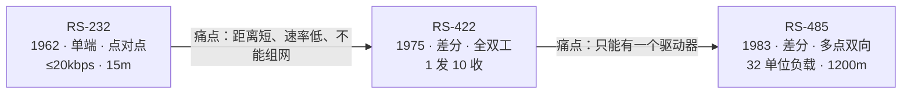
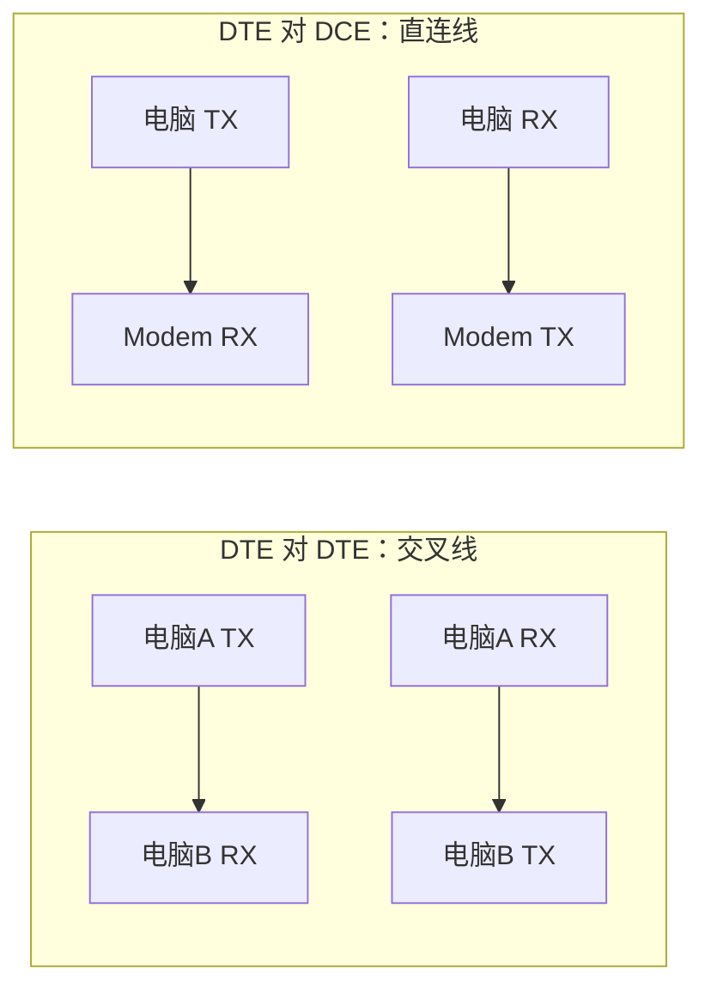
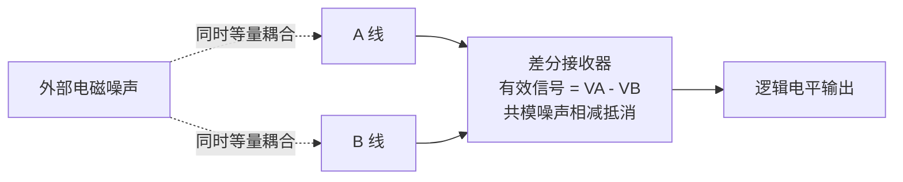
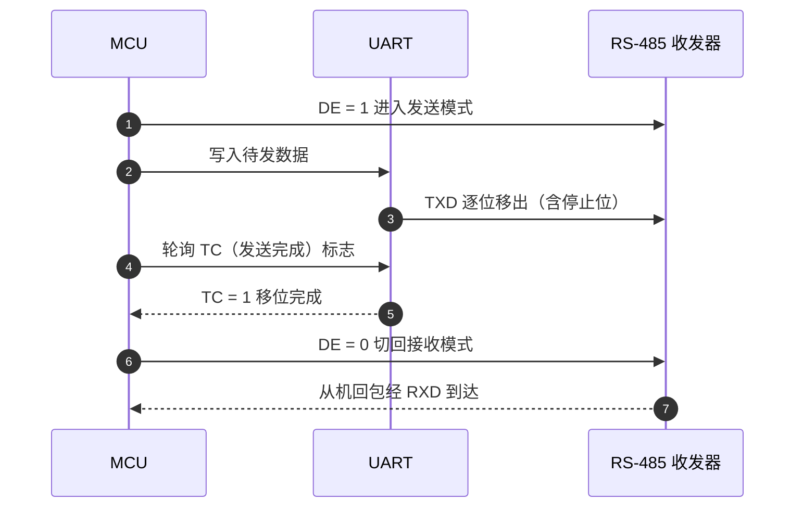
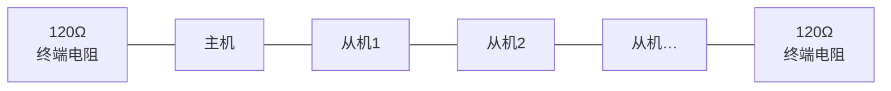
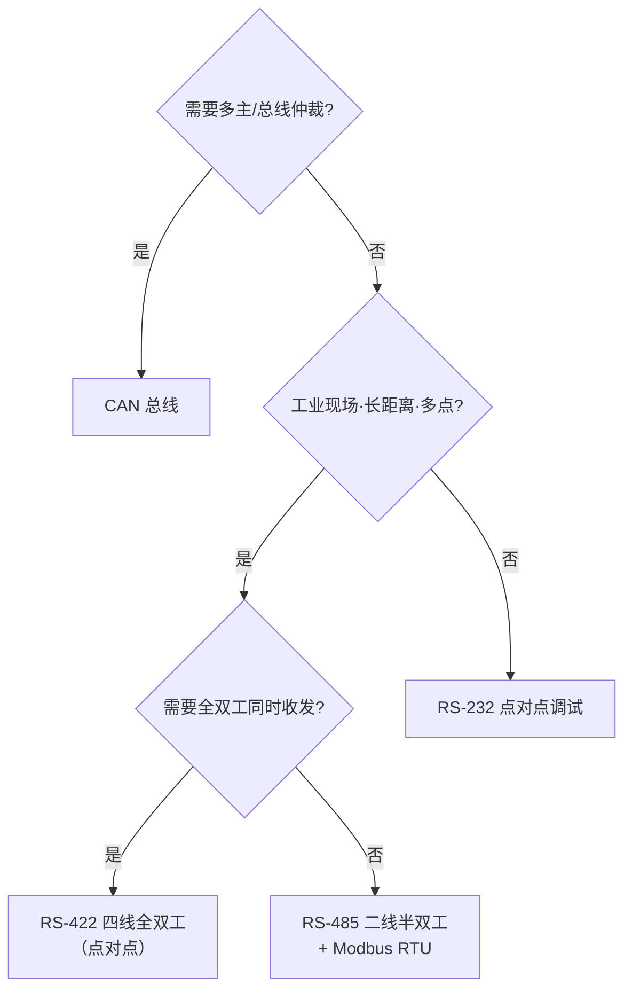

# RS-232 与 RS-485 串行通信标准

> 面向嵌入式开发面试的物理层对比笔记：拆解传输距离与抗干扰能力差异的底层物理原理，覆盖电平标准、硬件设计、组网拓扑、常见故障与选型。

## 概述：标准定位

RS 系列（Recommended Standard，推荐标准）由美国电子工业协会（EIA）制定，**只规定接口的电气特性**（电平、时序、负载），不涉及连接器、电缆与协议——上层用 UART 帧、Modbus 等自行定义。

- **RS-232**（1962，现 EIA/TIA-232-E）：单端、点对点、短距离
- **RS-422**（1975，TIA/EIA-422-A）：差分、全双工、1 发 10 收
- **RS-485**（1983，现 TIA/EIA-485-A）：差分、多点双向、32 单位负载

## 一、RS-232：单端短距离标准

### 1.1 信号机制与距离限制

**单端信号**：单根信号线以 GND 为参考传输。结构简单，但抗干扰弱，传输距离上限 15 米的根源：

1. **地电位差直接叠加进信号**：地线并非绝对零电位，两地电位差会以噪声形式叠加在信号上，距离越长越严重（对差分信号而言它是共模、可被抑制，对单端信号则是致命的差模干扰）；
2. **寄生 RC 低通滤波**：电缆分布电容与线路电阻构成 RC 低通，距离越远信号边沿越平缓，接收端最终无法区分高低电平。

定量依据：标准规定驱动器负载电容 ≤ **2500 pF**，典型电缆约 170 pF/m → 2500/170 ≈ **15 m**（前提：码元畸变 < 4%、速率 ≤ 20 kbps）。

### 1.2 电平定义与负逻辑

RS-232 采用 **±12V 高压负逻辑**，与 TTL 正好相反：

| 逻辑 | RS-232 电平 | TTL / 3.3V CMOS |
|---|---|---|
| 1（MARK，空闲态） | **-3V ~ -15V** | ≥ 2.0V |
| 0（SPACE） | **+3V ~ +15V** | ≤ 0.8V |
| 无效区（死区） | -3V ~ +3V | 0.8 ~ 2.0V |

- 高压摆幅 → 更大的噪声容限，抗干扰远强于 TTL；
- **-3V ~ +3V 死区**：±3V 阈值留出安全余量，小噪声不会误触发；
- 实际电路用 MAX232/MAX3232 等收发器，内部电荷泵从单电源产生 ± 电压，完成 TTL↔RS-232 电平转换。

**故障安全设计**：UART 空闲态 = MARK = 负电平。当总线未被驱动（如断线）时，接收端因输入偏置与死区设计停留在确定状态，不会把噪声当成起始位——硬件层面的可靠性设计。

### 1.3 接线与拓扑

- 常用 **DB9**（DTE 引脚定义）：2=RXD、3=TXD、5=GND；硬件流控增加 7=RTS、8=CTS；
- 最小通信系统仅需 **TX、RX、GND 三根线**；
- **仅支持点对点拓扑**：DTE↔DTE（电脑连电脑）用交叉线，DTE↔DCE（电脑连外设）用直连线。

## 二、RS-485：长距离多点总线标准

### 2.1 1200 米传输的四大技术支柱

RS-485 的长距离能力是多重设计共同作用的结果，而非单一特性：

| 支柱                  | 作用                                                             |
| ------------------- | -------------------------------------------------------------- |
| **差分信号 + 共模抑制（核心）** | A/B 双线传输，有效信号 = VA - VB；外部噪声同时等量耦合到两根线，接收端相减抵消；需双绞线紧耦合保证两线噪声一致 |
| 低阻抗驱动               | 减小信号传输衰减，维持长线幅度                                                |
| 终端电阻匹配              | 消除传输线末端反射                                                      |
| 宽共模范围（-7V ~ +12V）   | 容忍两端设备的地电位差，不饱和不失真                                             |

> 补充：实际应用建议额外接一根信号地（SC/G），防止地电位差超出共模范围导致接收器饱和失效。

### 2.2 关键电气参数与"极性陷阱"（面试高频）

| 参数 | 值 |
|---|---|
| 驱动器差分输出（54Ω 负载） | ≥ ±1.5V（空载最大 ±6V） |
| 接收器阈值 | ±200mV（VA-VB > +200mV → 1；< -200mV → 0） |
| 差分噪声容限 | 1.5V - 0.2V = **1.3V** |
| 共模电压范围 | **-7V ~ +12V** |
| 接收器输入电阻 | ≥ 12kΩ（= 1 单位负载） |
| 速率-距离关系 | 10Mbps@12m / 1Mbps@122m / 100kbps@1200m |
| 终端电阻 | 120Ω × 2（总线物理两端各 1 个） |

> ⚠️ **极性陷阱**：TIA/EIA-485 标准文本规定"binary 1 (OFF) 时 A 相对 B 为负"；但**所有厂商芯片（TI/MAXIM 等）约定 A 为非反相端**：DI 高 → VA>VB → RO 高。即"标准极性"与"芯片极性"命名相反，只是命名差异，**不要因此反接 A/B**。面试答"A 高 B 低 = 逻辑 1"，再点出标准文本差异即可。

### 2.3 终端电阻 120Ω 的设计逻辑

- **120Ω 的由来**：RS-485 推荐使用特征阻抗 Z0 = 100~120Ω 的双绞线，终端电阻 = 电缆特性阻抗，用于**阻抗匹配**，防止阻抗不连续引发反射、总线振铃、误码；
- **正确接法**：仅在总线的**物理最远端各接 1 个** 120Ω（全网络最多 2 个），中间节点禁止接；
- **54Ω 测试负载的由来**：2 个 120Ω 终端并联（60Ω）∥ 32 个 12kΩ 单位负载并联（375Ω）≈ 52Ω，标准取整为 **54Ω**；
- **副作用与失效保护**：空闲时总线无人驱动，VA-VB 趋于 0V，落在 ±200mV 阈值的不确定区间，接收端输出随机电平会被误认为起始位 → 需加**偏置电阻**（A 上拉到 VCC、B 下拉到 GND），使空闲差分电压 ≥ +200mV 并留出噪声余量。

### 2.4 半双工与 DE 时序控制（最经典故障点）

RS-485 通常为**半双工**，通过 DE 引脚切换收发方向：

- **切回接收太早**：最后字节的停止位被截断 → 从机接收错误；
- **切回接收太晚**：从机回包到达时主机仍占用总线（驱动器未三态）→ 回包被自身挡住，主机收不到；
- **正确做法**：等待 UART 的 **TC（发送完成）标志置位**后，再切换 DE 电平。

### 2.5 组网拓扑与节点数

- 标准拓扑为**总线式（菊花链）**，禁止星形、环形：星形下节点相当于超长存根，反射叠加破坏波形；每个节点经尽量短的**存根**接入主干，建议 < 30cm；
- **节点数**：1 单位负载 = 输入电阻 ≥ 12kΩ（+12V 时漏流 ≤ 1mA），标准规定驱动器须能驱动 32 单位负载；现代 1/8 UL 收发器（如 THVD1520）可挂 **256** 节点；
- **全双工 4 线 RS-485 无法多点**：所有从机 TX 并到主机 RX，同时发送会冲突——RS-485 本身无总线仲裁能力。

## 三、RS-232 / RS-422 / RS-485 总对比

| 维度 | RS-232 | RS-422 | RS-485 |
|---|---|---|---|
| 发布 | 1962（EIA-232-E） | 1975（TIA/EIA-422-A） | 1983（TIA/EIA-485-A） |
| 信号方式 | 单端（对地） | 差分 | 差分 |
| 拓扑 | 点对点 | 1 发 10 收（单向多点） | 多点双向总线 |
| 通信模式 | 全双工 | 全双工（4 线） | 半双工（2 线）/ 全双工（4 线，仅点对点） |
| 逻辑 1 | -3 ~ -15V | VA-VB > +200mV | VA-VB > +200mV * |
| 逻辑 0 | +3 ~ +15V | VA-VB < -200mV | VA-VB < -200mV * |
| 驱动器输出 | ±5 ~ ±15V（3~7kΩ 负载） | ≥ ±2V（100Ω 负载） | ≥ ±1.5V（54Ω 负载） |
| 接收阈值 | ±3V | ±200mV | ±200mV |
| 共模范围 | 以地为参考（无共模能力） | ±7V | **-7V ~ +12V** |
| 最大距离 | 15m @ 20kbps | 1200m @ 100kbps | 1200m @ 100kbps |
| 最大速率 | 20kbps（标准）/ 1Mbps（现代芯片） | 10Mbps | 10Mbps @ 12m |
| 节点数 | 2 | 11 | 32 单位负载（可扩至 256） |
| 接线 | TX/RX/GND 3 线 | 4 线 | 2 线（半双工） |
| 抗干扰 | 弱 | 强 | 强 |
| 标准定义范围 | 电气+机械（DB9/DB25）+功能 | 仅电气 | **仅电气**（连接器/协议自理） |
| 典型应用 | 调试口、Modem、打印机 | 工业相机、运动控制 | Modbus RTU、Profibus 等现场总线 |

\* 按厂商芯片极性约定，见 2.2 极性陷阱。

## 四、工业应用：RS-485 + Modbus RTU

- **主从架构天然避免总线冲突**：规则为"主机点名、从机应答"，同一时刻总线上只有一个驱动器；
- **帧边界同步**：帧间静默 ≥ **3.5 个字符时间**，帧内字符间隔 < 1.5 个字符时间——靠"静默计时"切分帧，是 Modbus RTU 的核心设计；
- 帧结构：地址 + 功能码 + 数据 + **CRC16** 校验；地址 0 为广播帧。

**工业现场可靠性原则**：变频器等设备会导致地电位大幅波动，未隔离易烧毁接收器；遵循"**每个节点独立隔离、屏蔽层单点接地**"原则，必要时加 TVS 钳位与共模电感。

## 五、常见故障排查速查表

| 故障现象 | 可能原因 | 排查/解决 |
|---|---|---|
| 完全无通信 | A/B 线接反 | 对调 A/B 两根线 |
| 通信时好时坏 | 星形拓扑、存根过长、缺信号地 | 改菊花链、存根 < 30cm、补信号地 |
| 误码/波形振铃 | 终端电阻缺失或位置错误 | 仅总线物理两端各接 120Ω |
| 丢最后一个字节 / 收不到回包 | DE 时序错误 | 等 TC 标志再切 DE；用逻辑分析仪同时抓 **DE/TXD/RXD** 三路定位 |
| 空闲时误收乱帧 | 缺失效保护偏置 | A 上拉、B 下拉，空闲差分 > 200mV |
| 偶尔烧芯片 | 共模超限、浪涌 | 隔离收发器、屏蔽层单点接地、TVS |
| 总线被"拉死" | 某节点 DE 常高或芯片损坏 | 逐个拔节点定位故障源 |

## 六、面试考点速览（重点：参数背后的物理意义）

| 考点                | 一句话答法                                |
| ----------------- | ------------------------------------ |
| 为什么是 15m / 20kbps | 2500pF 负载电容限制 + 单端信号叠加地电位差           |
| 负逻辑的设计意义          | 高压摆幅噪声容限大；空闲态（MARK）为确定电平             |
| 差分与共模抑制原理         | 双绞线等量耦合噪声 → 接收端相减抵消                  |
| 120Ω 的由来          | = 推荐双绞线特性阻抗 Z0，阻抗匹配防反射               |
| 54Ω 测试负载的由来       | 2×120Ω ∥ 32×12kΩ ≈ 52Ω → 取 54Ω       |
| -7V ~ +12V 的由来    | 驱动器 0~5V 摆幅 + ±7V 允许地电位差             |
| 为什么 32 节点         | 单位负载 12kΩ × 32；1/8 UL 芯片 → 256 节点    |
| 极性陷阱              | 标准文本 binary 1 = VA<VB；芯片约定 A 非反相，勿反接 |
| DE 时序控制           | TC 标志后再切换：过早截停止位、过晚挡回包               |
| 组网拓扑规则            | 菊花链、存根越短越好、禁星形                       |
| RS-485 只定义电气      | 连接器、引脚、协议全部上层自理                      |

## 七、选型建议

- 调试串口、点对点短距离 → **RS-232**
- 工业现场、多点长距离 → **RS-485**
- 点对点高速全双工 → **RS-422**
- 多主仲裁场景 → **CAN 总线**
- 禁忌：不要用 RS-232 做工业现场通信，也不要用 RS-485 做调试串口

## 参考

- [TI：RS-485 设计指南（SLLA272）](https://www.ti.com/lit/pdf/slla272)
- [ADI：RS-232、RS-422 与 RS-485 串行数据标准的选择与使用](https://www.analog.com/cn/resources/technical-articles/guide-to-selecting-and-using-rs232-rs422-and-rs485-serial-data-standards.html)
- [TI：RS-485 极性约定说明（Polarity Conventions）](https://e2e.ti.com/cfs-file/__key/telligent-evolution-components-attachments/13-143-00-00-00-26-49-60/RS485-_2D00_-Polarity-Conventions.pdf)
- [TI AN-979：RS-485 的实际极限](https://www.ti.com/lit/an/snla042a/snla042a.pdf)
- [Wikipedia: RS-485](https://en.wikipedia.org/wiki/RS-485)
