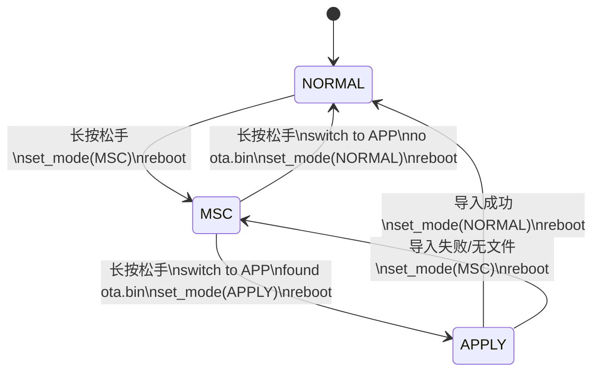

# OTA 升级状态机流程

  

本文档描述当前分支中 USB OTA 的实际状态机、启动分流和关键文件流转。

  

## 1. 总览

  

当前 USB OTA 使用 3 个模式：

  

- `USB_DISK_UPDATE_MODE_NORMAL`

  - 正常模式

  - 初始化 `CDC + BLE`

  - 不暴露 U 盘

- `USB_DISK_UPDATE_MODE_MSC`

  - U 盘模式

  - 暴露 `udisk` 为 USB MSC

  - 主应用继续运行

  - `CDC` 不初始化

- `USB_DISK_UPDATE_MODE_APPLY`

  - 应用升级模式

  - 应用侧挂载 `udisk`

  - 导入 `ota.bin`

  - 成功后切回 `NORMAL` 并重启

  - 失败后切回 `MSC` 并重启

  

模式值存储在 NVS：

  

- namespace: `usb_disk_update`

- key: `mode`

  

## 2. 关键模块

  

- `main`

  - 启动时调用 `usb_disk_update_boot_prepare(&usb_mode)`

  - 根据返回的 `usb_mode` 调用 `comm_init(usb_mode)`

- `comm_ota_usb`

  - 负责 NVS 模式读写

  - 负责 `MSC/APPLY` 启动分流

  - 负责 `udisk` 存储挂载与 `ota.bin` 导入

  - 负责 OTA 过程日志缓存和 `log.txt`

- `communication`

  - 负责正常通信初始化

  - 创建 `usb_mode_switch_task`

  - 消费按键长按松手事件 `ota_mode_trigger`

- `driver_key`

  - 负责产生 `ota_mode_trigger`

  - 当前语义是“请求切换 USB 模式”

  

## 3. 启动分流

  

### 3.1 启动入口

  

启动顺序：

  

1. `main` 上电后开启外设供电

2. 调用 `usb_disk_update_boot_prepare(&usb_mode)`

3. `usb_disk_update_boot_prepare()` 读取 NVS 中的 `mode`

4. 按 `mode` 执行启动分流

5. 返回给 `main`

6. `main` 调用 `comm_init(usb_mode)`

  

### 3.2 各模式启动行为

  

#### `NORMAL`

  

- `usb_disk_update_boot_prepare()` 直接返回

- `comm_init(usb_mode)` 初始化 `CDC`

- `BLE` 也初始化

- 进入正常业务流程

  

#### `MSC`

  

- 初始化 `udisk`

- 挂载 FATFS

- 把存储切到 `USB` 挂载点

- 暴露为 U 盘

- 清空旧的 `log.txt`

- 写入一条内存日志：`msc mode start`

- 返回 `main`

- `comm_init(usb_mode)` 跳过 `CDC`

- `BLE` 继续初始化

- UI / 传感器 / 按键任务继续运行

  

#### `APPLY`

  

- 进入应用升级模式

- 写入一条内存日志：`apply mode start`

- 初始化 `udisk`

- 在应用侧读取 `ota.bin`

- 执行 OTA 导入

- 关键结果写入内存日志

- 重启前 flush 到 `log.txt`

  

## 4. 运行时模式切换

  

### 4.1 触发源

  

按键模块在“长按后松手”时置位：

  

- `ota_mode_trigger = true`

  

该标志由 `usb_mode_switch_task` 轮询消费。

  

### 4.2 切换规则

  

#### `NORMAL -> MSC`

  

当当前模式是 `NORMAL` 时：

  

1. 检测到 `ota_mode_trigger`

2. 清零 `ota_mode_trigger`

3. 写 NVS：`mode = MSC`

4. `esp_restart()`

  

下次启动进入 `MSC`

  

#### `MSC -> APPLY`

  

当当前模式是 `MSC` 且用户再次长按松手时：

  

1. 先把存储从 `USB` 挂载点切回 `APP`

2. 在应用侧检查 `/udisk/ota.bin`

3. 若存在：

   - 写一条日志：`check ota file: found=1`

   - flush 到 `log.txt`

   - 写 NVS：`mode = APPLY`

   - `esp_restart()`

  

下次启动进入 `APPLY`

  

#### `MSC -> NORMAL`

  

当当前模式是 `MSC` 且用户再次长按松手，但未检测到 `ota.bin` 时：

  

1. 先把存储从 `USB` 挂载点切回 `APP`

2. 检查 `/udisk/ota.bin`

3. 若不存在：

   - 写一条日志：`check ota file: found=0`

   - flush 到 `log.txt`

   - 写 NVS：`mode = NORMAL`

   - `esp_restart()`

  

下次启动回到 `NORMAL`

  

#### `APPLY`

  

`APPLY` 模式下忽略按键切换请求。

  

## 5. APPLY 模式导入流程

  

`APPLY` 模式下导入流程如下：

  

1. 初始化 `udisk`

2. 查找 OTA 目标分区

3. 检查 `/udisk/ota.bin` 是否存在

4. 计算整包大小和 CRC32

5. 调 `ota_service begin(image_size, crc32)`

6. 分块读取文件并调用 `ota_service write(seq, chunk)`

7. 调 `ota_service end()`

8. 删除 `ota.bin`

9. 写 NVS：`mode = NORMAL`

10. flush 日志到 `log.txt`

11. 重启

  

### 失败路径

  

- `udisk` 初始化失败

  - 写 `mode = MSC`

  - 记录日志

  - flush

  - 重启

- `ota.bin` 不存在

  - 写 `mode = MSC`

  - 记录日志

  - flush

  - 重启

- 导入失败

  - 写 `mode = MSC`

  - 记录日志

  - flush

  - 重启

  

## 6. 文件与日志

  

### 6.1 固件文件

  

固定文件名：

  

- `ota.bin`

  

位置：

  

- `udisk` 根目录

  

### 6.2 日志文件

  

当前日志文件名：

  

- `log.txt`

  

日志机制：

  

- 先写入 RAM 缓存

- 格式为：

  

```txt

[t_ms=1234] message

```

  

- 关键重启前调用 flush

- 以追加方式写入 `log.txt`

  

### 6.3 当前日志行为

  

- 进入新的 `MSC` 会话时会清空旧 `log.txt`

- `MSC` 下不会每写一条就直接写盘

- `check ota file`、`APPLY` 结束前等关键节点会 flush

  

## 7. 状态机图

  



  

## 8. 当前使用约束

  

- `MSC` 模式下，用户应先完成文件复制，再执行切换动作

- 当前实现会在离开 `MSC` 前先把存储切回 `APP`，避免在主机持有 U 盘时直接检查 `ota.bin`

- `log.txt` 主要用于 OTA 链路排查，不是通用系统日志