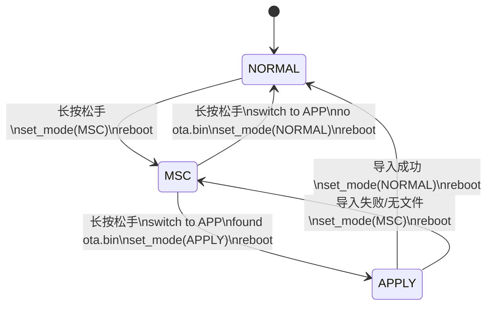

# OTA 升级状态机流程
本文档描述当前分支中 USB OTA 的实际状态机、启动分流和关键文件流转。
## 1. 总览

当前 USB OTA 使用 3 个模式：

- **USB_DISK_UPDATE_MODE_NORMAL**
  - 正常模式
  - 初始化 `CDC + BLE`
  - 不暴露 U 盘

- **USB_DISK_UPDATE_MODE_MSC**
  - U 盘模式
  - 暴露 `udisk` 为 USB MSC
  - 主应用继续运行
  - `CDC` 不初始化

- **USB_DISK_UPDATE_MODE_APPLY**

  - 应用升级模式
  - 应用侧挂载 `udisk`
  - 导入 `ota.bin`
  - 成功后切回 `NORMAL` 并重启
  - 失败后切回 `MSC` 并重启

模式值存储在 NVS：
- namespace: `usb_disk_update`
- key: `mode`
- 
## 2. 启动分流
### 2.1 启动入口
启动顺序：
1. `main` 上电后开启外设供电

2. 调用 `usb_disk_update_boot_prepare(&usb_mode)`

3. `usb_disk_update_boot_prepare()` 读取 NVS 中的 `mode`

4. 按 `mode` 执行启动分流

5. 返回给 `main`

6. `main` 调用 `comm_init(usb_mode)`
### 2.2 各模式启动行为

#### `NORMAL`

- `usb_disk_update_boot_prepare()` 直接返回

- `comm_init(usb_mode)` 初始化 `CDC`

- `BLE` 也初始化

- 进入正常业务流程
#### `MSC`

- 初始化 `udisk`

- 挂载 FATFS

- 把存储切到 `USB` 挂载点

- 暴露为 U 盘

- 清空旧的 `log.txt`

- 写入一条内存日志：`msc mode start`

- 返回 `main`

- `comm_init(usb_mode)` 跳过 `CDC`

- `BLE` 继续初始化

- UI / 传感器 / 按键任务继续运行  
#### `APPLY`
- 进入应用升级模式

- 写入一条内存日志：`apply mode start`

- 初始化 `udisk`

- 在应用侧读取 `ota.bin`

- 执行 OTA 导入

- 关键结果写入内存日志

- 重启前 flush 到 `log.txt`
## 3. 状态机图
  


  

```
NORMAL
  长按松手 -> 写 MSC -> 重启

MSC
  长按松手:
    有 ota.bin -> 写 APPLY -> 重启
    无 ota.bin -> 写 NORMAL -> 重启

APPLY
  启动自动执行:
    成功 -> 写 NORMAL -> 重启
    失败 -> 写 MSC -> 重启
```
## 8. 当前使用约束

  

- `MSC` 模式下，用户应先完成文件复制，再执行切换动作

- 当前实现会在离开 `MSC` 前先把存储切回 `APP`，避免在主机持有 U 盘时直接检查 `ota.bin`

- `log.txt` 主要用于 OTA 链路排查，不是通用系统日志