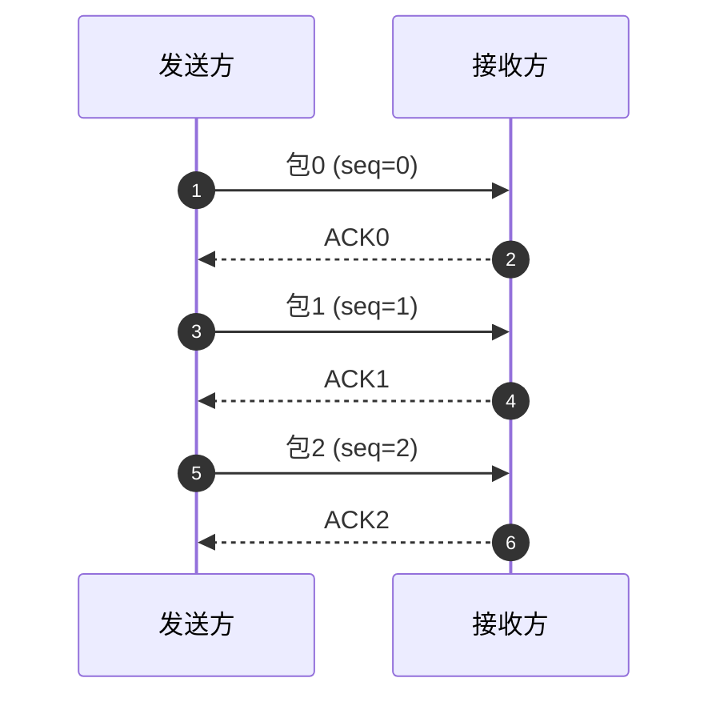
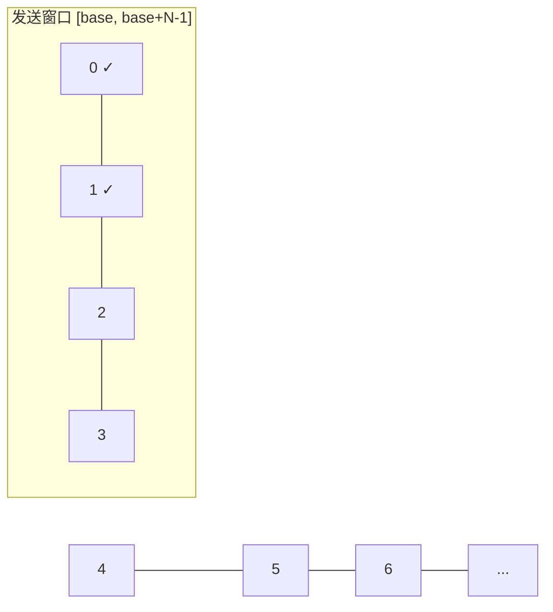
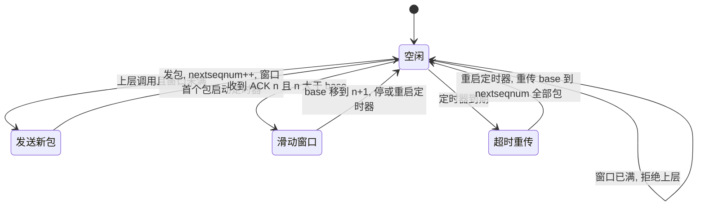
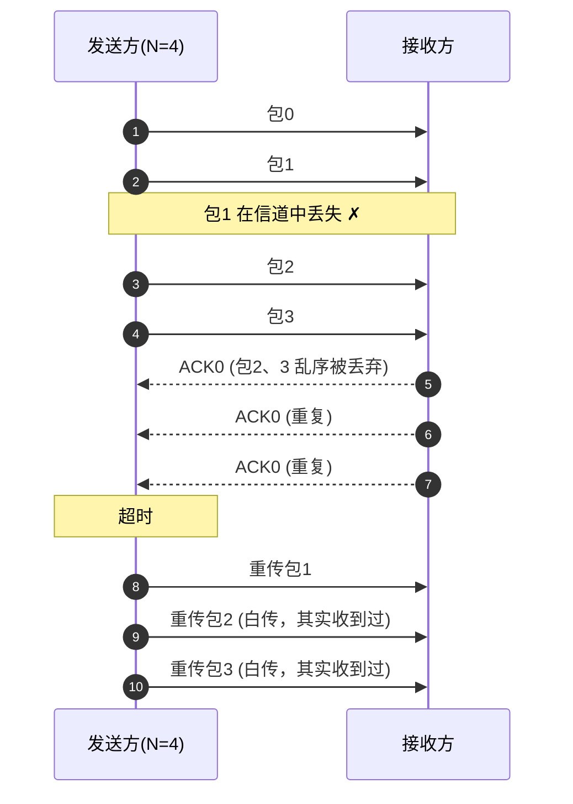
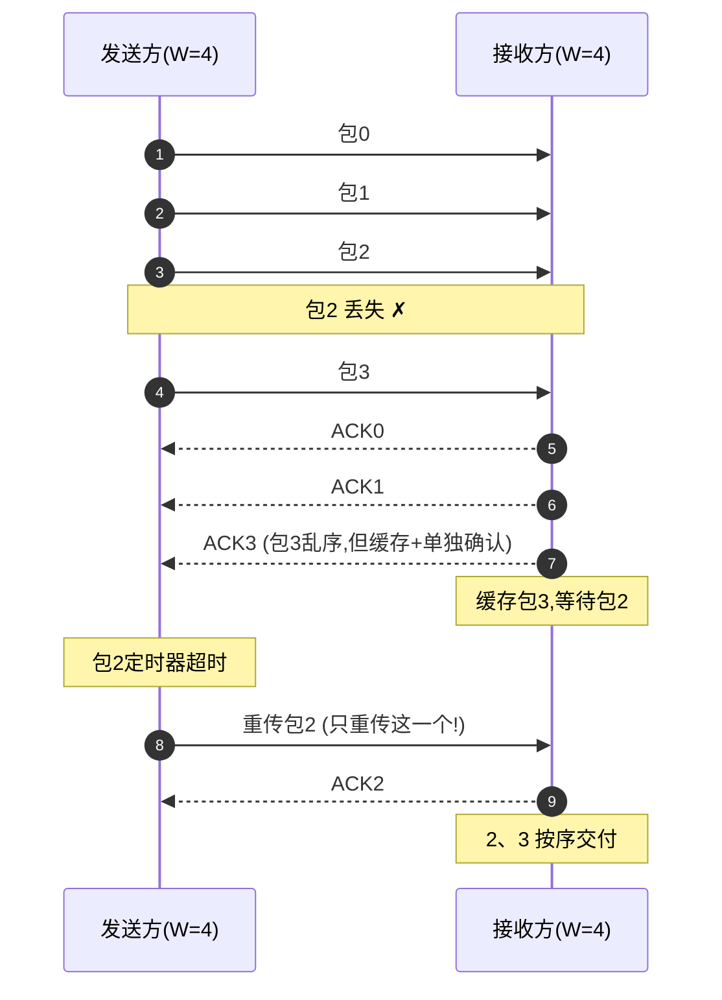

# 网络传输的可靠协议：GBN、SR 到 TCP
```
├── Stop-and-Wait（停止等待）
│
├── GBN（你已实现）
│
├── SR（选择重传）
│
└── TCP
     │
     ├── TCP Header
     ├── Sequence Number
     ├── ACK
     ├── Sliding Window
     ├── Flow Control（流量控制）
     ├── RTT 与超时重传（RTO）
     ├── SACK（选择确认）
     ├── Congestion Control（慢启动、拥塞避免、快重传、快恢复）
     ├── 三次握手
     ├── 四次挥手
     ├── TIME_WAIT
     ├── Nagle 算法
     ├── 延迟 ACK
     ├── KeepAlive
     └── Wireshark 抓包分析
```
## 背景：可靠传输要解决什么问题

信道是**不可靠**的，坏情况只有三种：

| 坏情况 | 起因 | 对策 |
|---|---|---|
| 比特翻转（损坏） | 噪声、干扰 | 校验和 + 重传 |
| 包丢失 | 缓冲溢出、信号差 | 超时重传 |
| 包重复/乱序 | 重传的副作用 | 序号 |

这些对策组合起来就是 **ARQ**（Automatic Repeat reQuest，自动重传请求）。Stop-and-Wait、GBN、SR、TCP 本质都是 ARQ 的不同配置。

---

## 第一章 Stop-and-Wait（停止等待）

### 定义：一次一个包，确认了再发下一个



### rdt 演进：从完美信道到最终形态

| 版本 | 新增能力 | 解决什么 |
|---|---|---|
| rdt1.0 | 无 | 假设信道完美，不现实 |
| rdt2.0 | 校验和 + ACK/NAK | 比特错误，**首次引入 ARQ** |
| rdt2.1 | **1 bit 序号** | ACK/NAK 本身损坏 → 接收方需区分"新包/重传旧包" |
| rdt2.2 | **去掉 NAK**，重复 ACK 代替 | 为 TCP 埋伏笔：**TCP 没有 NAK** |
| rdt3.0 | **超时重传** | 丢包，停止等待最终形态 |

关键点：**1 bit 序号就够用**——因为管道里最多只有一个在途包，0/1 交替即可区分新旧。

### 定时器问题

- 超时时间必须 **> RTT**，否则 ACK 还在路上就乱重传（产生大量重复包）
- 也不能太大，否则真丢包时要空等很久
- "设多久"的难题 → 后面 TCP 章节的 **RTT 估计与 RTO 计算**，此处先记住：**超时 > RTT**

### 效率：为什么停等慢

```
        Td(发送时间)                    RTT(往返)
发送方 |========发送========|      等待 ACK      |========发送========|
                           ^                     ^
                           |<------ 空闲 ------->|
```

$$U = \frac{Td}{Td + RTT}$$

**算例**：链路 1 Mbps，包 1000 B → Td = 8000 bit / 1e6 bps = **8 ms**；RTT = 30 ms → U = 8/(8+30) = **21%**。RTT 若为 500 ms（卫星），利用率跌到 1.6%——链路几乎全在空等。

**结论：必须引入流水线（pipelining）→ GBN。**

---

## 第二章 GBN（Go-Back-N，回退 N 步）

### 核心思想：发送窗口 + 流水线

不再等一个 ACK 再发下一个，而是**一口气发 N 个**：



两个指针理解整个 GBN：
- **base**：窗口左边界，最老的未确认包
- **nextseqnum**：下一个要发送的包的序号
- 窗口内可发送序号范围：`[base, base+N-1]`

### GBN 三条规则

1. **累计确认（cumulative ACK）**：`ACK n` 表示"序号 ≤ n 的全部收到"。收到 ACK 3 = 0、1、2、3 全确认，窗口直接滑到 4。
2. **单个定时器**：只给最老的未确认包（base 指向的包）启动一个定时器；确认导致窗口滑动就重启它。
3. **回退重传**：超时 → 把 base 到 nextseqnum 的**所有包全部重传**（"回退 N 步"名字由来）。

### 发送方状态机（三事件）



伪代码（Kurose 经典版）：

```c
// 发送方
void rdt_send(data) {
    if (nextseqnum < base + N) {            // 窗口未满
        sndpkt[nextseqnum] = make_pkt(seq=nextseqnum, data, checksum);
        udt_send(sndpkt[nextseqnum]);
        if (base == nextseqnum) start_timer();  // 窗口第一个包才启动定时器
        nextseqnum++;
    } else refuse_data();                   // 窗口满，拒收
}

void rcv_ack(acknum) {
    if (acknum > base) {                    // 累计确认：窗口整体滑动
        base = acknum + 1;
        if (base == nextseqnum) stop_timer();
        else restart_timer();
    }                                       // 重复 ACK 直接忽略
}

void timeout() {
    restart_timer();
    for (i = base; i < nextseqnum; i++)     // 回退 N：全重传
        udt_send(sndpkt[i]);
}
```

### 接收方：只有一个指针

```c
// 接收方
void rcv(pkt) {
    if (corrupt(pkt) || seq(pkt) != expectedseqnum) {
        udt_send(ACK(expectedseqnum - 1));  // 乱序/损坏 → 丢弃 + 重复发上次的 ACK
    } else {
        deliver_data(data);
        udt_send(ACK(seq(pkt)));
        expectedseqnum++;
    }
}
```

要点：**乱序包直接丢弃，不缓存**——这是 GBN 与 SR 的根本区别，也是 GBN 浪费带宽的根源。

### 序号空间：为什么窗口必须留出一个空位

**推导**（k 位序号 → 序号空间大小 S = 2^k；GBN 发送窗口 W）：

为了避免序号回绕后产生歧义，必须保证窗口至少留出一个未使用的序号：

$$W \le S - 1 = 2^k - 1$$

**本质（不要死记公式，记原因）**：GBN 的接收方不缓存乱序数据，它只能依靠序号判断数据是否属于"当前窗口"。因此发送窗口绝不能把整个序号空间占满，必须留出一个序号作为"分界点"，否则序号回绕后，新旧数据无法区分。

**为什么"留一个"就够（反例验证）：**

- 序号空间 = W（没留空位，W=4，序号 0,1,2,3）：ACK 全丢 → 超时重传 [0,1,2,3] → 接收方期待序号已回绕到 0 → **把重传的旧包 0 当新包交付 ✗**
- 序号空间 = W+1（W=3，序号 0,1,2,3）：ACK 全丢 → 重传 [0,1,2] → 接收方期待 3，旧包全部丢弃，回 ACK2 → 发送方 base 移到 3，发新包 3 ✓

| 序号位数 k | 序号空间 2^k | 窗口上限 2^k-1 |
|---|---|---|
| 1 | 2 | 1（停等 —— rdt2.1 的 1 bit 由来） |
| 2 | 4 | 3 |
| 3 | 8 | 7 |

**预告 SR**：接收方开始缓存乱序包后，一个空位就不够了——发送窗口和接收窗口各占 W 个序号，回绕时必须互不污染，因此窗口必须进一步缩小到 W ≤ 2^k / 2（序号空间的一半）。这也是 TCP 为什么更接近 SR 而不是 GBN 的重要原因。

### 效率与致命缺点

- 正常时（窗口满载理想）：$$U = \frac{N \cdot Td}{Td + RTT}$$，比停等提高约 N 倍
- **致命缺点**：丢一个包 → 重传后面全部。丢包率一高，重传量爆炸：



- 结论：GBN 适合**低丢包率、窗口不用太大**的场景；高丢包率/高时延 → 必须用 SR。

### 嵌入式里真实存在的 ARQ

| 协议 | ARQ 类型 | 说明 |
|---|---|---|
| **BLE 链路层** | 停等 ARQ | 数据头 **SN/NESN 各 1 bit**（正是 rdt2.1 的 1 bit 序号）：收到 SN 正确 → 回 NESN=¬SN 当 ACK；SN 不对 → 视为重传，确认但不交上层 |
| **802.11 WiFi 单播** | 停等（每帧等 ACK） | 单播数据帧必须等 immediate ACK，超时重传 |
| **802.11n+ A-MPDU** | Block ACK（SR 思想） | 批量发最多 64 个子帧，用**起始序号 + 64 bit 位图**选择性确认，只重传没 ACK 的子帧——SR 的位图版 |
| **Modbus RTU** | 停等（应用层） | 主站发请求后必须等从站应答才发下一条 |
| **TCP** | GBN + SR 混合 | 累计 ACK 像 GBN，但能只重传丢失段（靠 SACK）——后续章节细讲 |

> 直觉：写 BLE/Modbus 时其实一直在写停等 ARQ——只是没意识到它和 rdt3.0 是同一个东西。

---

## 第三章 SR（Selective Repeat，选择重传）

### 动机：GBN 的痛点

GBN 丢一个包（如包 2），要把 2、3、4、5 全部重传——**因为接收方把乱序的 3、4、5 全扔了**。丢包率 10% 时窗口内几乎每次都有丢失，重传量爆炸。

**SR 的解法：接收方也开窗口，乱序包先缓存，不扔。** 发送方因此知道"只有 2 丢了"，只重传 2。

### 核心机制：双方都开窗口

```
发送窗口（W=4）         接收窗口（W=4，新增！）
[2 3 4 5]  ←超时重传2    [2 3 4 5]  ←3、4、5 先缓存，等 2 补上再交付
  ↑                          ↑
已发未确认               期望收到的下一个
```

接收方缓存 `[rcv_base, rcv_base+W-1]` 内的乱序包，收到 2 后按序交付 2、3、4、5。

### 与 GBN 的四个关键区别

| | GBN | SR |
|---|---|---|
| 接收窗口 | 1（乱序就丢） | **N（缓存乱序）** |
| 确认方式 | 累计 ACK | **单个 ACK（每个包独立确认）** |
| 定时器 | 1 个（只给 base） | **每包一个** |
| 超时处理 | 重传窗口内全部 | **只重传超时的那一个** |

### 发送方状态机（三事件）

```
事件1: 上层要发数据
    窗口未满 (nextseqnum < base+W) → 发包 + 给该包启动独立定时器

事件2: 收到 ACK(n)
    标记包 n 已确认
    若 n == base → base 前移到下一个未确认包
                   窗口空出 → 补发新包

事件3: 超时（包 n 的定时器）
    只重传包 n，重启它的定时器     ← 与 GBN 的根本区别
```

```c
// 发送方（伪代码）
void rdt_send(data) {
    if (nextseqnum < base + W) {
        sndpkt[nextseqnum] = make_pkt(nextseqnum, data, checksum);
        udt_send(sndpkt[nextseqnum]);
        start_timer(nextseqnum);          // 每个包独立定时器！
        nextseqnum++;
    } else refuse_data();
}

void rcv_ack(acknum) {
    acked[acknum] = true;                 // 标记确认（不整体滑动）
    if (acknum == base) {                 // 只有 base 被确认才滑动
        while (acked[base]) base++;       // 前移到第一个未确认
        stop_timer(base - 1);
    }
    // 窗口空出后可发新包（回到事件1）
}

void timeout(seqnum) {
    udt_send(sndpkt[seqnum]);             // 只重传这一个
    start_timer(seqnum);
}
```

### 接收方状态机（注意一个容易漏的细节）

```c
// 接收方（伪代码）
void rcv(pkt) {
    seq = seqnum(pkt);
    if (corrupt(pkt)) return;

    if (在窗口内 [rcv_base, rcv_base+W-1]) {
        udt_send(ACK(seq));               // 每个包都回 ACK，包括乱序的
        buffer[seq] = data;               // 缓存，不交付
        if (seq == rcv_base) {            // 按序交付
            while (buffer[rcv_base] 非空) {
                deliver_data(buffer[rcv_base]);
                rcv_base++;
            }
        }
    }
    else if (seq < rcv_base) {
        udt_send(ACK(seq));               // ★ 已确认过的旧包：重发 ACK！
    }
    // seq > rcv_base+W-1：未来包，忽略
}
```

**★ 最重要的一行**：接收方收到**窗口左边的旧包**（说明发送方超时重传了，但我们的 ACK 丢了）→ 必须**重发 ACK**。否则发送方一直等不到 ACK，永远重传，死锁。这个细节最容易写漏。

### 时序图：SR 丢包恢复



对比 GBN 的时序图：**只重传 1 个包，接收方不再丢弃乱序包**。

### 序号空间：为什么必须 2^m ≥ 2W

沿用 GBN 的"分界点"心智模型升级：

- GBN：接收窗口 = 1，只有**发送方**一个窗口占序号空间 → 留 1 个空位就够 → W ≤ 2^k - 1
- SR：接收方也开窗口！**两个窗口同时在序号空间里滑动**，最坏情况它们会"错开"（发送方窗口滑了，接收方窗口还没滑）→ 1 个空位不够，需要给两个窗口各自留出判别空间

**反例**（序号空间 4 个，W=3）：

```
1. 发送窗口 [0,1,2]，接收窗口 [0,1,2]
2. 发出 0,1,2，全部到达 → 接收方交付，窗口滑到 [3,0,1]  ← 回绕
3. 但 0,1,2 的 ACK 全部丢失！
4. 发送方超时，重传 0,1,2
5. 接收方窗口 [3,0,1]：0、1 在窗口内 → 当作新数据交付 → 重复 ✗✗
```

发送方重传的包"追上了"接收方窗口回绕后的位置——**窗口 + 窗口 > 序号空间**，两个窗口重叠了。

**正解**：序号空间 ≥ 2W，例如 W=3、序号 0..5：

```
1. 发送 [0,1,2]，接收方交付，窗口滑到 [3,4,5]
2. ACK 全丢 → 发送方重传 0,1,2
3. 接收方窗口 [3,4,5]：0、1、2 全在窗口左边 → 重发 ACK，不交付 ✓
4. 发送方收到 ACK → base 前移 → 发新包 3,4,5 → 接收方正确接收 ✓
```

所以：

$$W \le \frac{2^k}{2} \quad (2^m \ge 2W)$$

> 记忆：GBN 留 **1 个空位**（单窗口），SR 留 **半个序号空间**（双窗口）——分界点从一个变成一半。

### SR 的代价（为什么 TCP 不直接用 SR）

| 代价 | 说明 |
|---|---|
| 接收方内存 | 要缓存最多 W 个乱序包（嵌入式 RAM 敏感） |
| 定时器资源 | 每个在途包一个定时器 |
| 实现复杂度 | 窗口滑动逻辑比 GBN 繁琐（acked[] 数组） |

所以 **TCP 是 GBN + SR 的混合**：累计 ACK（GBN 的滑动方式）+ 选择性确认 SACK 扩展（SR 的思想，只重传丢失段）——后续章节细讲。

### 嵌入式真实对应

| 协议 | SR 成分 |
|---|---|
| **802.11n A-MPDU Block ACK** | 位图选择性确认 + 只重传丢失子帧（上章表格的本质） |
| **TCP + SACK** | 累计确认推进 + SACK 块告诉发送方"哪些丢了" |
| BLE / Modbus | 无——停等即可：窗口 1 最简单，嵌入式链路带宽小不需要流水线 |

---

## 小结

| | 发送窗口 | 接收窗口 | 确认方式 | 丢包处理 | 序号需求 |
|---|---|---|---|---|---|
| 停等 | 1 | 1 | 单个 ACK | 重传当前包 | 1 bit（2^m ≥ 2） |
| GBN | N | 1（不缓存） | **累计 ACK** | 回退重传 N 个 | 2^m ≥ N+1 |
| SR | N | N（**缓存乱序**） | 单个 ACK | **只重传丢失的** | 2^m ≥ 2N（双窗口） |

## 相关笔记

- [[网络传输的五层架构]] — GBN/SR/TCP 属于传输层可靠传输机制
- [[待学习清单]] — 学习进度追踪
