# 网络传输的可靠协议：GBN、SR 到 TCP
```
├── Stop-and-Wait（停止等待）
│
├── GBN（你已实现）
│
├── SR（选择重传）
│
└── TCP
     │
     ├── TCP Header
     ├── 三次握手
     ├── 字节流与累计 ACK
     ├── 滑动窗口与流量控制（rwnd）
     ├── RTT 估计与 RTO
     ├── 丢包恢复：超时重传与快重传
     ├── SACK（选择确认）
     ├── 拥塞控制（cwnd、慢启动、拥塞避免、快恢复）
     ├── 四次挥手与 TIME_WAIT
     ├── Nagle / 延迟 ACK / KeepAlive
     ├── 嵌入式里的 TCP
     └── Wireshark 抓包分析
```
## 背景：可靠传输要解决什么问题

信道是**不可靠**的，坏情况只有三种：

| 坏情况 | 起因 | 对策 |
|---|---|---|
| 比特翻转（损坏） | 噪声、干扰 | 校验和 + 重传 |
| 包丢失 | 缓冲溢出、信号差 | 超时重传 |
| 包重复/乱序 | 重传的副作用 | 序号 |

这些对策组合起来就是 **ARQ**（Automatic Repeat reQuest，自动重传请求）。Stop-and-Wait、GBN、SR、TCP 本质都是 ARQ 的不同配置。

---

## 第一章 Stop-and-Wait（停止等待）

### 定义：一次一个包，确认了再发下一个

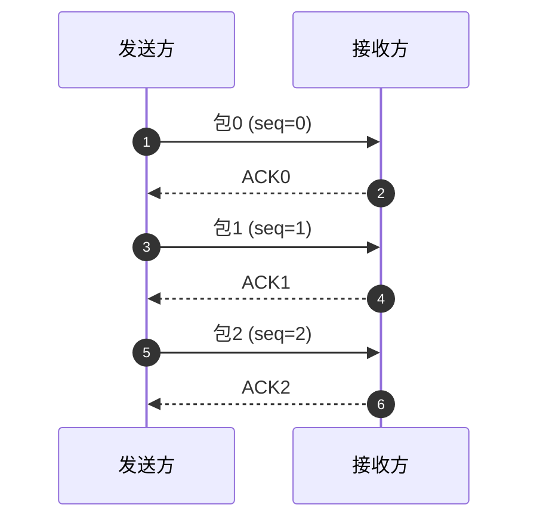

### rdt 演进：从完美信道到最终形态

| 版本 | 新增能力 | 解决什么 |
|---|---|---|
| rdt1.0 | 无 | 假设信道完美，不现实 |
| rdt2.0 | 校验和 + ACK/NAK | 比特错误，**首次引入 ARQ** |
| rdt2.1 | **1 bit 序号** | ACK/NAK 本身损坏 → 接收方需区分"新包/重传旧包" |
| rdt2.2 | **去掉 NAK**，重复 ACK 代替 | 为 TCP 埋伏笔：**TCP 没有 NAK** |
| rdt3.0 | **超时重传** | 丢包，停止等待最终形态 |

关键点：**1 bit 序号就够用**——因为管道里最多只有一个在途包，0/1 交替即可区分新旧。

### 定时器问题

- 超时时间必须 **> RTT**，否则 ACK 还在路上就乱重传（产生大量重复包）
- 也不能太大，否则真丢包时要空等很久
- "设多久"的难题 → 后面 TCP 章节的 **RTT 估计与 RTO 计算**，此处先记住：**超时 > RTT**

### 效率：为什么停等慢

```
        Td(发送时间)                    RTT(往返)
发送方 |========发送========|      等待 ACK      |========发送========|
                           ^                     ^
                           |<------ 空闲 ------->|
```

$$U = \frac{Td}{Td + RTT}$$

**算例**：链路 1 Mbps，包 1000 B → Td = 8000 bit / 1e6 bps = **8 ms**；RTT = 30 ms → U = 8/(8+30) = **21%**。RTT 若为 500 ms（卫星），利用率跌到 1.6%——链路几乎全在空等。

**结论：必须引入流水线（pipelining）→ GBN。**

---

## 第二章 GBN（Go-Back-N，回退 N 步）

### 核心思想：发送窗口 + 流水线

不再等一个 ACK 再发下一个，而是**一口气发 N 个**：

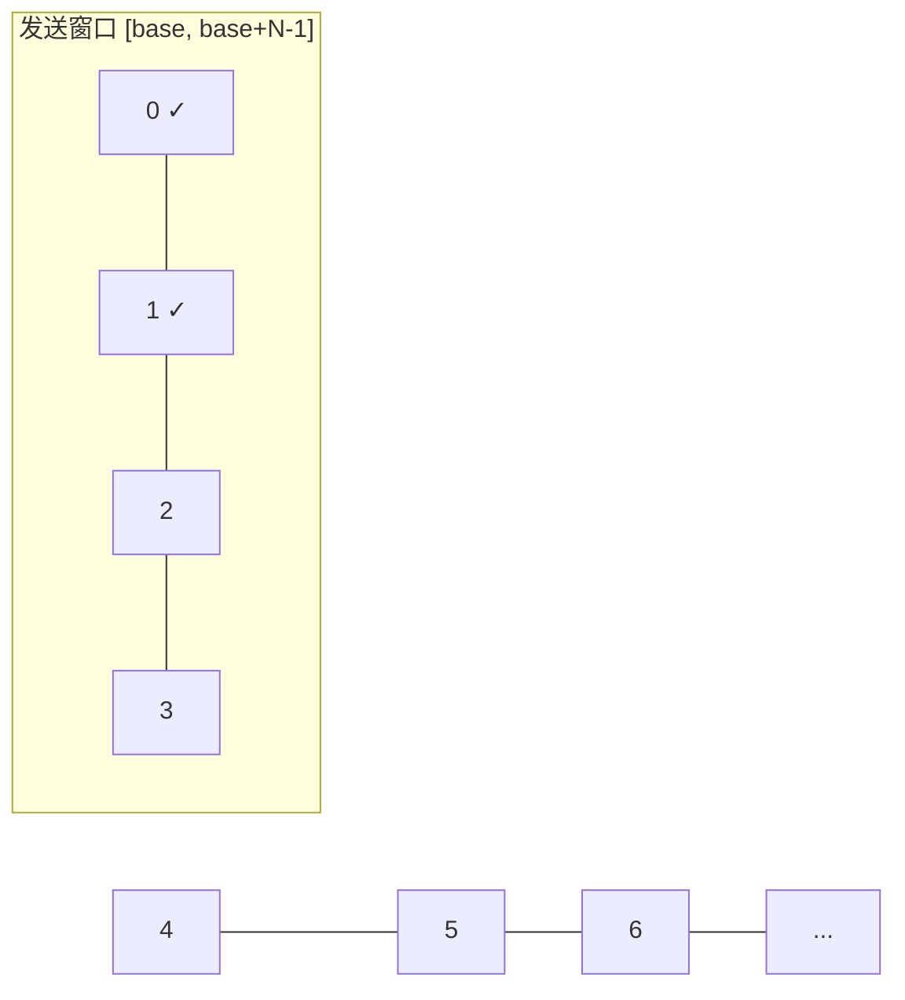

两个指针理解整个 GBN：
- **base**：窗口左边界，最老的未确认包
- **nextseqnum**：下一个要发送的包的序号
- 窗口内可发送序号范围：`[base, base+N-1]`

### GBN 三条规则

1. **累计确认（cumulative ACK）**：`ACK n` 表示"序号 ≤ n 的全部收到"。收到 ACK 3 = 0、1、2、3 全确认，窗口直接滑到 4。
2. **单个定时器**：只给最老的未确认包（base 指向的包）启动一个定时器；确认导致窗口滑动就重启它。
3. **回退重传**：超时 → 把 base 到 nextseqnum 的**所有包全部重传**（"回退 N 步"名字由来）。

### 发送方状态机（三事件）

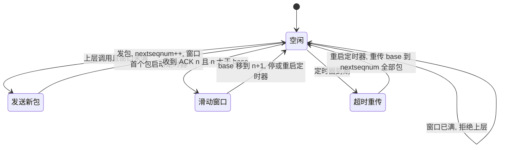

伪代码（Kurose 经典版）：

```c
// 发送方
void rdt_send(data) {
    if (nextseqnum < base + N) {            // 窗口未满
        sndpkt[nextseqnum] = make_pkt(seq=nextseqnum, data, checksum);
        udt_send(sndpkt[nextseqnum]);
        if (base == nextseqnum) start_timer();  // 窗口第一个包才启动定时器
        nextseqnum++;
    } else refuse_data();                   // 窗口满，拒收
}

void rcv_ack(acknum) {
    if (acknum > base) {                    // 累计确认：窗口整体滑动
        base = acknum + 1;
        if (base == nextseqnum) stop_timer();
        else restart_timer();
    }                                       // 重复 ACK 直接忽略
}

void timeout() {
    restart_timer();
    for (i = base; i < nextseqnum; i++)     // 回退 N：全重传
        udt_send(sndpkt[i]);
}
```

### 接收方：只有一个指针

```c
// 接收方
void rcv(pkt) {
    if (corrupt(pkt) || seq(pkt) != expectedseqnum) {
        udt_send(ACK(expectedseqnum - 1));  // 乱序/损坏 → 丢弃 + 重复发上次的 ACK
    } else {
        deliver_data(data);
        udt_send(ACK(seq(pkt)));
        expectedseqnum++;
    }
}
```

要点：**乱序包直接丢弃，不缓存**——这是 GBN 与 SR 的根本区别，也是 GBN 浪费带宽的根源。

### 序号空间：为什么窗口必须留出一个空位

**推导**（k 位序号 → 序号空间大小 S = 2^k；GBN 发送窗口 W）：

为了避免序号回绕后产生歧义，必须保证窗口至少留出一个未使用的序号：

$$W \le S - 1 = 2^k - 1$$

**本质（不要死记公式，记原因）**：GBN 的接收方不缓存乱序数据，它只能依靠序号判断数据是否属于"当前窗口"。因此发送窗口绝不能把整个序号空间占满，必须留出一个序号作为"分界点"，否则序号回绕后，新旧数据无法区分。

**为什么"留一个"就够（反例验证）：**

- 序号空间 = W（没留空位，W=4，序号 0,1,2,3）：ACK 全丢 → 超时重传 [0,1,2,3] → 接收方期待序号已回绕到 0 → **把重传的旧包 0 当新包交付 ✗**
- 序号空间 = W+1（W=3，序号 0,1,2,3）：ACK 全丢 → 重传 [0,1,2] → 接收方期待 3，旧包全部丢弃，回 ACK2 → 发送方 base 移到 3，发新包 3 ✓

| 序号位数 k | 序号空间 2^k | 窗口上限 2^k-1 |
|---|---|---|
| 1 | 2 | 1（停等 —— rdt2.1 的 1 bit 由来） |
| 2 | 4 | 3 |
| 3 | 8 | 7 |

**预告 SR**：接收方开始缓存乱序包后，一个空位就不够了——发送窗口和接收窗口各占 W 个序号，回绕时必须互不污染，因此窗口必须进一步缩小到 W ≤ 2^k / 2（序号空间的一半）。这也是 TCP 为什么更接近 SR 而不是 GBN 的重要原因。

### 效率与致命缺点

- 正常时（窗口满载理想）：$$U = \frac{N \cdot Td}{Td + RTT}$$，比停等提高约 N 倍
- **致命缺点**：丢一个包 → 重传后面全部。丢包率一高，重传量爆炸：

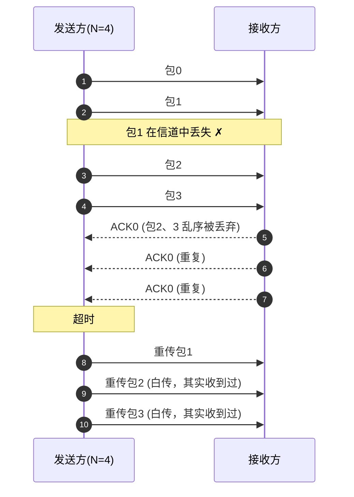

- 结论：GBN 适合**低丢包率、窗口不用太大**的场景；高丢包率/高时延 → 必须用 SR。

### 嵌入式里真实存在的 ARQ

| 协议 | ARQ 类型 | 说明 |
|---|---|---|
| **BLE 链路层** | 停等 ARQ | 数据头 **SN/NESN 各 1 bit**（正是 rdt2.1 的 1 bit 序号）：收到 SN 正确 → 回 NESN=¬SN 当 ACK；SN 不对 → 视为重传，确认但不交上层 |
| **802.11 WiFi 单播** | 停等（每帧等 ACK） | 单播数据帧必须等 immediate ACK，超时重传 |
| **802.11n+ A-MPDU** | Block ACK（SR 思想） | 批量发最多 64 个子帧，用**起始序号 + 64 bit 位图**选择性确认，只重传没 ACK 的子帧——SR 的位图版 |
| **Modbus RTU** | 停等（应用层） | 主站发请求后必须等从站应答才发下一条 |
| **TCP** | GBN + SR 混合 | 累计 ACK 像 GBN，但能只重传丢失段（靠 SACK）——后续章节细讲 |

> 直觉：写 BLE/Modbus 时其实一直在写停等 ARQ——只是没意识到它和 rdt3.0 是同一个东西。

---

## 第三章 SR（Selective Repeat，选择重传）

### 动机：GBN 的痛点

GBN 丢一个包（如包 2），要把 2、3、4、5 全部重传——**因为接收方把乱序的 3、4、5 全扔了**。丢包率 10% 时窗口内几乎每次都有丢失，重传量爆炸。

**SR 的解法：接收方也开窗口，乱序包先缓存，不扔。** 发送方因此知道"只有 2 丢了"，只重传 2。

### 核心机制：双方都开窗口

```
发送窗口（W=4）         接收窗口（W=4，新增！）
[2 3 4 5]  ←超时重传2    [2 3 4 5]  ←3、4、5 先缓存，等 2 补上再交付
  ↑                          ↑
已发未确认               期望收到的下一个
```

接收方缓存 `[rcv_base, rcv_base+W-1]` 内的乱序包，收到 2 后按序交付 2、3、4、5。

### 与 GBN 的四个关键区别

| | GBN | SR |
|---|---|---|
| 接收窗口 | 1（乱序就丢） | **N（缓存乱序）** |
| 确认方式 | 累计 ACK | **单个 ACK（每个包独立确认）** |
| 定时器 | 1 个（只给 base） | **每包一个** |
| 超时处理 | 重传窗口内全部 | **只重传超时的那一个** |

### 发送方状态机（三事件）

```
事件1: 上层要发数据
    窗口未满 (nextseqnum < base+W) → 发包 + 给该包启动独立定时器

事件2: 收到 ACK(n)
    标记包 n 已确认
    若 n == base → base 前移到下一个未确认包
                   窗口空出 → 补发新包

事件3: 超时（包 n 的定时器）
    只重传包 n，重启它的定时器     ← 与 GBN 的根本区别
```

```c
// 发送方（伪代码）
void rdt_send(data) {
    if (nextseqnum < base + W) {
        sndpkt[nextseqnum] = make_pkt(nextseqnum, data, checksum);
        udt_send(sndpkt[nextseqnum]);
        start_timer(nextseqnum);          // 每个包独立定时器！
        nextseqnum++;
    } else refuse_data();
}

void rcv_ack(acknum) {
    acked[acknum] = true;                 // 标记确认（不整体滑动）
    if (acknum == base) {                 // 只有 base 被确认才滑动
        while (acked[base]) base++;       // 前移到第一个未确认
        stop_timer(base - 1);
    }
    // 窗口空出后可发新包（回到事件1）
}

void timeout(seqnum) {
    udt_send(sndpkt[seqnum]);             // 只重传这一个
    start_timer(seqnum);
}
```

### 接收方状态机（注意一个容易漏的细节）

```c
// 接收方（伪代码）
void rcv(pkt) {
    seq = seqnum(pkt);
    if (corrupt(pkt)) return;

    if (在窗口内 [rcv_base, rcv_base+W-1]) {
        udt_send(ACK(seq));               // 每个包都回 ACK，包括乱序的
        buffer[seq] = data;               // 缓存，不交付
        if (seq == rcv_base) {            // 按序交付
            while (buffer[rcv_base] 非空) {
                deliver_data(buffer[rcv_base]);
                rcv_base++;
            }
        }
    }
    else if (seq < rcv_base) {
        udt_send(ACK(seq));               // ★ 已确认过的旧包：重发 ACK！
    }
    // seq > rcv_base+W-1：未来包，忽略
}
```

**★ 最重要的一行**：接收方收到**窗口左边的旧包**（说明发送方超时重传了，但我们的 ACK 丢了）→ 必须**重发 ACK**。否则发送方一直等不到 ACK，永远重传，死锁。这个细节最容易写漏。

### 时序图：SR 丢包恢复

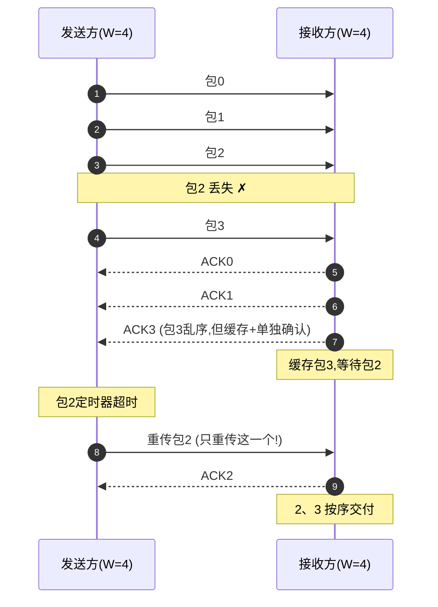

对比 GBN 的时序图：**只重传 1 个包，接收方不再丢弃乱序包**。

### 序号空间：为什么必须 2^m ≥ 2W

沿用 GBN 的"分界点"心智模型升级：

- GBN：接收窗口 = 1，只有**发送方**一个窗口占序号空间 → 留 1 个空位就够 → W ≤ 2^k - 1
- SR：接收方也开窗口！**两个窗口同时在序号空间里滑动**，最坏情况它们会"错开"（发送方窗口滑了，接收方窗口还没滑）→ 1 个空位不够，需要给两个窗口各自留出判别空间

**反例**（序号空间 4 个，W=3）：

```
1. 发送窗口 [0,1,2]，接收窗口 [0,1,2]
2. 发出 0,1,2，全部到达 → 接收方交付，窗口滑到 [3,0,1]  ← 回绕
3. 但 0,1,2 的 ACK 全部丢失！
4. 发送方超时，重传 0,1,2
5. 接收方窗口 [3,0,1]：0、1 在窗口内 → 当作新数据交付 → 重复 ✗✗
```

发送方重传的包"追上了"接收方窗口回绕后的位置——**窗口 + 窗口 > 序号空间**，两个窗口重叠了。

**正解**：序号空间 ≥ 2W，例如 W=3、序号 0..5：

```
1. 发送 [0,1,2]，接收方交付，窗口滑到 [3,4,5]
2. ACK 全丢 → 发送方重传 0,1,2
3. 接收方窗口 [3,4,5]：0、1、2 全在窗口左边 → 重发 ACK，不交付 ✓
4. 发送方收到 ACK → base 前移 → 发新包 3,4,5 → 接收方正确接收 ✓
```

所以：

$$W \le \frac{2^k}{2} \quad (2^m \ge 2W)$$

> 记忆：GBN 留 **1 个空位**（单窗口），SR 留 **半个序号空间**（双窗口）——分界点从一个变成一半。

### SR 的代价（为什么 TCP 不直接用 SR）

| 代价 | 说明 |
|---|---|
| 接收方内存 | 要缓存最多 W 个乱序包（嵌入式 RAM 敏感） |
| 定时器资源 | 每个在途包一个定时器 |
| 实现复杂度 | 窗口滑动逻辑比 GBN 繁琐（acked[] 数组） |

所以 **TCP 是 GBN + SR 的混合**：累计 ACK（GBN 的滑动方式）+ 选择性确认 SACK 扩展（SR 的思想，只重传丢失段）——后续章节细讲。

### 嵌入式真实对应

| 协议 | SR 成分 |
|---|---|
| **802.11n A-MPDU Block ACK** | 位图选择性确认 + 只重传丢失子帧（上章表格的本质） |
| **TCP + SACK** | 累计确认推进 + SACK 块告诉发送方"哪些丢了" |
| BLE / Modbus | 无——停等即可：窗口 1 最简单，嵌入式链路带宽小不需要流水线 |

---

## 第四章 TCP：可靠传输的最终形态

> 前三章在"包模型"里解决了信道不可靠；TCP 把它们变成现实协议，并加上两个前三章没有的维度：**两端速率不匹配**（流量控制）和**网络过载**（拥塞控制），以及一套**连接管理**状态机。本章按连接的生命周期讲：建立（握手）→ 传输（序号/窗口/重传/拥塞）→ 释放（挥手），最后是工程细节和验证。

### 定义：面向字节流、需要建立连接、全双工的可靠传输协议

**TCP 与前三章的关系一句话：GBN 骨架（累计 ACK 滑动窗口）+ SR 补丁（缓存乱序、SACK 选择重传）+ 字节粒度序号。**

|        | 停等     | GBN    | SR     | TCP                         |
| ------ | ------ | ------ | ------ | --------------------------- |
| 序号单位   | 包      | 包      | 包      | **字节**                      |
| 确认方式   | 单个 ACK | 累计 ACK | 单个 ACK | 累计 ACK                      |
| 接收方缓存  | 无      | 无      | 缓存乱序   | 缓存乱序（上限 rwnd）               |
| 丢包恢复   | 重传当前包  | 回退重传全部 | 只重传丢失的 | 超时/快重传最老段；SACK 后只重传丢失段      |
| 要解决的问题 | 信道不可靠  | 信道不可靠  | 信道不可靠  | 信道不可靠 + 速率不匹配 + 网络拥塞 + 连接管理 |

### TCP Header：所有机制都写在头里

```text
 0                   1                   2                   3
 0 1 2 3 4 5 6 7 8 9 0 1 2 3 4 5 6 7 8 9 0 1 2 3 4 5 6 7 8 9 0 1
+-+-+-+-+-+-+-+-+-+-+-+-+-+-+-+-+-+-+-+-+-+-+-+-+-+-+-+-+-+-+-+-+
|          Source Port          |       Destination Port        |
+-+-+-+-+-+-+-+-+-+-+-+-+-+-+-+-+-+-+-+-+-+-+-+-+-+-+-+-+-+-+-+-+
|                        Sequence Number                        |
+-+-+-+-+-+-+-+-+-+-+-+-+-+-+-+-+-+-+-+-+-+-+-+-+-+-+-+-+-+-+-+-+
|                    Acknowledgment Number                      |
+-+-+-+-+-+-+-+-+-+-+-+-+-+-+-+-+-+-+-+-+-+-+-+-+-+-+-+-+-+-+-+-+
|  Data |       |C|E|U|A|P|R|S|F|                               |
| Offset| Rsrvd |W|C|R|C|S|S|Y|I|            Window             |
|       |       |R|E|G|K|H|T|N|N|                               |
+-+-+-+-+-+-+-+-+-+-+-+-+-+-+-+-+-+-+-+-+-+-+-+-+-+-+-+-+-+-+-+-+
|           Checksum            |         Urgent Pointer        |
+-+-+-+-+-+-+-+-+-+-+-+-+-+-+-+-+-+-+-+-+-+-+-+-+-+-+-+-+-+-+-+-+
|                           [Options]                           |
+-+-+-+-+-+-+-+-+-+-+-+-+-+-+-+-+-+-+-+-+-+-+-+-+-+-+-+-+-+-+-+-+
```

| 字段 | 位宽 | 作用 |
|---|---|---|
| 源 / 目的端口 | 16 + 16 | 进程寻址，与 IP 组成四元组唯一定位一条连接 |
| 序号 | 32 | 本段第一个数据**字节**的序号（SYN 段例外，见握手）|
| 确认号 | 32 | 期望收到的下一个字节号（ACK 标志置位时有效）|
| Data Offset | 4 | 头长，单位 32 位字（5~15 → 20~60 字节）|
| 标志位 | 9 | CWR ECE URG ACK PSH RST SYN FIN |
| 窗口 | 16 | 接收方愿意接收的字节数（rwnd）→ 流量控制用 |
| 校验和 | 16 | 覆盖伪头部 + 头 + 数据 |
| 紧急指针 | 16 | URG 置位时有效（很少用）|

要点：

1. **固定 20 字节，最大 60 字节**（选项最多 40 字节）——头开销比 BLE（2~4 字节）大一个数量级，所以 TCP 不适合小包高频通信（这也是嵌入式小数据场景常用 UDP 的原因之一）。
2. **序号、确认号都是 32 位**：因为按字节编号，序号空间 2^32 ≈ 4 GB，1 Gbps 链路 30 多秒就绕一圈——回绕问题靠时间戳选项（PAWS）兜底，此处只留个印象。
3. 校验和覆盖**伪头部**（源/目的 IP 地址、协议号、TCP 长度共 12 字节）：IP 层不校验数据完整性，TCP 自己兜底，防止跨网络篡改。
4. 选项里与本章相关的：**MSS**（握手时协商，双方取小）、**窗口缩放**、**SACK-Permitted**、**时间戳**。

### 三次握手：连接是"商量"出来的

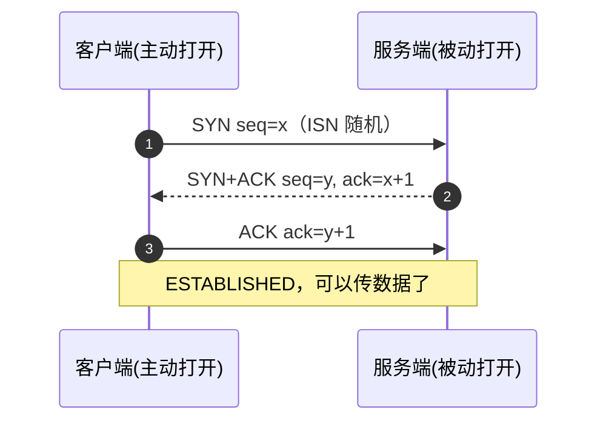

三个包各干一件事：

| 包 | 内容 | 作用 |
|---|---|---|
| 1. SYN | seq = ISN(随机) | 客户端宣告"我要连接，我的初始序号是 x" |
| 2. SYN+ACK | seq = y, ack = x+1 | 服务端应答"收到，我的初始序号是 y，我期待你的字节 x+1" |
| 3. ACK | ack = y+1 | 客户端确认"收到你的序号"，服务端由此确认连接建立 |

**为什么必须是三次，两次不行？（反例）**

```
1. 客户端发 SYN(x) → 在网络中滞留
2. 超时后重发 SYN(x') → 服务端正常应答，连接建立，数据传完，正常关闭
3. 滞留的旧 SYN(x) 此时才到服务端
4. 服务端以为又有新连接 → 回 SYN+ACK(x+1)，并分配资源等待数据
5. 客户端对这个"幽灵连接"一无所知，不会回应 → 服务端资源被白白占住
```

两次握手时，服务端**收到 SYN 就认为连接建立**；三次握手时，服务端必须等到客户端的 ACK 才进入 ESTABLISHED——旧 SYN 的应答永远不会被确认，服务端超时放弃，幽灵连接自动消失。**第三次 ACK 的本质：让"谁发起了这次连接"无法伪造**（ack 必须等于对端 SYN 的序号 + 1，只有真正收到过那个 SYN 的对端才知道）。

**容易忽略的三个细节：**

- **SYN 消耗一个序号**：SYN 段本身占一个字节号，客户端数据从 x+1 开始（所以服务端回 ack=x+1 意思是"把你的数据从 x+1 发来"）。FIN 同样消耗序号——挥手时 ACK 都是 +1 的来历。
- **ISN 必须随机**：初始序号可预测时，攻击者可伪造 RST 切断连接。现代实现按时间 + 秘密随机数生成。
- 握手包同时**协商选项**：MSS、窗口缩放、SACK-Permitted、时间戳——一次握手，整个连接生效。

### 字节流与累计 ACK：序号是字节号，不是包号

GBN/SR 的序号是**包号**（包 0、1、2…）；TCP 的序号是**字节号**——每个字节一个序号，段的序号 = 该段第一个字节的序号。

例：应用一次写 3000 字节，TCP 切成 3 段，每段 1000 字节：

```
段1: seq=0     （字节 0~999）
段2: seq=1000  （字节 1000~1999）
段3: seq=2000  （字节 2000~2999）
接收方全收到 → ACK=3000（期望的下一个字节）
```

**为什么按字节编号？**

1. 应用层是**字节流**：写 1 字节、写 5 字节、写 3000 字节都合法。按包编号的话，包边界本身不稳定（MSS 可协商、段可合并拆分）；按字节编号，**任何切法都能被精确确认**。
2. 累计 ACK 更强大：`ACK n` = "序号 < n 的所有字节都到了"，与包边界无关。

**关键：ACK 停在缺口处 → 重复 ACK 诞生**

```
发送方发出 段1(0~999) 段2(1000~1999) 段3(2000~2999)，段2 丢失：

接收方：段1 到 → ACK=1000
        段3 到（乱序）→ 立即回 ACK=1000（重复 ACK #1）★
发送方：连续收到 ACK=1000 → 知道 1000~1999 这段丢了
```

★ 接收方**乱序时立即回 ACK**（不等延迟 ACK），RFC 5681 明确要求——这是后面快重传能工作的前提。重复 ACK 与 SR 里"窗口左边的旧包重发 ACK"精神一致：**用重复 ACK 告诉发送方缺口在哪**。

### 滑动窗口与流量控制：rwnd —— 接收方能吃多少

前三章的窗口解决"信道不可靠"；流量控制解决另一个问题：**接收方处理不过来**（应用读得慢、缓冲区小）。

- 接收方在**每个段的窗口字段**通告 rwnd："我还能收多少字节"
- 发送方在途字节数必须 ≤ rwnd；rwnd 变成 0 → 发送方停发

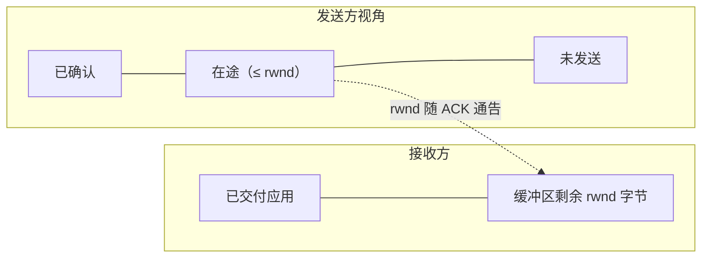

**零窗口与 persist 定时器（防死锁）**

rwnd=0 时发送方停发。之后接收方应用读走数据 → 发一个窗口更新 ACK → 发送方恢复。**但这个窗口更新 ACK 可能丢失** → 接收方以为通知过了、发送方永远等 → 死锁。

解法：发送方在 rwnd=0 时启动 **persist 定时器**，周期性发 1 字节探测段（必须带 1 字节数据——0 字节段允许被丢弃，1 字节段必须确认），迫使接收方回 ACK（顺带带回新 rwnd）。**这与 SR 接收方"对窗口左边的旧包重发 ACK"是同一个防死锁思路：确认会丢，所以必须周期性迫使对方确认。**

**窗口缩放选项**：窗口字段只有 16 位 → 最大 64 KB，高速链路（带宽时延积大）不够用。握手时协商"窗口缩放因子"，实际窗口 = 字段值 << 因子（最多 2^30 ≈ 1 GB）。抓包看到 Window 字段 65535 不代表上限，要结合缩放因子看。

### RTT 估计与 RTO：第一章"定时器设多久"的正式答案

第一章留下问题：超时要 > RTT，但 RTT 会变，设死值不行。TCP 的做法是**动态估计 RTT，并加上抖动余量**：

RFC 6298 公式（两个状态变量：SRTT 平滑值、RTTVAR 抖动）：

```
首次样本 R：      SRTT = R，RTTVAR = R/2，RTO = SRTT + 4×RTTVAR
后续样本 R'：     RTTVAR = (1-β)×RTTVAR + β×|SRTT - R'|
                  SRTT = (1-α)×SRTT + α×R'
                  RTO = SRTT + 4×RTTVAR        （α=1/8, β=1/4）
```

**算例**（RTT 样本 30ms → 50ms → 30ms，模拟一次抖动）：

| 样本 | SRTT | RTTVAR | RTO |
|---|---|---|---|
| 30 ms | 30.0 | 15.0 | 30 + 4×15 = **90 ms** |
| 50 ms | 32.5 | 16.3 | 32.5 + 4×16.3 = **98 ms** |
| 30 ms | 32.2 | 12.8 | 32.2 + 4×12.8 = **83 ms** |

观察：RTT 抖动 → RTO 放大到 98ms（比静态 30ms 留了 3 倍余量）；RTT 恢复 → RTO 平滑回落（98 → 83），不会跳变——SRTT 跟踪平均值，RTTVAR 跟踪波动，**RTO = 平均 + 4×波动，波动越大越保守**。

工程细节（RFC 6298）：

- **下限 1 秒**：局域网 RTT 只有 1ms 时 RTO 也不允许低于 1s——避免误重传（旧标准 3s，2011 年降到 1s）
- **Karn 算法**：重传过的段**不采样** RTT——分不清 ACK 是回应第一次发送还是重传，重传后的样本是假的
- **指数退避**：超时后 `RTO ×= 2`（1s → 2s → 4s…），直到拿到新的有效样本才恢复——网络拥塞时退避是保护网络，呼应 GBN 的教训：重传本身也会加剧拥塞

### 丢包恢复：超时重传 vs 快重传

TCP 超时重传只重传**最老的未确认段**——不是 GBN 的回退 N。为什么？累计 ACK 已经隐含确认了 base 之前的所有段，缺的只有 base 这一个；重传它之后，后续段由新收到的累计 ACK 决定是否再传。**TCP 用"累计 ACK + 逐段重传"实现了 GBN 的滑动效率和 SR 的重传精度。**

但等 RTO 太慢（下限 1s，局域网丢一个包要卡 1 秒）→ **快重传**：不等超时。

```
接收方乱序段立即回重复 ACK（上节 ★）
发送方收到 3 个重复 ACK → 判定该段丢失 → 立即重传，不等 RTO
```

**为什么 3 个不是 2 个？** 网络可能乱序：段 3、4 先到、段 1 后到，也会产生重复 ACK。RFC 5681 的经验值：1 个重复 ACK 可能是乱序，**3 个基本可以断定是丢了**（丢段后它后面的每个段都会各触发一个重复 ACK）。

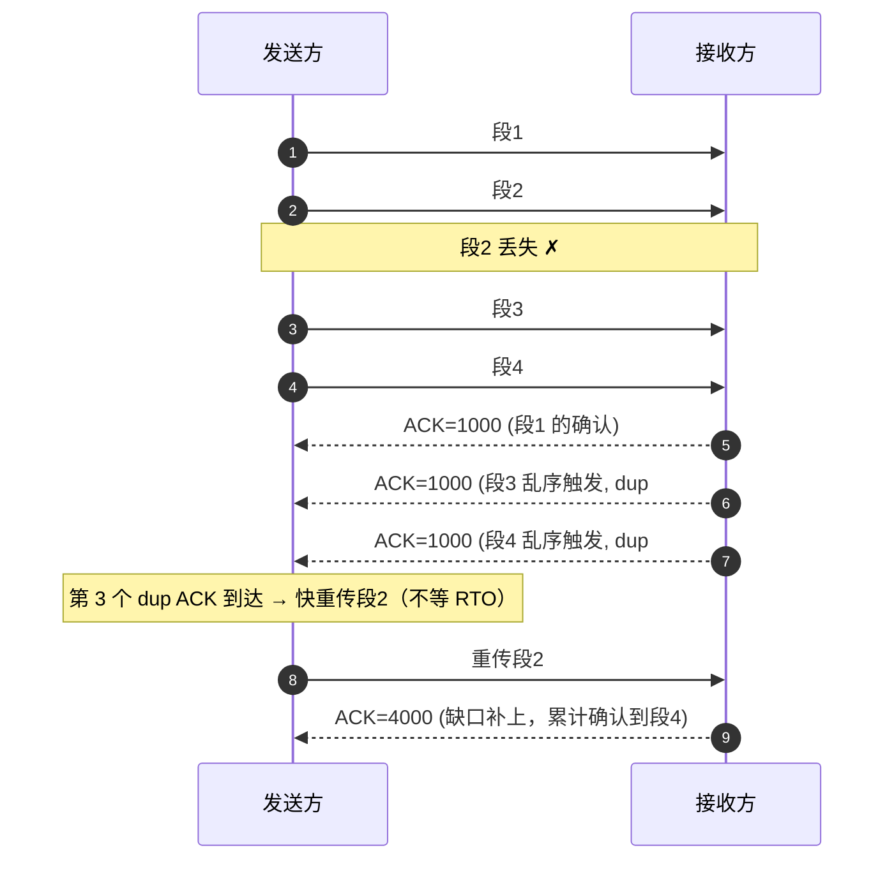

对比：GBN 要重传 2、3、4 三个段，TCP 只重传段2（接收方缓存了 3、4）——**超时/快重传 + 接收方缓存，本质上已经是 SR，只是确认仍走累计 ACK（GBN 风格）**。这正是没有 SACK 时 TCP 的样子；开了 SACK 后连"缺口在哪"都不用猜，见下节。

### SACK：把"缺了哪几块"直接告诉发送方

没有 SACK 时，多个段丢失（如段2、段5），累计 ACK 只能停在段1 处——发送方只知道"2 丢了"，不知道 3、4、6、7 其实都到了，恢复过程中可能白白重传。**SACK 让接收方把"已收到的非连续块"列表发给发送方。**

RFC 2018：

- 协商：SYN 里带 **SACK-Permitted**（kind=4）→ 双方都支持才启用
- 数据段里带 **SACK 选项**（kind=5）：一块 = 左边界 + 右边界（各 32 位）共 8 字节；选项空间 40 字节 → 最多 4 块（带时间戳则 3 块）
- **SACK 不改变累计 ACK 语义**——它是补充信息，不是替代

**示例**（发 4 段各 500B：seq 5000、5500、6000、6500，第一段丢）：

| 到达 | ACK 字段 | SACK 块 |
|---|---|---|
| 5500 | 5000 | [5500, 6000) |
| 6000 | 5000 | [5500, 6500) ← 相邻块自动合并 |
| 6500 | 5000 | [5500, 7000) |

发送方读 SACK：5500~7000 全到了，只有 5000~5500 缺 → **只重传这一块**。这就是第三章 SR 的思想，用选项在 TCP 里实现了。

> 呼应第二章的表格：802.11n 的 **Block ACK** 用"起始序号 + 64 位位图"做选择性确认；TCP 的 **SACK** 用"块列表"（左右边界）做同样的事——**同一个 SR 思想，两种编码**。位图适合固定窗口（WiFi 最多 64 子帧），块列表适合字节流（缺口位置任意）。

### 拥塞控制：cwnd —— 网络能吃多少

流量控制（rwnd）防的是**接收方**溢出；但瓶颈还可能在**网络**（路由器缓冲区满 → 丢包）。发送方必须自己估计网络容量：**cwnd（拥塞窗口）**。

**发送上限 = min(cwnd, rwnd)**：一个防接收方，一个防网络，谁小听谁的。

```
cwnd=16, rwnd=64 → 一次最多在途 16 个段（被网络限制）
cwnd=32, rwnd=8  → 一次最多在途 8 个段（被接收方限制）
```

四个算法（RFC 5681），**丢包 = 拥塞信号**：

| 算法 | 触发 | 行为 | 目的 |
|---|---|---|---|
| 慢启动 | cwnd < ssthresh | 每个 ACK：cwnd += min(N, MSS)（每 RTT 翻倍）| 快速探测可用带宽 |
| 拥塞避免 | cwnd ≥ ssthresh | 每 RTT cwnd +1 个 MSS | 线性逼近瓶颈 |
| 快重传 | 3 个重复 ACK | 立即重传丢失段 | 不等 RTO |
| 快恢复 | 快重传后 | 见下 | 不跌回 1，保持管道满 |

**慢启动为什么叫"慢"启动**：cwnd 从 1 开始，每 RTT 翻倍（1→2→4→8→16）。名字叫慢，实际是指数增长，几个 RTT 就摸到瓶颈。ssthresh 是"从指数切到线性"的门槛。

**两种丢包，两种惩罚（RFC 5681）：**

```
RTO 超时（严重拥塞，管道完全断了）：
    ssthresh = max(在途字节/2, 2×MSS)
    cwnd = 1 → 重新慢启动

3 个重复 ACK（轻度拥塞，还有包在流动）：
    ssthresh = max(在途字节/2, 2×MSS)
    cwnd = ssthresh + 3×MSS   ← 触发重复 ACK 的 3 个段已离开网络，可多放 3 个
    每多一个重复 ACK：cwnd += 1   （又一个段离开了网络）
    收到恢复 ACK：cwnd = ssthresh → 进入拥塞避免
```

**为什么快恢复不跌回 1？** 重复 ACK 说明接收方还在收数据（网络没死），只是丢了一个段；"在途 = cwnd + 已离开网络的段"，收到 3 个重复 ACK 意味着至少 3 个段离开了网络，所以 cwnd 立刻加回 3 个位置。**快恢复是"维持管道不空"，代价是 ssthresh 减半——这就是 TCP 的 AIMD（加性增、乘性减）：接近瓶颈时线性试探，遇到拥塞就减半。**

```
cwnd (MSS)
16 ┤          /\               /\
   │         /  \             /  \
 8 ┤   /\   /    \      /\   /    \
   │  /  \ /      \    /  \ /      \
 1 ┤ /    \/       \  /    \/       \
   └──────────────────────────────────→ 时间
    ↑慢启动(指数)   ↑3 dup ACK: 减半+快恢复  ↑RTO超时: 掉到1重新慢启动
    ↑ssthresh       ↑拥塞避免(线性)
```

**算例**：cwnd=16 时丢一个段，走 3 个重复 ACK → ssthresh=8，cwnd=11，恢复 ACK 后 cwnd=8 线性增长（约 8 个 RTT 回到 16）；若走 RTO → cwnd=1，慢启动 4 个 RTT 才爬回 16。**同一个丢包，快恢复惩罚轻得多——这就是为什么乱序时接收方必须立即回重复 ACK。**

> 现代实现：Linux 默认 CUBIC（大窗口下增长更快）、Google 的 BBR（不再以丢包为拥塞信号，改为测量带宽）。本笔记只讲 RFC 5681 的经典四算法，它们是一切拥塞控制的地基。

### 四次挥手与 TIME_WAIT：每个方向各关各的

TCP 是**全双工**：两个方向独立传输。关闭时每个方向都要单独说"我不发了"——所以挥手要 4 段：

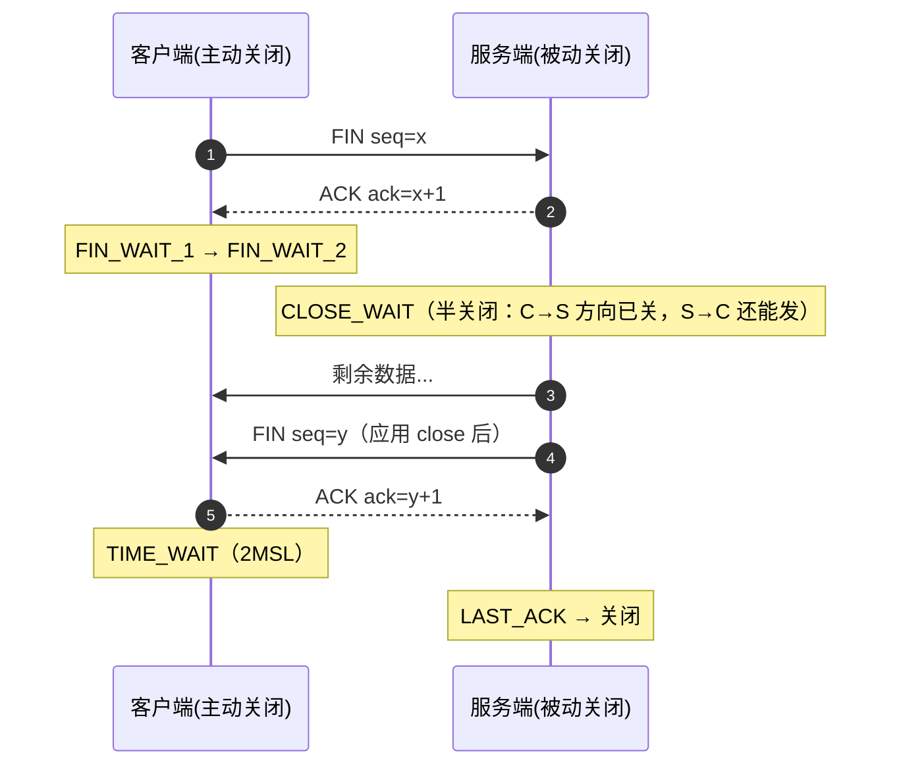

**为什么不能把第 2、3 段合并成"三次挥手"？** 服务端收到 FIN 后只是"确认收到"，它**可能还有数据要发**（比如还剩半个响应没发完）。第 2 段的 ACK 是"知道了"，第 3 段的 FIN 是"我也发完了"——中间隔着应用层处理，无法保证同时发生。

状态机（只画两条典型路径，完整版有 11 个状态）：

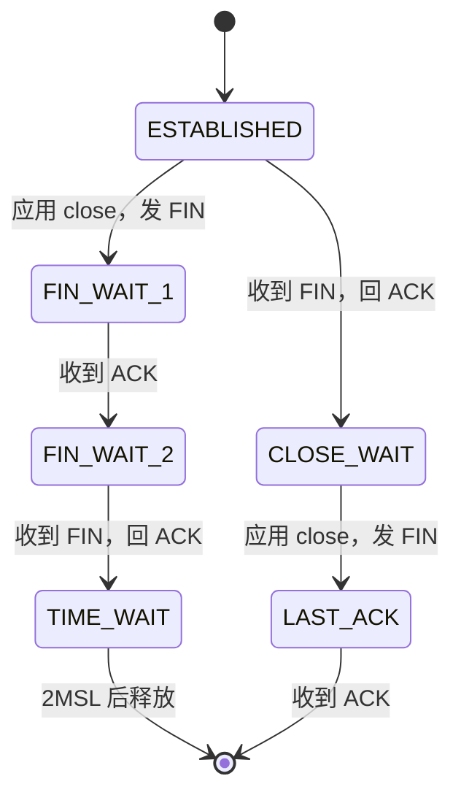

**TIME_WAIT 为什么必须等 2MSL？**

1. **最后那个 ACK 可能丢**：服务端在 LAST_ACK 等 ACK 等不到 → 重传 FIN → 客户端必须还活着好再回一次 ACK。等 2MSL（两倍最大段寿命，RFC 建议 MSL 2 分钟，Linux 实现约 60s）足够对方重传 FIN 并让自己回 ACK。
2. **防止旧包污染新连接**：等 2MSL 后，旧连接残留在网络里的包（寿命 ≤ MSL）全部消亡，之后才能安全复用相同四元组（IP+端口）建新连接。

注意：**只有主动关闭方进 TIME_WAIT**（最后那个 ACK 是它发的，它要为这个 ACK 负责）。两个常见坑：

- **CLOSE_WAIT 堆积**：客户端断开后服务端应用忘了 close() → 连接永远停在 CLOSE_WAIT（fd 泄漏）。嵌入式服务器（HTTP 服务、网关）最常见的连接问题就是它。
- **TIME_WAIT 堆积**：服务器主动关连接 + 高并发短连接 → 2MSL 内四元组不能复用，端口耗尽。

### Nagle、延迟 ACK、KeepAlive：三个工程细节

**小包问题**：交互式应用（telnet/SSH/控制指令）每敲一个键发一个包 → 1 字节数据 + 40 字节头，带宽利用率 2.5%。

**Nagle 算法**（发送端）：**有未确认数据在途时，小包（< MSS）不发**，等 ACK 清空在途数据，或凑满 MSS 再发。

**延迟 ACK**（接收端）：收到**单个**段不立即回 ACK，等最多 40ms（RFC 1122 上限 500ms，Linux 默认 40ms），期望捎带响应数据或合并多个确认；收到**连续两个**段则立即 ACK。

**两者相遇 → 40ms 级假死锁**（Stuart Cheshire 的经典案例）：

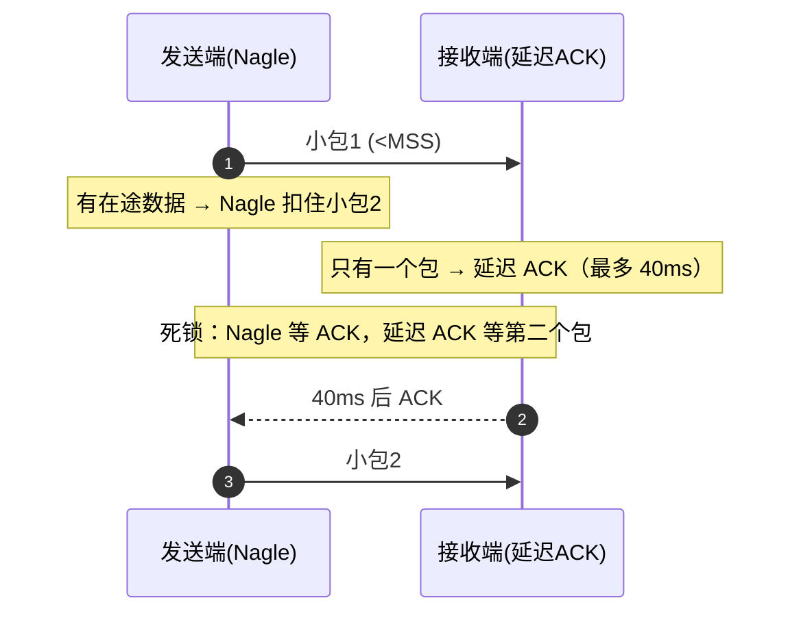

请求-响应协议（如 HTTP）每次交互都白等一个 40ms → 吞吐掉一个数量级。解法：

- 发送端关 Nagle：`TCP_NODELAY`（低延迟控制场景常用）
- 接收端关延迟 ACK：`TCP_QUICKACK`（Linux）
- Minshall 修改：允许 1 个 runt（小于 MSS 的包）在途——兼顾效率与延迟

**KeepAlive：TCP 自带的"探测心跳"**

- RFC 1122：keepalive **默认关闭**（必须由应用打开），空闲间隔默认**不少于 2 小时**
- Linux 默认：`tcp_keepalive_time=7200s` + 探测间隔 75s × 9 次 → 约 2 小时 11 分钟才判定死链
- 为什么这么保守：误判会杀掉好连接、探测包浪费带宽（RFC 原文的三条理由）
- 实际工程：**等不了 2 小时，MQTT 等长连接都在应用层做心跳**（几十秒一次），TCP keepalive 只是最后防线

### 嵌入式里的 TCP

| 场景 | 要点 |
|---|---|
| lwIP（ESP32/STM32 常用） | 窗口、MSS、收发缓冲都是**编译期宏**（lwipopts.h），RAM 越小窗口越小——理解了 rwnd 就知道窗口开多大是"内存换吞吐" |
| 低延迟控制 | 小包指令 + 默认 Nagle → 命令延迟被拖到 40ms 级；实测异常时先查是否要开 TCP_NODELAY |
| 长连接设备 | TCP keepalive 默认 2h 不实用 → 应用层心跳（MQTT PINGREQ 等）|
| 设备作为服务器 | 客户端断开后没 close() → CLOSE_WAIT 堆积 → fd 耗尽重启。诊断：`netstat -an \| grep CLOSE_WAIT` |
| 资源权衡 | 一条 TCP 连接要维护序号/窗口/定时器等状态（几十 KB 量级），连接数多时要算 RAM——这也是嵌入式常"用 UDP + 自己加确认"的原因 |

### Wireshark 抓包分析

**三步走验证本章所有机制：**

1. **握手**：抓一次 TCP 连接（如浏览器开任意网页），看三个包——
   - SYN 的选项区：MSS（以太网通常 1460）、窗口缩放、SACK-Permitted、时间戳
   - ISN 每次连接都不同（随机化）
   - 第 3 个包之后才允许传数据（试试看第 2 个包能不能带数据）
2. **传输与窗口**：下载一个大文件，观察——
   - 慢启动：吞吐逐 RTT 爬升
   - Window 字段随时间变化（接收方通告的 rwnd）
   - `tcp.analysis.ack_rtt` 过滤可看每个 RTT 样本
3. **丢包恢复**：人为制造丢包（Windows 用 clumsy 工具设 5% 丢包率，或拔网线瞬间）——
   - 重复 ACK：`tcp.analysis.duplicate_ack` 会标红
   - 快重传：`[TCP Retransmission]` 出现但间隔远小于 1s（说明走了快重传而非 RTO）
   - SACK：重传包同时带 SACK 块，看左右边界
   - 超时重传：断网几秒再恢复，看 RTO 指数退避（重传间隔 1s → 2s → 4s）

> 抓包时记得：Wireshark 显示的 `Seq` 是相对序号（把 ISN 归零了），`Len` 是数据长度，`Ack` 是期望的下一个字节号——对着 4.4 的字节流例子看一遍就通了。

### 第四章小结

把四种协议放进一张表（TCP 的"序号需求"不再是窗口约束问题——32 位序号 + 时间戳防回绕）：

| | 停等 | GBN | SR | TCP |
|---|---|---|---|---|
| 序号单位 | 包 | 包 | 包 | 字节 |
| 发送窗口 | 1 | N | N | min(cwnd, rwnd) |
| 接收窗口 | 1 | 1 | N | rwnd 字节（乱序缓存）|
| 确认方式 | 单个 ACK | 累计 ACK | 单个 ACK | 累计 ACK + SACK |
| 丢包处理 | 重传当前包 | 回退全部 | 只重传丢失的 | 超时/快重传最老段；SACK 后只重传丢失段 |
| 额外机制 | 无 | 无 | 无 | 连接管理、流量控制、拥塞控制、Nagle/KeepAlive |

**一条主线串起全章**：TCP 用**字节序号**让"确认"精确到字节（4.4）→ 用**累计 ACK + 接收方缓存**继承 GBN 的滑动效率和 SR 的重传精度（4.5/4.7）→ 用 **rwnd 和 cwnd 两个窗口**分别防接收方溢出和网络拥塞（4.5/4.9）→ 用 **RTO 动态估计**解决第一章遗留的定时器问题（4.6）→ 用 **SACK** 补上多缺口场景的效率（4.8）→ 用**三次握手/四次挥手**把连接管理做成状态机（4.3/4.10）。

---

## 小结（前三章）

| | 发送窗口 | 接收窗口 | 确认方式 | 丢包处理 | 序号需求 |
|---|---|---|---|---|---|
| 停等 | 1 | 1 | 单个 ACK | 重传当前包 | 1 bit（2^m ≥ 2） |
| GBN | N | 1（不缓存） | **累计 ACK** | 回退重传 N 个 | 2^m ≥ N+1 |
| SR | N | N（**缓存乱序**） | 单个 ACK | **只重传丢失的** | 2^m ≥ 2N（双窗口） |

## 相关笔记

- [[网络传输的五层架构]] — GBN/SR/TCP 属于传输层可靠传输机制
- [[待学习清单]] — 学习进度追踪
