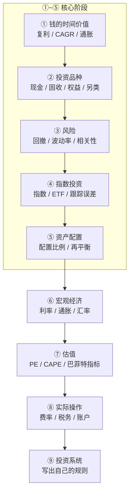

# 金融学习路线

> **定位：** "个人资产配置 + 风险管理"课程，而不是"炒股课程"。
> 不需要学到金融本科水平，花 3~6 个月、每周 3~5 小时（每天 20~30 分钟），建立一套够用的框架。

## 总路线

$$
FV = PV(1+r)^n
$$

---

## 第一阶段：金融最基础的数学（1~2 周）

**目标：知道"钱是怎么增长的"。**

学习内容：单利 vs 复利、年化收益率、CAGR、现值 PV / 终值 FV、通货膨胀、实际收益率、机会成本、现金流、风险溢价。

核心公式：$FV = PV(1+r)^n$

例：30 万 × 1.08¹⁰ ≈ 64.8 万。投资不是"今年赚多少"，而是"几十年以后有多少钱"。

**检验标准，应该能回答：**

- [ ] 30 万，年化 7%，10 年后是多少钱？
- [ ] 年化 10% 和年化 7%，20 年后为什么差这么多？
- [ ] 通胀 3%、投资收益 8%，实际收益大概多少？

## 第二阶段：认识各种资产（2 周）

**目标：搞明白"我买的到底是什么"。**

| 类别 | 品种 |
| ---- | ---- |
| 现金类 | 银行存款、货币基金、短期债券 |
| 固收类 | 国债、公司债、债券基金 |
| 权益类 | 股票、股票基金、ETF、指数基金 |
| 另类资产 | 黄金、REITs、商品 |

例如：买纳斯达克 100 ETF ≠ 买一个基金代码，而是**用基金这个工具，间接持有一篮子大型科技/成长型公司**。

## 第三阶段：理解风险（2 周）

**目标：不只看收益率，同时看最大回撤。**

例：30 万 +20% → 36 万，再 -30% → 25.2 万。**投资最难的不是赚钱，而是承受亏损。**

学习内容：波动率、最大回撤、风险收益比、标准差、Beta、相关性、分散化、系统性/非系统性风险。

重点搞懂**相关性**：股票跌时黄金不一定跌，所以"股票 + 黄金"比"股票 + 股票"更有分散效果。

## 第四阶段：指数投资（3 周）

**目标：理解指数投资为什么可能长期有效，以及为什么过去表现好不代表未来好。**

学习内容：

- 什么是指数：沪深 300、中证 A500、标普 500、纳斯达克 100、恒生指数
- 市值加权 / 等权、成分股、指数调仓
- ETF、跟踪误差、管理费、分红、累计收益

## 第五阶段：资产配置（3 周）⭐ 核心课程

**目标：回答的不是"纳指今年会不会涨"，而是"我的 30 万应该怎么分"。**

学习内容：战略/战术资产配置、再平衡、风险承受能力、投资期限、流动性需求、生命周期投资。

配置方案举例：

| 方案 | 配置 |
| ---- | ---- |
| A（进取） | 股票 80% + 黄金 10% + 现金 10% |
| B（稳健） | 股票 60% + 黄金 15% + 债券 15% + 现金 10% |

要学会计算：**如果股票跌 40%，我的总资产会跌多少？** 这比预测涨跌重要得多。

## 第六阶段：宏观经济（4 周）

**目标：看懂财经新闻背后的逻辑**（如"为什么美元上涨压制黄金""为什么降息预期推升股票"）。

| 板块 | 内容 |
| ---- | ---- |
| 美联储 | 加息、降息、QE、QT、联邦基金利率 |
| 通胀 | CPI、PCE、通胀预期 |
| 经济 | GDP、PMI、失业率 |
| 利率市场 | 美债收益率、实际利率、收益率曲线 |
| 汇率 | 美元指数、人民币汇率、日元汇率 |

## 第七阶段：估值（4 周）

**目标：回到"巴菲特指标现在是不是很高"这类问题时，不只看到一个百分比，而是会问：**

- 这个指标到底衡量什么？
- 为什么高估值可能意味着未来收益下降？
- 它有没有预测短期市场的能力？
- 它适不适合判断未来 10 年的收益？

学习内容：PE、PB、PS、PEG、股息率、盈利收益率、CAPE、巴菲特指标。

## 第八阶段：投资实际操作（4 周）

**目标：搞清楚持有工具的全部成本与风险，海外指数尤其不能跳过。**

学习内容：基金费率、ETF 申购/赎回、买卖价差、滑点、税、分红、汇率风险、跨境投资、投资账户、资金安全、基金清盘、券商风险。

> "知道纳斯达克长期不错" 和 "知道自己通过什么工具、什么账户、什么成本、承担什么汇率和税务风险去持有纳指" 完全是两回事。

## 第九阶段：建立自己的投资系统（落地）

最终写出一份属于自己的配置规则：

- **目标：** 30 岁前达到 100 万以上可投资资产
- **投资期限：** 8~10 年以上
- **核心资产：** 全球/美国股票指数
- **辅助资产：** 黄金
- **安全资产：** 现金/低风险资产
- **投资方式：** 长期定投 + 定期再平衡
- **纪律：** 不因为短期新闻改变长期配置
- **再平衡：** 每年检查一次
- **风险规则：** 股票下跌 20% 不改变策略；下跌 30% 重新评估，但不恐慌卖出

从"我觉得纳指会涨"变成"我有一套资产配置系统"。

---

## 时间表

| 时间 | 学习内容 | 重要程度 |
| ---- | ---- | ---- |
| 第 1~2 周 | 复利、收益率、通胀 | ⭐⭐⭐⭐⭐ |
| 第 3~4 周 | 股票、债券、基金、ETF、黄金 | ⭐⭐⭐⭐⭐ |
| 第 5~6 周 | 风险、回撤、相关性、分散 | ⭐⭐⭐⭐⭐ |
| 第 7~9 周 | 指数投资 | ⭐⭐⭐⭐⭐ |
| 第 10~12 周 | 资产配置 | ⭐⭐⭐⭐⭐ |
| 第 13~16 周 | 宏观经济 | ⭐⭐⭐⭐ |
| 第 17~20 周 | 估值 | ⭐⭐⭐ |
| 第 21~24 周 | 税费、账户、实际投资 | ⭐⭐⭐⭐ |

## 学习原则

避免走成：金融知识 → 看股票 → 看 K 线 → 猜涨跌 → 天天盯盘

应该走成：**金融知识 → 理解资产 → 理解风险 → 资产配置 → 长期执行**

最终目标不是成为交易员，而是 30 岁以后面对 100 万、200 万、500 万甚至更多资产时，知道：**钱应该放在哪里、为什么放那里、承担什么风险，以及什么时候应该调整。**
